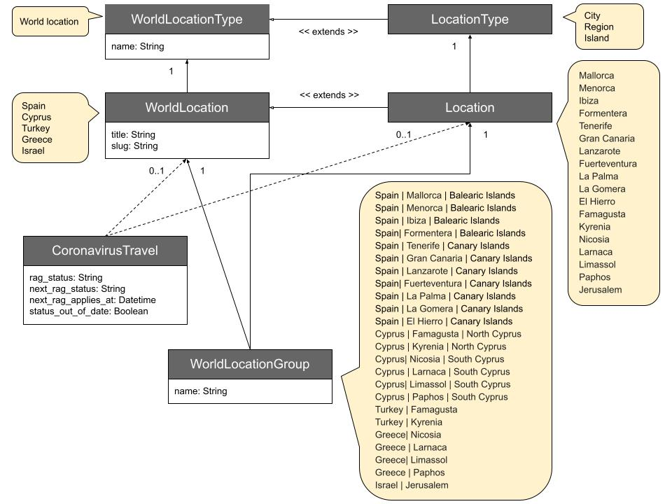

# Creating World Location Regions

## Summary

This proposal sets out an approach to add regions to the WorldLocation API and make them available to the Department for Transport (DfT) in [`travel-advice-publisher`](https://github.com/alphagov/travel-advice-publisher) for content augmentation.

## Problem

Prompted by the recent development of a travelling abroad during Coronavirus (COVID-19) Smart Answer - which uses the WorldLocation API to generate the list of countries for the [`country_select`](https://github.com/alphagov/smart-answers/blob/main/lib/smart_answer/question/country_select.rb) question type - it was noted that it is currently not possible to implement some must have user stories.

This is due to three issues:

  1. The WorldLocation API does not currently support location groupings.

  2. The WorldLocation API does not currently support location types other than `World location`.

  3. The country list used by (and manually maintained in :scream:) `travel-advice-publisher` is not in-sync with the WorldLocation API (see [this appendix](#appendix-analysis-of-travel-advice-publisher-and-worldlocation-api-locations)).

One user story in particular stands out:

```text
* As a Department for Transport (DfT) content owner
* I want to be able to add a region against a country
* So that when the region is on the red-list and the country is on the green-list, users are still able to get accurate travel information to both the region and the country
```

An example of this might be: the island of Crete goes into the red-list, but the rest of Greece stays on the green-list.

## Proposal

There are a few guiding design principles used in this proposal:

  * We must not compromise, break or damage the existing functionality of the WorldLocation API.

  * We must ensure that DfT can manage all location content for all location types and groupings in one place. This includes the proposed changes from [this prototype](https://github.com/alphagov/whitehall/pull/6378).

  * We should not use a third-party location API.

  * There must be a single list of locations that is used by the WorldLocation API and `travel-advice-publisher`.

There are a number of different data structures that are appropriate, that work and are tried-and-tested for this situation. However, we are going to put forward an approach that not only satifies our guiding design principles above (most do not as they require potentially significant changes to the existing structure), but is also generic, easy to understand and simple to implement.

With this approach we do not touch the existing WorldLocation or WorldLocationType, but augment them with a grouping structure that only links to existing structure externally.

### Proposed data structure



This creates a parallel data structure (Location and LocationType) that mirrors and inherits from the existing WorldLocation and WorldLocationType classes. With these we can add new location types and locations that are not available (or belong) in the WorldLocation (countries) data, yet share the same data and methods. An additional many-to-many relationship is introduced that with allows for - named or unnamed - groups to be created from WorldLocations and our new Locations.

After we apply the changes suggested from [this prototype](https://github.com/alphagov/whitehall/pull/6378), we can now provide the data to support [islands](https://en.wikipedia.org/wiki/Island) (Mallorca, Ibiza, Tenerife etc), [island groups](https://en.wikipedia.org/wiki/Archipelago) (the Balearics, Canaries, Greek islands for example), [regions](https://en.wikipedia.org/wiki/Region) (British Antarctic Territory), [areas](https://www.collinsdictionary.com/dictionary/english/geographical-area) (Phapos, Limassol etc), [cities](https://en.wikipedia.org/wiki/City) (e.g. Jerusalem), and more. Plus the required content relating to travelling to/from the UK during the Coronavirus pandemic. In short, we can now accommodate the missing DfT requirement above.

### Sample code

Sample code showing how this structure can be implemented, can be found [here](rfc-000/rfc-000.rb).

### The updated API

With this structure in-place we can update the API output.

Here is an example of the current ['Spain' WorldLocation API response](https://www.gov.uk/api/world-locations/spain) (some fields have been removed for brevity):

```json
{
  "id": "https://www.gov.uk/api/world-locations/spain",
  "title": "Spain",
  "format": "World location",
  "web_url": "https://www.gov.uk/world/spain",
  "details": {
    "slug": "spain",
  }
}
```

Here are two examples generated by the [sample code](rfc-000/rfc-000.rb):

[Spain](rfc-000/api/spain.json)

```json
{
  "title": "Spain",
  "id": "https://www.gov.uk/api/world-locations/spain",
  "format": "World location",
  "web_url": "https://www.gov.uk/world/spain",
  "details": {
    "slug": "spain"
  },
  "england_coronavirus_travel": {
    "rag_status": "Green"
  }
}
```

[Mallorca](rfc-000/api/mallorca.json)

```json
{
  "title": "Mallorca",
  "id": "https://www.gov.uk/api/world-locations/mallorca",
  "format": "Island",
  "web_url": "https://www.gov.uk/world/mallorca",
  "details": {
    "slug": "mallorca"
  },
  "england_coronavirus_travel": {
    "rag_status": "Red"
  }
}
```

### Sharing the location structure with `travel-advice-publisher`

TODO

Idea: Can we use something like the [WorldLocation class in `smart-answers`](https://github.com/alphagov/smart-answers/blob/main/app/models/world_location.rb)?

Question: How is the hierarchy best represented to the user? Idea: multiple `country_selects` one per grouped level?

## Appendix Analysis of travel-advice-publisher and WorldLocation API locations

The approach is simply to match as many countries from the [`/lib/data/countries.yml`](https://github.com/alphagov/travel-advice-publisher/blob/main/lib/data/countries.yml) in travel-advice-publisher to those available in the WorldLocation API.

The first point to note is that none of the content_id's between the two lists. We have tried matching on `name`, `slug`, and `name` & `slug`. We will match on `slug` for what follows as this yields the highest number of matches.

There are a total of 229 WorldLocations and 228 countries.

The WorldLocation API is missing 6 countries and the country list is missing 5 WorldLocations.

The following are missing from the countries list:
  * Name: [American Samoa] Slug: [american-samoa]
  * Name: [British Antarctic Territory] Slug: [british-antarctic-territory]
  * Name: [Saint-Barthélemy] Slug: [saint-barthelemy]
  * Name: [South Georgia and the South Sandwich Islands] Slug: [south-georgia-and-the-south-sandwich-islands]
  * Name: [St Martin] Slug: [st-martin]
  * Name: [United Kingdom] Slug: [united-kingdom]

The following are missing from the WorldLocation:
  * Name: [Antarctica/British Antarctic Territory] Slug: [antarctica-british-antarctic-territory]
  * Name: [Cook Islands, Tokelau and Niue] Slug: [cook-islands-tokelau-and-niue]
  * Name: [Jerusalem] Slug: [jerusalem]
  * Name: [South Georgia and the South Sandwich Islands] Slug: [south-georgia-and-south-sandwich-islands]
  * Name: [St Martin and St Barthélemy] Slug: [st-martin-and-st-barthelemy]

When we dig deeper into these, we find that:

  * American Samoa - is a US territory
  * Jerusalem - is a city
  * Cook Islands - is an island group nation with political links to New Zealand
  * Tokelau - is dependent territory of New Zealand
  * Niue - is a self-governing state with a free association with New Zealand
  * United Kingdom - is made up of the following countries: England, Scotland, Wales and Northern Ireland
  * British Antarctic Territory, South Georgia and the South Sandwich Islands - are areas claimed as overseas territories
  * St Martin - is an island under the joint sovereignty of France and the Netherlands
  * St Barthélemy - is an overseas territory claimed by France

None of the above are countries!

We also note that the `slug` differs between the countries list and WorldLocation API for both the British Antarctic Territory (`british-antarctic-territory` and `antarctica-british-antarctic-territory`) and South Georgia and the South Sandwich Islands (`south-georgia-and-the-south-sandwich-islands` and `south-georgia-and-south-sandwich-islands`).

It appears that St Martin and St Barthélemy have been joined together (presumably just the French side of St Martin) in the countries list, but seperate in the WorldLocation API.
