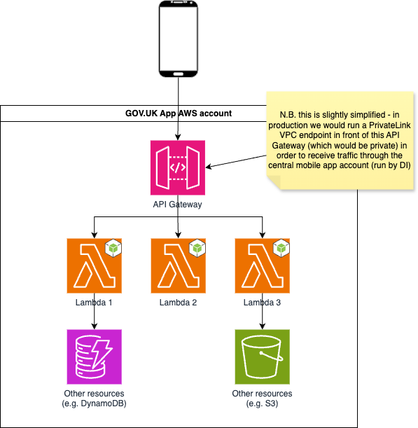
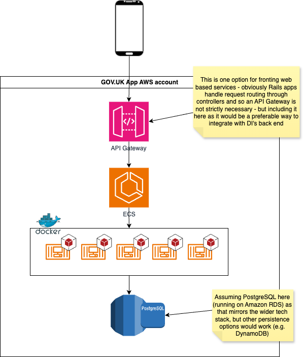

# Back end stack for GOV.UK App backends

## Summary

This RFC proposes a back end architecture and tech stack for internet-facing services (i.e. APIs) which underpin the GOV.UK mobile app. It draws on the existing work carried out on the Digital Identity programme to define an extensible, scalable architecture which meets the needs of a high-volume mobile application, and create a solid base for future development.

The proposal is to adopt an AWS serverless stack, in line with DI, with the predominant implementation approach being to run Node.js Lambda functions to execute business logic.

## Problem

The new GOV.UK App is going to require back end services to enable many of its features. The app is a shared product with Digital Identity, where the existing ID Check app that they have in production will be superseded by a new, single app that incorporates both Digital Identity and GOV.UK features.

The DI Mobile team have an existing set of back ends which are implemented in line with the Digital Identity architecture - namely, AWS serverless using Lambda functions (primarily Node.js with some Java). The decision making process behind this is recorded in the Digital Identity architecture repostitory (for example, [ADR-0001](https://github.com/govuk-one-login/architecture/blob/main/adr/0001-auth-hosting.md)) _(N.B. this is currently a private repo)_.

As GOV.UK, we need to determine a tech stack for back end services which underpin the GOV.UK elements of the app.

The following are key considerations we need to take into account:

1. There is a single app, and it would be most straightforward to integrate the app with a single back end. This means we only need a single set of configuration rather than multiple settings for different features. Additionally, we can centralise concerns like logging, monitoring and alerting.
1. In all likelihood, the various mobile back end services across both DI and GOV.UK will _eventually_ end up being supported and maintained by the same group of people. Therefore, parity of skillset is an advantage.
1. There are broader conversations across GDS looking into our strategy around tech stacks, and we should fold in to those

## Options

We have considered two principal options for tech stacks:

1. Adopt a serverless stack on AWS
2. Adopt a Ruby-based containerised stack on AWS

### Option 1 - Adopt a serverless stack on AWS

Under this option, we would adopt a serverless stack which broadly mirrors the approach taken on DI. Connectivity would be provided by API Gateways (see note below about the proposed approach to this). Compute would be based on Lambda functions, running the Node.JS runtime.

The Lambda functions would be able to call out to other AWS services as needed. While the subject of this RFC is predominantly the connectivity and compute (i.e. API Gateway and Lambda), the proposal would also be to adopt other cloud-native services which commonly form part of a serverless approach, namely using DynamoDB for storage.

This option has the following advantages:
* Essentially unlimited scalability without the need for active management
* Cost-efficient, pay-for-what-you-use pricing (we can get some cost reports from DI if this would be helpful)
* A step towards no-ops, where we are not responsible for or have the cost/burden of infra maintenance as this would be handled by AWS, so there are no [tricky manual steps](https://guides.rubyonrails.org/upgrading_ruby_on_rails.html) to upgrade to latest versions of underpinning software (only deprecated runtimes need to be considered)
* Lambda functions are small and self-contained, thus easy to reason about. They are written in JavaScript, which is familiar to many developers and therefore the learning curve is not too steep
* Aligns with the DI tech stack so that the entire mobile back end estate could be maintained by a single group of people
* Benefit from existing DI infrastructure for NFRs like monitoring / logging / alerting

The principal drawback of this option is that it is not currently a stack that is widely used and understood across GOV.UK, so would require some upskilling - particularly in terms of infrastructure management and use of AWS SAM (although we could look at an alternative to this like CDK).

### Option 2 - Adopt a Ruby-based containerised stack on AWS

In this option, we would build a Rails application (potentially more than one, if we deemed it correct from an architectural perspective). This Rails application would sit in a Docker container, and we would host it on Amazon Elastic Container Service (ECS) - or Elastic Kubernetes Service (EKS) if deemed a better fit.

As noted in the diagram, there are multiple ways to route internet traffic through to ECS or EKS, of which API Gateway is only one. It is not strictly needed because the Rails apps themselves can handle routing of requests through their controller classes, but it is included here as it would help to standardise the approach along with DI - and would potentially allow us to still use a single endpoint for all app back end concerns.

The principal advantage of this approach is that it draws on the existing skills and knowledge within GOV.UK around building and running Rails apps. Containers are a recognised, modern way of running web framework-based services on cloud providers.

There are however numerous downsides to this approach:
* Inconsistent tech stack across the app means we could end up with one team having to maintain services built in very different paradigms. Additionally we would have to create separate monitoring and logging stacks across the two approaches
* Whilst containers (and container-hosting services) are designed to scale up and down flexibly, there is manual configuration, intervention and adjustment needed to do this effectively

## Proposal

The proposal is to adopt option 1, serverless applications on AWS, using Lambda functions written in Node.js. There should be some flex around some of the specifics - for example, we may decide that proxying to static files on S3 is a better fit for some workloads, or that DynamoDB is not the right option for data storage for some requirements. But the guiding principle should be that for compute, we use Lambda functions.

## Appendix - Potential sub-options

The following are potential sub-approaches we could take, which may address some of the considerations above. They are open to discussion.

### Option 1A
Use serverless but write Lambda functions in Ruby. This approach enables us to make use of the existing Ruby expertise within GOV.UK, but still allows us to get the benefits of the serverless paradigm and align broadly with the DI tech stack. The reason this isn’t the preferred option is that it introduces an additional language into the ‘target stack’. Both Ruby and Node.js are easy to work with on Lambda and so the difference is judged to be minimal.

### Option 2A
Use containers but embed them within AWS Fargate. Fargate is a semi-managed ‘serverless’ compute engine for containers which takes care of some concerns such as scaling and server management. DI do use Fargate for some front ends, but the feedback from the team is that it is quite difficult to work with, still requires quite a lot of manual intervention, and can be expensive. Therefore we have discounted this option here.
