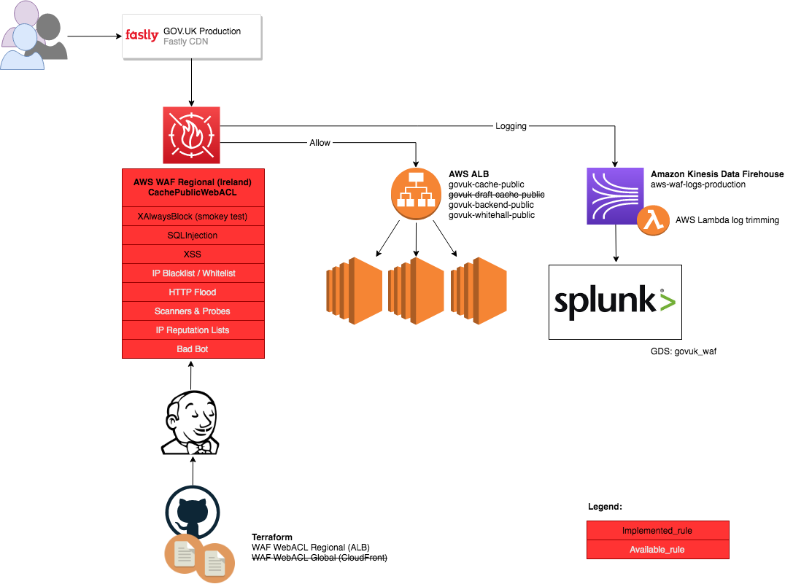

# Use CloudFront as primary ingress gateway

## Summary

Move the publishing backends into AWS and use CloudFront as the primary CDN
(Content Distribution Network) for ingress to GOV.UK to take full advantage of
the protection and support afforded to us from our AWS Advanced support contract
and simplify our architecture.

## Problem

### Motivation

GOV.UK should harden their public facing ingress gateways in order to respond
to (if not mitigate) the growing threats from Denial Of Service, Distributed
Denial of Service, and common automated vulnerability scanning tools
(Cross-Site-Scripting, SQL Injection, etc).

The current architecture of GOV.UK has Fastly as a CDN in front of an
Application Load Balancer which is protected by a WAF (Web Application
Firewall) and AWS Shield Advanced's DDoS detection/support.

This architecture has the following problems:

* The ALB/WAF is unable to perform rate limiting functions as traffic will be from Fastly
* DDoS detection and protection will be ineffective as traffic will only be from Fastly
* The publishing backends are left unprotected by the WAF/Shield Advance as they are yet to be migrated to AWS

### Goals

* Provide equivalent cache functionality as currently (pass-through cache / stale reads)
* Provide a configuration point at the edge for applying ip-based restrictions
* Provide a configuration point at the edge for applying rate limiting restrictions
* Provide a configuration point at the edge for applying basic sqli/xss detection
* Provide detection and options for dealing with large scale distributed attacks

### Non-Goals

* Replicating every Fastly feature with CloudFront (some may be better implemented elsewhere)

### User Stories

_problem description in the form of user needs identified that we are currently not meeting or partially meeting_

_the need for a caching CDN layer is not discussed in this proposal as it is well understood_

#### User Personas

* *User*: A member of the public who wants to access content on GOV.UK
* *MaliciousUser*: A naughty User
* *Developer*: Builds, maintains and deploys GOV.UK applications and services with a strong focus on User needs and delivery.
* *ReliabilityEngineer*: Provides support to GOV.UK with a strong focus on automation and reliability.

#### Denial of Service (DoS)

As a Developer/ReliabilityEngineer I want to be able to set IP based rate
limits for requests to GOV.UK applications so the actions of a MaliciousUser
attempting to overwealm one or more applications with requests has little to no
impact on the vast majority of Users.

As a User who is seeing rate limiting errors on GOV.UK as a result of the
actions of a MaliciousUser who was operating from the same network as me I
want to be shown information about why I cannot access the site so that I can
understand why I am unable to access the site and if the situation is temporary
or not.

##### Distributed Denial of Service (DDoS)

As a Developer/ReliabilityEngineer I want a channel available to me with my
cloud provider who is capable of detecting and limiting the impacts of
distributed layer 3/4 (network) and layer 7 (application/http) attacks so that
I have options available to me under extreme circumstances.

As a Developer/ReliabilityEngineer I want visibility of potential DDoS attacks
that could be impacting my service so that I can narrow the scope of
troubleshooting under these conditions and begin communication with my cloud
provider for mitigation options as soon as possible.

##### SQL Injection

As a Developer maintaining a database connected application I want requests from
automated tooling that scans for common SQL Injection vulnerabilities to be
detected and blocked before reaching my application so that I have an
additional line of defence protecting me from the common pitfals often exposed
by database connected frameworks, libraries and applications.

As a Developer maintaining a database connected application I want to have
visibility of requests that are being detected and blocked as potential SQL
injection attempts so that I can modify my application to avoid triggering
false positives.

##### Cross Site Scripting (XSS)

As a Developer maintaining a frontend application I want requests from
automated tooling that scans for common XSS vunerabilities to be
detected and blocked before reaching my application so that I have an
additional line of defence protecting me from the common pitfals often exposed
by frontend frameworks, libraries and applications.

As a Developer maintaining a frontend application I want to have visibility of
requests that are being detected and blocked as XSS attempts so that I can
modify my application to avoid triggering false positives.

## Proposal

_High level proposal for how to meet the needs defined in `Problem` definition_

### Implementation

We should complete the migration of the publishing backends into AWS. This is
important because attempting to protect the backends behind CloudFront _before_
completing the migration will lead to significant added complexity for
configuration and invalidations, additional traffic costs and potentially hard
to reason about traffic routes.

We will add a CloudFront distribution configured to replicate the
routing/origins, cache-control and stale reads currently provided by Fastly.
This should operate in parallel to the exisiting Fastly CDN so as not to impact
the existing setup.

We will extend any cache clearing logic to include cache invalidations of the
CloudFront distribution.

We will consider and modify the failover plan for mirrors as required. [expand?]

We will move the existing WAF rules from the ALB to the CloudFront
distribution, enable it as a Shield Advanced "protected resource" and extend it
to support rate-limiting rules tuned based on application capability,
historical data and risk.

We will use weighted DNS (or similar method) to direct a limited proportion of
users to the new CDN to limit the impact of any issues during rollout and we
will gradually phase out Fastly once we are confident.

With CloudFront as the primary ingress point we will able to meet the previously unmet needs:

* Rate limiting rules will be effective with CloudFront at the edge as it can
  correctly see the client IP
* DDoS detection and protection will be effective
  with CloudFront at the edge as it is seeing all the traffic from the public
* The publishing backends will be protected as they will be behind the same
  ingress gateway as the rest of the platform

### Cost comparrison

TODO: compare relative costs between Fastly/CloudFront (traffic, storage,
cache-invalidation estimates etc) - exclude WAF costs as these would be same

### Risks & Mitigations

Fastly takes the brunt of the load of GOV.UK, any changes to the caching
behaviour risk altering the load that the applications are currently tuned to
handle. This can be mitigated by building the new CDN route in parallel,
testing thoroughly and distributing only a fraction of the traffic (DNS/Fastly
load balancing/ to the new system and ramping up to build confidence.

Adding IP based rate-limiting has the potential to block organisations who have
large numbers of users behind NAT, for example, univerisities. This can be mitigated by
tuning the rate-limiting rules based on historical request data as well as scoping the
rules to only the request paths/methods that have the most potential for lowering reliability
(if the frontends can actually handle GET requsts at 100req/s probably don't
let rate limiting kick in until it's nearer that number - DDoS is a separate
issue that cannot be resolved by rate-limiting alone)

SQL injection and XSS blocking carry the risk of false positives, where
legitimate requests are blocked as they contain things that are commonly found
in attack payloads such as `(null)` or `<script>` This can be mitigated either
by a good culture of acceptance testing applications in a staging environment
that replicates the application firewall rules or as a last resort by
whitelisting certain strings to bypass the firewall.

### Drawbacks

* More AWS lock-in, however all major cloud providers offer CDNs of roughly equivilent features

### Alternatives considered

#### Fastly

* Fastly could provide a WAF capable of detecting and blocking SQLi/XSS type
  requests.
* Fastly could provide extended level of support for DDoS situations, but since
  we already pay for AWS Shield Advanced for the GDS estate this would be an
  unfortunate expense for a similar product.
* Fastly does not provide a way of managing rate-limiting, you could
  potentially approximate rate-limiting using vcl but it would be fragile and a
  burden to maintain

#### CloudFront -> Fastly

* Run CloudFront in a non-caching configuration IN FRONT of Fastly, to gain the rate-limiting and acls at the edge
* We would be double spending on traffic, storage and latency
* We would be increasing the support/maintainability burden
* We would be adding complexity to the system where there shouldn't be

