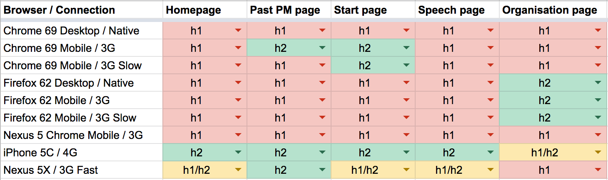
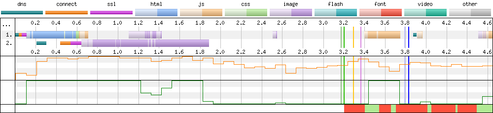

# Enabling HTTP/2 on GOV.UK

## Deadline for comments
27th January 2020 (2 weeks).

## Summary
Back in November 2018 we trialed the use of HTTP/2 on GOV.UK. According to quite a few sources, enabling HTTP/2 should improve web performance for users by introducing technology like multiplexed streams, HPACK header compression and stream prioritisation. Unfortunately it turned out that from our synthetic web performance testing it actually slowed the site down in many instances.

We tested 5 different page types, on multiple devices and connection speeds and examined the following performance metrics to come up with a result:

* First visual change
* Visually complete 95%
* Last visual change
* Speed index 
* Load time (fully loaded)

And for Lighthouse reports these metrics were examined:

* First Contentful Paint
* First Meaningful Paint
* Speed Index
* First CPU Idle
* Time to Interactive

The RFC below discusses the problems with our current setup and suggests possible solutions. 

## Problems
### 1 - Sub Resource Integrity (SRI)

On GOV.UK we are using Subresource Integrity for all our CSS and JavaScript assets coming from the assets domain. The [SRI specification](https://www.w3.org/TR/SRI/#cross-origin-data-leakage) requires that the `crossorigin` attribute is set to `anonymous` to be used with SRI resources for security reasons. This is because of data leakage from credentialed TCP connections. This requirement is forcing the browser to open a second TCP connection in 'anonymous mode' so it can download the CSS / JS from the assets domain. In doing so this is adding 100's of milliseconds of delay to the page rendering timeline. This occurs even when using the [`preconnect`](https://www.w3.org/TR/resource-hints/#fetching-the-resource-hint-link) resource hint, a browser feature intended to help fix this issue.

This performance issue is occurring in both HTTP/1.1 and HTTP/2 as seen in the WebPageTest connection view waterfalls below:

#### HTTP/1.1

Here we can see 13 TCP connections being opened (6 'credentialed', 6 'anonymous', 1 third-party to Google Analytics). If we weren't using SRI, we could reduce this requirement down to 8 (6 'credentialed', 1 'anonymous' for fonts, 1 third-party to Google Analytics). This is the first step in improving web performance for GOV.UK users on HTTP/1.1.

#### HTTP/2
Below you can see the delay in the waterfall while the 2nd `anonymous` TCP connection is established:

And this is what it could look like if we were to remove SRI:

In the example test above on a Nexus 5 device under 3G connection speeds, we could bring the request of the CSS & JS files forwards by ~750 ms. This should speed up the whole waterfall and turn the results from the summary list above from red to green in favour of HTTP/2.

This is achieved through the use of HTTP/2 connection coalescing, which can be seen in action on GOV.UK from our trial below:

The coalesced connection is under-utilised if 'anonymous mode' is used on our static assets. There's also an impact from the fact that [TCP Slow Start](https://en.wikipedia.org/wiki/TCP_congestion_control#Slow_start) is in action on the delayed `anonymous` connection, meaning assets will download slower than they could via the single coalesced connection. So we are in the following situation: the connection used to download the HTML isn't utilised fully (by this point it will already be up to speed), and the `anonymous` connection downloading the critical CSS has been delayed, so it isn't up to speed yet. For best performance we should be utilising the connection that has already been established via the HTML download, and use it for other critical page assets (CSS/JS).

### 2 - Assets served with `Access-Control-Allow-Origin: *`
My initial thinking was that we could quickly switch the `crossorigin` attribute from `anonymous` to `use-credentials` for our static assets (CSS/JS). Unfortunately on examining the [Fetch specification](https://fetch.spec.whatwg.org/) there's [information in the table (5th row down)](https://fetch.spec.whatwg.org/#cors-protocol-and-credentials) that states:

> `Access-Control-Expose-Headers`, `Access-Control-Allow-Methods`, and `Access-Control-Allow-Headers` response headers can only use `*` as value when request’s credentials mode is not "include".

Basically, the use of the wildcard (`*`) isn't allowed on a credentialed connection (`use-credentials`). And if it is used, the browser will block any requests and raise an error message the that looks like this:

> Cross-Origin Request Blocked: The Same Origin Policy disallows reading the remote resource at ‘https://assets.example.com/script.js’. (Reason: Credential is not supported if the CORS header ‘Access-Control-Allow-Origin’ is ‘*’).

We are currently [serving all our assets](https://github.com/alphagov/govuk-puppet/blob/962ea899e9c6778fe91e80074346912bd4314b10/modules/router/templates/assets_origin.conf.erb#L36-L38) from the `assets` domain with the `Access-Control-Allow-Origin: *` header, which is blocking us from making this change. The reason why we are serving assets like this is because we are using SRI and they need the `crossorigin` attribute for it to work.

The Heroku applications (e.g. https://government-frontend.herokuapp.com) that are created are a legitimate reason for using this header when `crossorigin` is present. If we were to remove the `Access-Control-Allow-Origin: *` header then the JS and fonts (due to their [unique CORS requirements](https://www.w3.org/TR/css-fonts-3/#font-fetching-requirements)) on the Heroku previews would break. According to the `Access-Control-Allow-Origin` [documentation](https://developer.mozilla.org/en-US/docs/Web/HTTP/Headers/Access-Control-Allow-Origin), there are only 3 valid values for this header:

- `*`
- `<origin>`
- `null`

The `<origin>` value is very important. As this is where we would ideally like to specify: `*.gov.uk; *.herokuapp.com`. Unfortunately this header only accepts a **single** origin, and it **doesn't** recognise wildcard values. So we are in a situation where we need to use `*` (for SRI) and a specific origin value (e.g `https://government-frontend.herokuapp.com` for every unique Heroku app URL, including individual PR's) at the same time. There's the possibility that this can be done by adjusting the [VCL config on the CDN](https://www.fastly.com/blog/caching-cors), but that then opens us out to more potential complications as listed in @kevindew's comment [here](https://github.com/alphagov/govuk-rfcs/pull/115#discussion_r366510706). So this could complicate both the CDN configuration and local development if not properly investigated.

### 3 - The assets domain
Domain sharding for static assets is an anti-pattern under HTTP/2, and our current HTTP/1.1 setup isn't optimal for performance either. If our static assets weren't being served including SRI we would be able to remove the `crossorigin` and `integrity` attributes from the `<script>` and `<link>` tags. This in turn would allow the browser to correctly use [HTTP/2 connection coalescing](https://daniel.haxx.se/blog/2016/08/18/http2-connection-coalescing/), which would minimise the impact the assets domain is having on HTTP/2 performance. 

Some browser implementations of HTTP/2 connection coalescing are [notoriously flaky](https://bugs.chromium.org/p/chromium/issues/detail?id=1011685), so this performance benefit will only be available in some browsers. Users on older versions of Safari (before 12), IE, and Edge 18 and below, all don't support coalescing, so won't benefit from this optimisation. But as we've seen above, the domain sharding isn't offering any benefits anyway. So why not remove the need for connection coalescing completely for our static assets and serve them from the origin. All browsers that support HTTP/2 will then receive the same benefits and experience of the browser using a single multiplexed TCP connection. [95.7% of the UK population](https://caniuse.com/#search=http2) use a browser that supports HTTP/2, so most of our users will benefit from this change.

Once completed our connection graph will look similar to this:

The bulk of the page assets will be downloaded on the initial connection to the origin (www.gov.uk), with a secondary `anonymous` connection only being opened for the fonts. That's twelve connections under our current HTTP/1.1 implementation, down to just two for HTTP/2 in many cases. So in order to fix our HTTP/1.1 and HTTP/2 performance issues we should serve static assets (CSS, JavaScript, fonts, images) all from the origin (www.gov.uk).

### Summary
In order to enable HTTP/2 on the GOV.UK domain (and for it to perform well) we need to all problems listed above:

- SRI requires the `crossorigin` attribute to be set for it to work.
- The use of `crossorigin='anonymous'` breaks HTTP/1.1 connection reuse and HTTP/2 connection coalescing.
- Switching to use `crossorigin='use-credentials'` isn't possible because we serve our assets with the `Access-Control-Allow-Origin: *` header so that the assets leveraging SRI can be used on other domains (e.g. Heroku).
- Even if we serve the static assets from the origin, we will still need the `crossorigin` attribute because we will still be loading them with SRI enabled.

Therefore my recommendation is to remove the `integrity` and `crossorigin` attributes from our static resources (CSS, JS) and work towards serving these assets from the origin domain so we are no longer reliant on an individual browsers implementation of HTTP/2 connection coalescing. NOTE: it is possible to do these streams of work separately.

We should only serve our fonts with the `Access-Control-Allow-Origin: *` header (this is a requirement when using web fonts). All other assets can have this header removed (as we will have removed the `crossorigin` attribute). We only need to be serving the following font files:

- EOT - For Internet Explorer only (6-11)
- WOFF - For all modern versions of "evergreen" browsers and IE9-11.
- WOFF2 - All modern browsers since ~2016. it's usage trumps the use of WOFF.

EOT files are no longer going to be served to Internet Explorer once GOV.UK has migrated fully to the Design System. So EOT can be removed in the future. There are no plans that I am aware of to create another webfont format, so we won't be needing to add any more for the foreseeable future.

SRI Note: In serving the static assets from the origin domain, SRI no longer serves any purpose, as it's a security measure intended to be used on third party resources. As all of our assets will be first party, it really isn't required and serves only to complicate our setup and impact on performance.

Serving static assets from the origin also clears a path for future web performance enhancements like [HTTP/3, QUIC (Quick UDP Internet Connection)](https://www.fastly.com/blog/why-fastly-loves-quic-http3) and 0-RTT. [HTTP/3](https://caniuse.com/#feat=http3) has no support at the moment as it currently sits behind browser flags. But at some point in the future it will be supported and the asset domain will need to be removed for static assets anyway, to keep up with the latest protocol developments.

NOTE: As mentioned by @david-ncsc in [his comment](https://github.com/alphagov/govuk-rfcs/pull/115#issuecomment-567907397), there's probably a security benefit to keeping the uploaded files on a separate origin as defence against uploaded malicious files. We should therefore only serve the static assets (CSS, JavaScript, fonts) from the origin. All other assets can stay the same.

## Proposal
### MUST
* Only serve our font assets with `Access-Control-Allow-Origin: *` header (WOFF2, WOFF, EOT). - Medium (work required to modify NGINX config [here](https://github.com/alphagov/govuk-puppet/blob/962ea899e9c6778fe91e80074346912bd4314b10/modules/router/templates/assets_origin.conf.erb#L36-L38) and [here](https://github.com/alphagov/govuk-puppet/blob/master/modules/govuk/templates/asset_pipeline_extra_nginx_conf.erb))
* Remove the `integrity` and `crossorigin` attributes from our static resources (CSS, JS) - Easy (PR's quickly raised for all apps CSS/JS).
* Serve static assets from the origin rather than the assets domain - Medium/Hard (spike already investigated by @kevindew and commented on [here](https://github.com/alphagov/govuk-rfcs/pull/115#issuecomment-573008991)).

### SHOULD
* Review the use of `Access-Control-Allow-Methods` and `Access-Control-Allow-Headers` headers as from looking at the CORS documentation they aren't actually needed. - Easy (Code resides [here](https://github.com/alphagov/govuk-puppet/blob/962ea899e9c6778fe91e80074346912bd4314b10/modules/router/templates/assets_origin.conf.erb#L36-L38)).

### Consequences
* Browsers that support HTTP/2 will be allowed to use it to its maximum potential. Browsers that don't will still use HTTP/1.1, but will now only require 6 TCP connections rather than 12.
* Both H1 and H2 users should receive improved performance due to improved TCP connection efficiencies.
* Under HTTP/2 we should see only 2 TCP connections on the WebPageTest connection graph, with the vast majority of assets loading via the same connection as the HTML.

### How to enable HTTP/2
Once we have made the changes how do we enable HTTP/2, and what changes need to be made to the applications?

- I simply contact Fastly support and ask them to enable it on GOV.UK. This will enable it on production, integration, and the assets domains.
- No changes to any infrastructure or apps need to be made, as this is a transport layer change on the CDN.