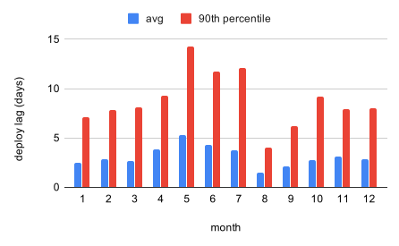

# Continuous Deployment

## Summary

In [RFC 70](https://github.com/alphagov/govuk-rfcs/blob/master/rfc-070-path-towards-continuous-deployment-cd.md#proposal) we committed to fully automatic deployments. The following provides a framework for how we will actually achieve this for all of our existing apps.

Decision: in order to safely enable automatic deployments for each app, we will specify minimum criteria that must first be met. See the criteria described [below](#safety-concerns).

An audit of our apps against these criteria can be found in [Appendix A: Compatibility](rfc-128/compatibility.md).

## Problem

Merging a PR for an application repo [results in a new "release" tag](https://github.com/alphagov/govuk-jenkinslib/blob/30e9392d31b98e5c251ea471d793761748eea1e8/vars/govuk.groovy#L123). We have a [Release](https://github.com/alphagov/release) app to monitor these. Every new release tag [is automatically deployed to our Integration environment](https://github.com/alphagov/govuk-jenkinslib/blob/30e9392d31b98e5c251ea471d793761748eea1e8/vars/govuk.groovy#L134).

This is where the automation ends. In order for a release (or series of releases) to be deployed to the GOV.UK Production environment, a developer with [production access](https://docs.publishing.service.gov.uk/manual/rules-for-getting-production-access.html) must:

- Manually check the release is "OK" in Integration.
- Manually deploy the release to Staging.
- Manually check the release is "OK" in Staging.
- Manually deploy the release to Production.

Having these manual steps has lead to a number of problems.

### We freely merge PRs with breaking changes

It's easy to merge a PR and later worry if it breaks the app. This can cause the codebase to become undeployable, and interrupt other developers testing changes on Integration.

Example: https://github.com/alphagov/email-alert-api/commit/8e633fc7d89d7f13bc0e5bdcab14ed3dea968289#diff-c1fd91cb1911a0512578b99f657554526f3e1421decdb9e908712beab57e10f9R20

Fix: https://github.com/alphagov/email-alert-api/pull/1346

I couldn't find a good example of myself doing this, but I've definitely done it too. We will never write unbreakable code, yet we have too little caution around merging our changes.

### We do not have a working definition of "OK"

It's easy for each developer to have their own standards, and rely on their own judgement when it's not clear that something is broken. Theoretically, we assume a developer will:

- Check the results of [the smoke tests](https://deploy.integration.publishing.service.gov.uk/job/Smokey/).
  - ⚠ Our smoke tests are flakey [[1](https://github.com/alphagov/govuk-puppet/pull/10604)] [[2](https://github.com/alphagov/smokey/pull/669)] [[3](https://github.com/alphagov/smokey/pull/665)] [[4](https://github.com/alphagov/smokey/pull/663)].
  - ⚠ It's unclear which tests are relevant to each app [[1](https://github.com/alphagov/smokey/pull/681/commits/ee027a4f59d023381fb5c138a5a74463ca655e74)].

- Look for any Icinga alerts related to the app.
  - ⚠ It's unclear which alerts should block deploys for an app.
  - ⚠ It's unclear how long to wait for alerts to appear.

- Check the [deployment dashboard for the app](https://docs.publishing.service.gov.uk/manual/deployment-dashboards.html).
  - ⚠  It's unclear what to look for on these dashboards.

### We have a constant backlog of deployments

> Full stats and supporting code can be found [here](https://docs.google.com/spreadsheets/d/1Hw1qE-ozqb7n97-fsWkH8Ddgz-7Jyr2G8z8lHXJZPhE/edit#gid=0). We expect these will improve slightly over the coming months, due to the reduction in changes generated by Dependabot [[1](https://github.com/alphagov/govuk-rfcs/blob/master/rfc-126-custom-configuration-for-dependabot.md)].

It's easy to *not* deploy a change. This is especially true for new joiners, who can only merge PRs and cannot deploy them beyond Integration. A backlog of deployments makes diagnostics harder:

- ⚠ We can mistakenly debug an issue against the undeployed version of the code.
- ⚠ We may struggle to isolate a breaking change, if many were deployed together.

## Proposal

Make deployments fully automatic for the apps listed [here](https://github.com/alphagov/govuk-puppet/blob/c24ff191ce7fc8a38ceb464f0139faba04b9734b/hieradata_aws/common.yaml#L145). This has already begun, as part of [a successful trial of Continuous Deployment](https://docs.google.com/document/d/18y2fLzqbHyTliThxuiyxKznDw4TZmPiQZAk-3rkgpBg/edit) and [a subsequent extension to include 5 more apps](https://docs.google.com/document/d/1YhgjJjDRB57-IlgPNAAZzFTI3jIUucGJKokti_lQiRQ/edit).

> **It is still possible to deploy an app manually.** The new pipeline is just an automation of the manual deployment steps. Rollback is unchanged, and freezing deployments is supported [[1](https://github.com/alphagov/govuk-puppet/blob/c24ff191ce7fc8a38ceb464f0139faba04b9734b/modules/govuk_jenkins/templates/jobs/deploy_app_downstream.yaml.erb#L22)].

We will continue to use the new development and deployment pipeline created for the trials. Much of the functionality is defined in [a new `Deploy_App_Downstream` Jenkins job](https://github.com/alphagov/govuk-puppet/blob/c24ff191ce7fc8a38ceb464f0139faba04b9734b/modules/govuk_jenkins/templates/jobs/deploy_app_downstream.yaml.erb), which works like this:

1. **Integration**

   1. Deployment runs.
   1. [**new**] Wait for the Smoke tests for the app to pass [[1](https://github.com/alphagov/govuk-puppet/pull/10387)].
   1. [**new**] Remotely trigger the same deployment in Staging.

1. **Staging**

   1. [**new**] Repeat as for Integration, but to Production.

We propose to apply this automation across our apps. Given the scale of the change, we need to think carefully about how we can make it consistently safe and secure, before we enable CD for an app.

### Safety concerns

The person who merges a PR must be confident that it is safe to do so. As part of the trial of CD, [we added PR templates to each affected app](https://github.com/alphagov/smart-answers/pull/4758), to explicitly warn developers about the automatic deployment.

However, we also want to ensure that a faulty PR merged in haste can be caught before it impacts the live site. There are a number of checks we can perform to help ensure this, without aiming for perfection.

> **We won't check alerts.** At the time of writing, we have no evidence that checking Icinga alerts has any advantage over the checks discussed below. We can investigate such a check if we find evidence [[1](https://github.com/alphagov/govuk-puppet/pull/10597)].

> **We will only consider _live_ code.** Interactions due to manual and scheduled tasks can be checked manually, using a branch deployment. In the worst case, we should have ample time to fix any faults that develop.

#### Check: Internal repo tests pass (i.e. features are tested in detail)

For the purpose of automating deployments:

- We will use code coverage as our indicator of previous, thorough testing. While an app may have a [rigorous testing strategy](https://github.com/alphagov/content-publisher/blob/69bed3535de1e65bda9d5909a3bc56a319e46576/docs/testing-strategy.md), it's hard to know if this has been applied consistently as the app has evolved.

- We will require a minimum level of coverage that is realistic for all of our apps. We will not pursue this once CD is enabled, as doing so could encourage [a lack of rigour in the way we write our tests](https://jeroenmols.com/blog/2017/11/28/coveragproblem/).

- We will not check coverage of periphery code e.g. CSS, JavaScript. This is because it has a low footprint in our codebases, and it's hard to measure coverage for: the frameworks we use don't support it.

An app has "enough" of these tests when:

- Its code coverage exceeds 95% at the point when CD is enabled.

#### Check: API [contract tests](https://docs.publishing.service.gov.uk/manual/pact-broker.html) pass (i.e. adapters work with their APIs)

For the purpose of automating deployments:

- We only need to add contract tests when it's hard to be confident about an API change. If an API endpoint only has a single "consumer" app, then it's easy to gain confidence by manually testing the pair still work together.

- We only need to add contract tests for the APIs we consume internally. Some of our APIs may be public, but this is a separate, product-level commitment. Our strategy for testing public APIs is out-of-scope for this RFC.

With this in mind, an API app has "enough" of these tests when:

- Each endpoint with multiple consumers has at least one contract test.

> Example: [Asset Manager](https://github.com/alphagov/asset-manager) is missing contract tests because multiple apps use it to create [[1](https://github.com/alphagov/content-publisher/blob/0c757447ca2aad3621f11c99fe8307a718ade186/app/services/preview_asset_service.rb#L29)] [[2](https://github.com/alphagov/specialist-publisher/blob/8debeb2f0147142c87f22308d57fe4f6dd0c1297/app/models/attachment.rb#L49)] assets, among other APIs. Conversely, no [Support API](https://github.com/alphagov/support-api) endpoints are used by more than one GOV.UK app [[1](https://github.com/alphagov/support-api/tree/75540575ae11095bb8d4736490abdc9927049aaf#technical-documentation)].

#### Check: App is healthy (i.e. it can run in a production environment)

For the purpose of automating deployments:

- We need to test that an app can respond to a request for each of the machine classes it runs on [[1](https://github.com/alphagov/govuk-app-deployment/blob/d4bb62aa79face46d2e164e316f38f7a64a1b8be/content-store/config/deploy.rb#L3)] [[2](https://github.com/alphagov/govuk-app-deployment/blob/d4bb62aa79face46d2e164e316f38f7a64a1b8be/whitehall/config/deploy.rb#L13)]. This is purely to prove that an instance of the app is running [[1](https://github.com/alphagov/email-alert-api/pull/1346)], and may be covered by other tests.

- We need to test that an app can connect to any systems it uses for data storage and retrieval, such as a database. This usually has production-specific config [[1](https://github.com/alphagov/email-alert-api/blob/1b5f59f3927637afb0c790702f8f0050788edc9d/config/database.yml#L22)] [[2](https://github.com/alphagov/content-store/blob/f4b61d4f2756341b6418085d878ec83b09d70e9c/config/mongoid.yml#L23)] [[3](https://github.com/alphagov/content-publisher/blob/944fe51b4cb8205348e155b965b8bad57adcf4fe/config/storage.yml#L5)], which could be faulty.

- We do not need to test connectivity to other GOV.UK apps, since this should be handled by [our internal API adapters](https://github.com/alphagov/gds-api-adapters/blob/1ceba690edb37295257328d953874224833fcd5e/lib/gds_api.rb) with no configuration inside the repo. An exception to this is [authentication with Signon](https://github.com/alphagov/email-alert-api/blob/1b5f59f3927637afb0c790702f8f0050788edc9d/config/initializers/gds_sso.rb).

With this in mind, an app has "enough" of these tests when:

- It has a test that checks for a successful response to an arbitrary request.
- It has a test that checks for a successful login with Signon (if applicable).
- It has a test that checks for connectivity to any read/write dependencies:

  - Databases e.g. MongoDB, Postgres, MySQL, Redis
  - File systems e.g. AWS S3
  - Caching systems e.g. Memcached

> Example: [Travel Advice Publisher](https://github.com/alphagov/travel-advice-publisher) has enough of these tests because it has one to check login with Signon [[1](https://github.com/alphagov/smokey/blob/a60df2cde5c886fa6d54e8cd820d90facca89e8e/features/publishing_tools.feature#L106)] and another to check its `/healthcheck` endpoint for connectivity to Redis and MongoDB [[1](https://github.com/alphagov/smokey/blob/a60df2cde5c886fa6d54e8cd820d90facca89e8e/features/travel_advice_publisher.feature)] [[2](https://github.com/alphagov/travel-advice-publisher/pull/979)].

> **Services are special.** We cannot make a request to a service, as it has no web interface. Instead, we will update [the deployment script for each service app](https://github.com/alphagov/govuk-app-deployment/blob/efc730f0f101b2e457abc48cbab67982728a8c93/email-alert-service/config/deploy.rb) to check the process is running after the app is restarted.

#### Check: Smoke test pass (i.e. double check critical features work)

For the purpose of automating deployments, we do not strictly _need_ Smoke tests for arbitrary features of an app: in theory, they are replaced by the other checks described here. However, this assumes perfect testing.

We can think of our Smoke tests as a "backup" or "secondary" layer of testing for features we have previously deemed to be critical. We will therefore check all existing Smoke tests pass, where they are relevant to an app.

### Security concerns

We need to ensure that only people with [production access](https://docs.publishing.service.gov.uk/manual/rules-for-getting-production-access.html) are able to deploy code to the live site. This is equivalent to being a member of the "GOV.UK Production" GitHub team. As part of the trial of CD, we restricted merge access on the affected repos to people in this team [[1](https://github.com/alphagov/govuk-saas-config/pull/49)] [[2](https://github.com/alphagov/govuk-saas-config/pull/51)] [[3](https://github.com/alphagov/govuk-saas-config/pull/55)]. We will [continue to use this approach](https://github.com/alphagov/govuk-saas-config/pull/52#issuecomment-651903746).

As well as restricting who can merge, we also had to address a vulnerability with Integration Jenkins: someone without production access could manually trigger the CD pipeline by running the [`Deploy_App_Downstream` Jenkins job](https://github.com/alphagov/govuk-puppet/blob/c24ff191ce7fc8a38ceb464f0139faba04b9734b/modules/govuk_jenkins/templates/jobs/deploy_app_downstream.yaml.erb). In order to prevent this kind of unauthorised deployment, the job has additional checks:

- The tag to deploy must be the highest `release_123`-type tag.
- The tagged commit must match the latest commit on the master branch.

Note that someone without production access could still subvert this protection, by manually altering the job definition. In this scenario, we would permit an unauthorised deployment to the Staging environment, but no further: only people with production access can access Staging Jenkins [[1](https://github.com/alphagov/govuk-developer-docs/blame/736a167bf93b7338347c73cacbddfbdc68e72733/source/manual/rules-for-getting-production-access.html.md#L18-L19)], which also does the above checks.

## Rejected approaches

The following are alternatives we considered to address the safety concerns with enabling automatic deployments for our apps. We did not consider any alternative approaches to address security concerns.

### Check: interactions between apps work

A previous draft of this RFC would have made extensive use of Smoke tests and [sandboxed "end-to-end" (E2E) tests](https://github.com/alphagov/publishing-e2e-tests) to check apps can successfully communicate with real instances of other apps (as opposed to test stubs). The need for sandboxed E2E tests arises when the tests have some associated state [[1](https://github.com/alphagov/smokey/pull/689#issuecomment-651144341)].

This approach was rejected because:

- The API calls made by each app are [stubbed at the request level](https://github.com/alphagov/gds-api-adapters/tree/8a67c1e2d65ac46533725730fa68d24485c9d964/lib/gds_api/test_helpers), so there is little benefit in re-testing the associated functionality if our API adapters are guaranteed by contract tests.

- The environment we have for sandboxed E2E tests does not reflect our real environments [[1](https://github.com/alphagov/publishing-e2e-tests/pull/386)] [[2](https://github.com/alphagov/publishing-e2e-tests/pull/383)] [[3](https://github.com/alphagov/publishing-e2e-tests/pull/379)] [[4](https://github.com/alphagov/publishing-e2e-tests/pull/367)] [[5](https://github.com/alphagov/publishing-e2e-tests/pull/326)]. It's unclear if something that works in this environment will also work in a real one.

- The environment we have for sandboxed E2E tests is notoriously slow, brittle and complex [[1](https://github.com/alphagov/publishing-e2e-tests/pull/381)] [[2](https://github.com/alphagov/publishing-e2e-tests/pull/360)] [[3](https://github.com/alphagov/publishing-e2e-tests/pull/355)] [[4](https://github.com/alphagov/publishing-e2e-tests/pull/331)] [[5](https://github.com/alphagov/publishing-e2e-tests/pull/284)]. We should invest in more granular forms of testing instead of this one [[1](https://github.com/alphagov/publishing-e2e-tests/blob/f12ce7a9626b38728758cf157ea883907bd89de2/docs/what-belongs-in-these-tests.md)] [[2](https://technology.blog.gov.uk/2019/01/29/lessons-learnt-using-contract-testing-in-gov-uk-pay/)].

### Check: detailed features of GOV.UK work

A previous draft of this RFC would have required a detailed audit of the functionality of each app, to ensure we had Smoke or sandboxed E2E tests for each of its features, for some definition of "feature".

This approach was rejected because:

- There is no clear way to demarcate features of an app, let alone GOV.UK as a whole. Given the sheer volume of functionality in our apps, it's not practical to audit or have realistic tests for all of it.

- While we have existing tests for specific features of GOV.UK [[1](https://github.com/alphagov/publishing-e2e-tests/tree/b4a7961cdcd200623a694baf833724a41c98d051/spec/collections_publisher)] [[2](https://github.com/alphagov/smokey/blob/a60df2cde5c886fa6d54e8cd820d90facca89e8e/features/csv_preview.feature)], there is no thorough, positive logic to justify their existence or extension [[1](https://github.com/alphagov/govuk-rfcs/blob/master/rfc-050-do-end-to-end-testing-of-gov-uk-applications.md#solution)] [[2](https://github.com/alphagov/publishing-e2e-tests/blob/f12ce7a9626b38728758cf157ea883907bd89de2/docs/what-belongs-in-these-tests.md)]. This is a weak foundation to try and build upon.

## Consequences

### Being more cautious

We will no longer have the safety blanket of our changes languishing in Integration or Staging. It may take some time for us to get used to this new way of working e.g. by gradually doing more [branch deployments](https://docs.publishing.service.gov.uk/manual/development-pipeline.html#review-your-own-changes).

> **Quote from the trial of CD**: "We'll have to up our game to check things before deploying them. There are always corner cases you don't expect. We're perfectly capable of checking all our changes."

### Automatic deployments

We will enable automatic deployments for the apps listed [here](https://github.com/alphagov/govuk-puppet/blob/c24ff191ce7fc8a38ceb464f0139faba04b9734b/hieradata_aws/common.yaml#L145), but only when they meet the safety criteria of this RFC. To help with this, a rough audit of "compatibility" can be found in [Appendix A: Compatibility](rfc-128/compatibility.md).

- We can immediately enable automatic deployments for apps marked with a ✅.
- We will undertake work to address all the issues (⚠) for apps marked with a ❌.

> **We will disable CD for Publishing API**. This was only enabled on a trial basis, and requires non-trivial work to bring it up to the new standard. We should avoid setting a false precedent by leaving CD enabled.

The following steps must be taken as part of enabling automatic deployments:

- Restrict merge access to "GOV.UK Production" [[example](https://github.com/alphagov/govuk-saas-config/pull/55)].

- Tag [relevant Smoke tests](https://github.com/alphagov/smokey/blob/5dc36fc78c12838ec1c8070d6fbc535ae5433b89/docs/writing-tests.md#filtering-by-app) to run for the app [[example](https://github.com/alphagov/smokey/pull/708/commits/91a5ce94b7b96d09f5db87e63fbc3e400788de00)].

- Add a note in the [Release](https://github.com/alphagov/release) app to warn about the change.

- Add a PR template to warn about the change [[example](https://github.com/alphagov/smart-answers/blob/3509ba3e68c62a206874c96111628dd65adae689/.github/pull_request_template.md)].

  - Backfill the PR template as a comment on existing PRs.

- Enable automatic deployments in a Puppet PR [[example](https://github.com/alphagov/govuk-puppet/pull/10590)].

  - Comment on how the app meets the criteria of this RFC.

> **We can be flexible with coverage**. We can defer adding internal repo tests if the code has no impact on the running app e.g. rake tasks [[1](https://github.com/alphagov/email-alert-api/blob/59fc71a58317ef2998f2c0ef102020da3ca9df96/lib/tasks/support.rake)]. But we should not defer removing any unused code.

### Delete [publishing-e2e-tests](https://github.com/alphagov/publishing-e2e-tests)

These sandboxed E2E tests are only run for the apps affected by this RFC, but do not form part of the new safety criteria for automatically deploying them. In other words, they become superfluous, yet their maintenance cost is very high. They, along with all of their associated infrastructure [[1](https://github.com/alphagov/email-alert-api/blob/0b87e62288ddb1653451f84e1f36e17ce4e8e9dc/Dockerfile)] [[2](https://github.com/alphagov/govuk-app-deployment/blob/58fcfab4262da0ba06a568dd5e9bbd76be2f4f62/lib/docker_tag_pusher.rb)], can be safely deleted once automatic deployments are enabled for [all of the supported apps](https://github.com/alphagov/publishing-e2e-tests/blob/8412c23c5907a41a3d8b2c9dcd52d4905b139e32/docker-compose.yml). For now, they should be seen as deprecated.

We will add a deprecation notice to the repo.

### Healthy deployments

The original implementation of the CD pipeline resulted in [a new set of `/healthcheck` tests in Smokey](https://github.com/alphagov/smokey/pull/731), in addition to checking them with [an Icinga alert on each machine](https://github.com/alphagov/govuk-puppet/blob/5652ffd21b4dc1bad0baa5254f1baa810a1685a8/modules/govuk/manifests/app/config.pp#L308). It's still impractical to use Icinga as part of the CD pipeline: the alerts are checked asynchronously and the names are unstable. Some duplication is therefore inevitable.

An alternative to individual Smokey tests is to make calling the `/healthcheck` endpoint part of the ["Deploy_App" job](https://github.com/alphagov/govuk-puppet/blob/5652ffd21b4dc1bad0baa5254f1baa810a1685a8/modules/govuk_jenkins/templates/jobs/deploy_app.yaml.erb), such that it would fail if the healthcheck fails. We will investigate this approach as a way to DRY up the Smokey tests, in parallel with enabling automatic deployments for our apps.

### Explainable Smoke tests

We will add documentation to [Smokey](https://github.com/alphagov/smokey) to explain that the tests it contains should be limited to features we have deemed to be critical to the users of GOV.UK, and therefore exist:

- As a way to test for problems due to changes in infrastructure.
- As a "backup" layer of testing for changes to individual apps.
