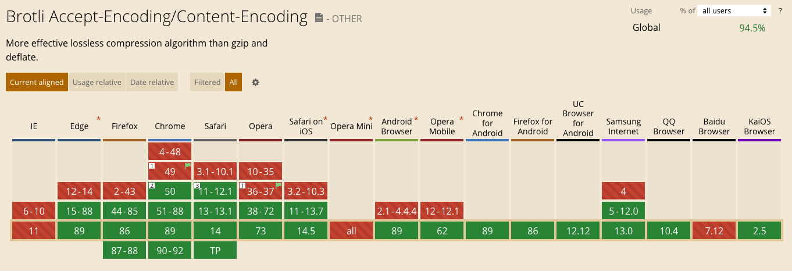
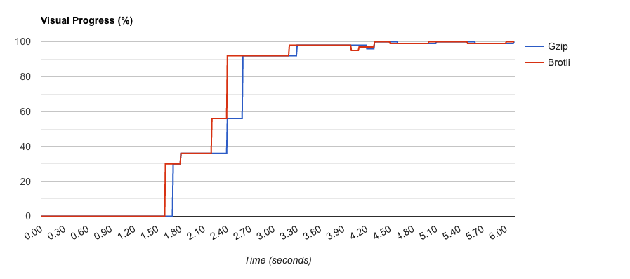
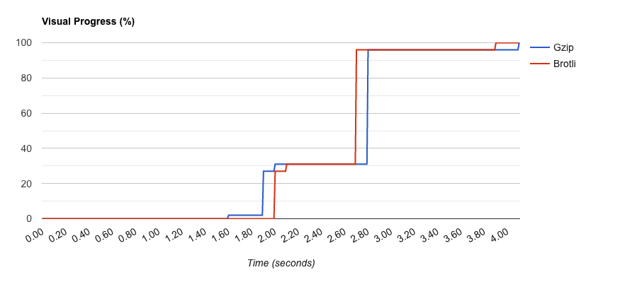
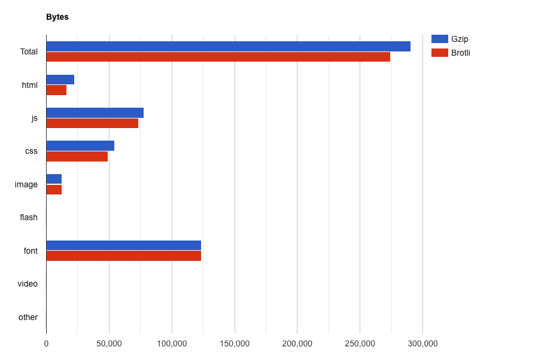
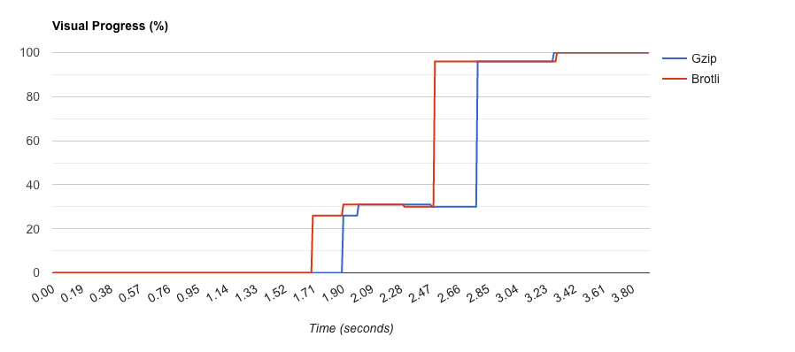
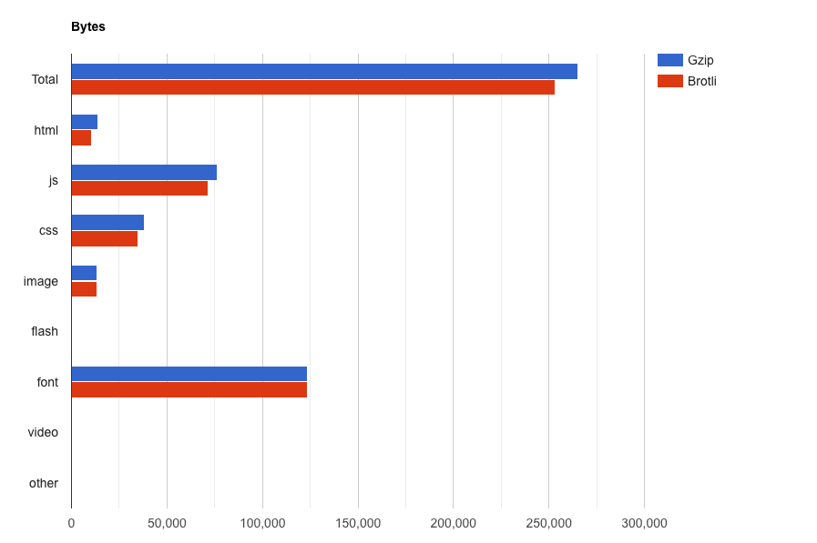
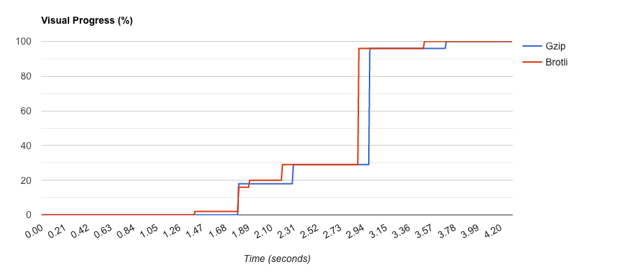
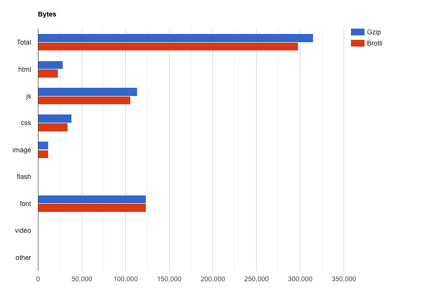

# Enable Brotli compression on GOV.UK

## Summary

Brotli compression is a new compression algorithm that is available in modern browsers that can offer 10-20% better compression over gzip compression. By enabling this option on the CDN users with browsers that support it will receive smaller static files over the wire (HTML, CSS, JavaScript), and those that don't will continue to receive assets that are gzipped.

## Problem

On GOV.UK we should always be looking to reduce the number of bytes a user has to download to view our pages. This is both good for web performance and data consumption on user devices. Any browser that supports WOFF2 fonts will also support Brotli compression (since this is the compression used in the fonts). According to the latest stats from [caniuse.com](https://caniuse.com/brotli), the Brotli `Accept-Encoding`/`Content-Encoding` functionality is supported by 95% of user browsers globally, and I expect this figure will actually be bigger if we only consider UK based users:

This compression has been enabled on both integration and staging. We saw the following savings in terms of total page bytes for HTML, CSS, and JavaScript across the frontend applications of GOV.UK:

| Page                               | Application             | Before (b) | After (b) | Diff (%) |
|------------------------------------|-------------------------|------------|-----------|----------|
| /                                  | frontend                | 259,371    | 248,653   | -4.13    |
| /coronavirus                       | info-frontend           | 288,650    | 272,687   | -5.53    |
| /browse/driving/driving-licences   | collections             | 278,385    | 265,832   | -4.51    |
| /contact                           | feedback                | 242,047    | 232,124   | -4.10    |
| /search/all                        | finder-frontend         | 313,400    | 295,979   | -5.56    |
| /bank-holidays                     | frontend                | 263,686    | 251,555   | -4.60    |
| /national-minimum-wage-rates       | government-frontend     | 266,699    | 254,073   | -4.73    |
| /info/coronavirus/business-support | info-frontend           | 233,133    | 226,382   | -2.90    |
| /licence-finder/sectors            | licence-finder          | 242,555    | 234,969   | -3.13    |
| /guidance/immigration-rules        | manuals-frontend        | 250,431    | 240,763   | -3.86    |
| /service-manual/service-standard   | service-manual-frontend | 254,529    | 245,881   | -3.40    |
| /additional-commodity-code/y       | frontend                | 250,664    | 240,974   | -3.87    |
| /government/people/theresa-may     | whitehall               | 277,888    | 265,642   | -4.41    |

These savings for the pages tested converted into the following performance improvements. All tested on a simulated Moto G4 mobile on a 3G connection.

### Homepage

The visual progress of the homepage has improved by approximately 110 ms as can be seen in the visual progress graph:

And we see the a reduction in bytes for all the expected assets:

### Coronavirus page

The visual progress graph for this page starts off worse by 400ms, but quickly catches up and the viewport for Brotli completes rendering 200ms before gzip:

And we see the a reduction in bytes for all the expected assets:

Showing a 5.53% reduction.

### Bank holidays

The visual progress of the bank holidays has improved by approximately 200ms as can be seen in the visual progress graph:

And we see the a reduction in bytes for all the expected assets:

Showing a 4.60% reduction.

### Search page

The visual progress of the search page has improved by approximately 400ms initially, 200ms at the end. As can be seen in the visual progress graph:

And we see the a reduction in bytes for all the expected assets:

Showing a 5.56% reduction.

### Summary 

In all the pages tested across the frontend apps (17 in total) we see between 3-6% reduction in the number of bytes a browser is having to download over the network. This saving is being converted to improvements in the visual metrics a users is seeing in the browser.

## Proposal

The proposal is to enable Brotli compression at the edge using the [Fastly Brotli Compression LA](https://www.fastly.com/release-notes/q3-2020#brotli). Browsers that support Brotli will receive these versions of the files. Any browsers that don't will receive the gzip version of the file. This can therefore be applied using the progressive enhancement methodology. In doing so we MUST update the configuration VCL so as to automate this process. During testing it was simply enabled via the Fastly user interface.

We SHOULD also purge the static cache once completed as it was found during testing that certain Fastly PoP's continued to serve the uncompressed version of the file since there was a mismatch between `Accept-Encoding` header from the browser and `Content-Encoding` version available on the CDN. Once the cache was purged this issue was rectified. However, this issue would rectify itself over time even without the manual purging, since Rails inserts an MD5 fingerprint into the filename of each file. Once a file is changed it will have a new URL, thus invalidating the old cache.
