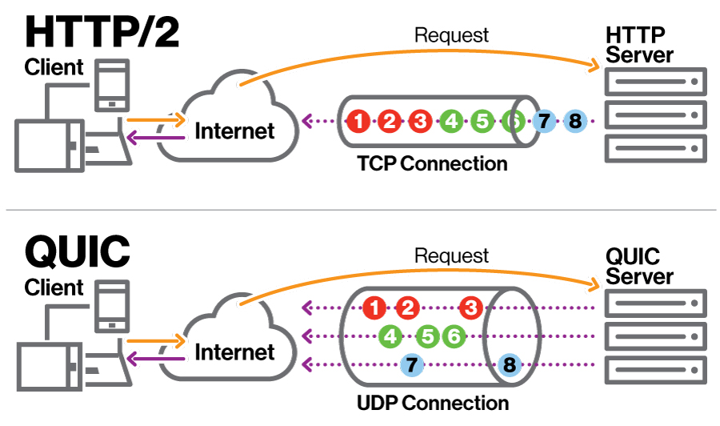
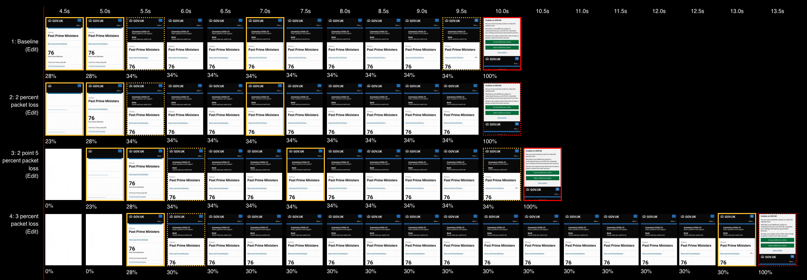
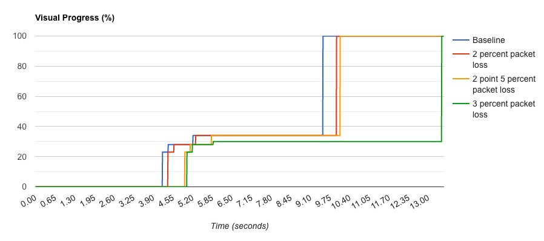
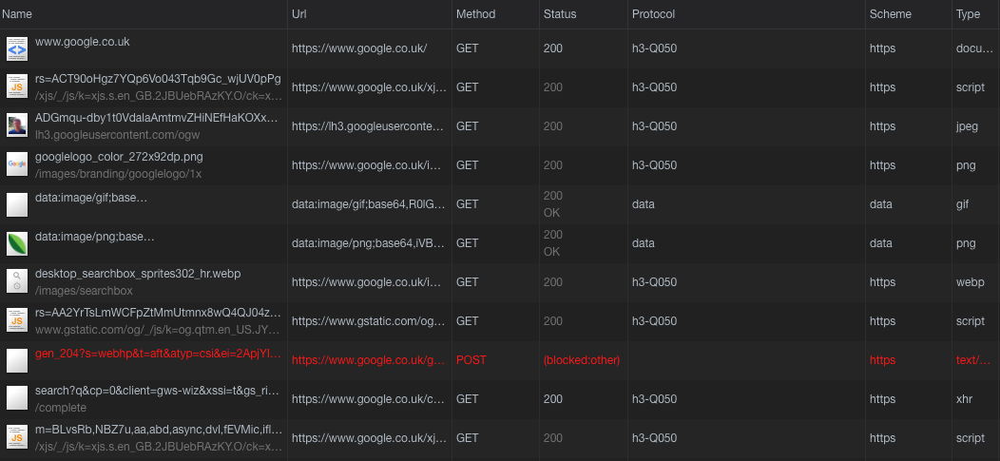
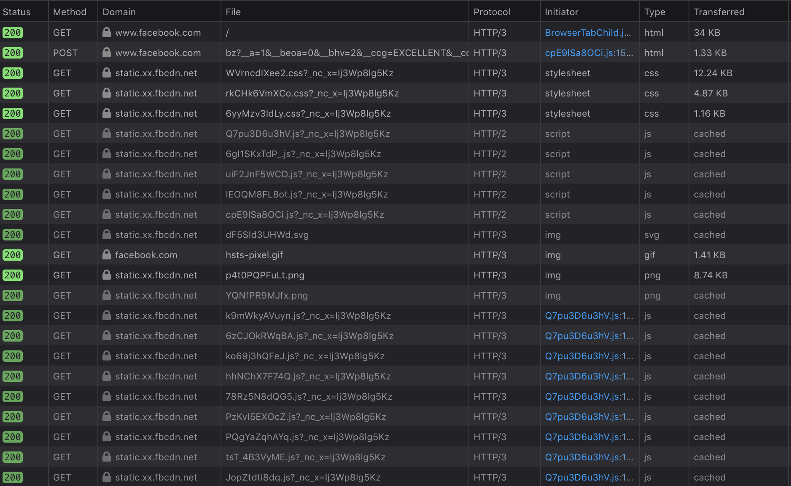

# Enabling HTTP/3 on GOV.UK

## Summary

HTTP/3 is the latest version of the HTTP protocol that is currently in use in production by Facebook and Google, as well as many others. It offers web performance improvements over HTTP/2, specifically when connections with high packet loss are being used. Users on unstable mobile connections and rural areas should see the most improvement with this new protocol adoption.  

## Problem

According to [MLab](https://www.measurementlab.net/)'s latest data the UK has a median download speed of 20 MBit/s and 7.2 MBit/s upload speed, as seen in their [dashboard data from October 2020](https://datastudio.google.com/u/0/reporting/12XddYj7__cZOaBF2RwplImw_ZdQQ5Nuw/page/9GTNB?s=tA4mKm65BqY&params=%7B%22df5%22:%22include%25EE%2580%25800%25EE%2580%2580IN%25EE%2580%2580United%2520Kingdom%22%7D). Exporting this dashboard data to a spreadsheet paints a [very different picture](https://docs.google.com/spreadsheets/d/1UTRucwLY2VC4944-cKunL9yUPJkjDKXDdIPk6GY3610/edit#gid=0). 

The data shows that there are parts of the UK that have connection speeds less than 0.3 MBit/s for both download, and upload. This is roughly equivalent to a 2G connection. It's worth noting that as these are median values, many users in these areas will be seeing much lower connection speeds than this in reality. These areas have a connection speed that is 98.5% slower than the median for the whole country. 

Users in these areas still have a need to access government services and the information that GOV.UK offers, but under these conditions it won't be a very pleasant experience. These are the users that will benefit from a transition to HTTP/3.

## Brief history of HTTP
Each iteration of the HTTP protocol has set out to improve the web performance of the previous version of the protocol.

### HTTP/1.0
The first version of the HTTP protocol came with a number of web performance issues, a primary issue being that only a single asset could be downloaded on a Transmission Control Protocol (TCP) connection before the connection was then closed. There was no way for these connections to persist for multiple asset downloads. This resulted in a lot of wasted negotiation time to establish separate TCP connections for each asset.

### HTTP/1.1
HTTP/1.1 fixed the persistent connections issue, allowing multiple assets to be downloaded over a single connection once established. Unfortunately this didn't fully solve the web performance issues seen with the HTTP protocol (stemming from the TCP layer). 

Under HTTP/1.1 the browser must download 100% of an asset before it can move onto the next asset. Meaning it can only download a single asset at a time per connection, the other assets are blocked. This is called Head-of-Line Blocking (HOL Blocking). Browser vendors quickly tried to solve this issue by allowing a browser to open up to 6 TCP connections per domain, so 6 assets can be downloaded in parallel.

Unfortunately a number of issues still exist with this method:

1. Most sites have many more than 6 assets per page, so HOL blocking is still occurring in almost every page load under HTTP/1.1.
2. Each TCP connection is independent and have no knowledge of each other. All 6 are fighting for limited bandwidth which in turn can saturate the network.
3. Many websites resorted to "domain sharding" (hosting assets across multiple domains), to allow a browser to open up more that 6 TCP connections. This in turn exacerbated the problem mentioned in point 2.

Another solution needed to be found.

### HTTP/2
HTTP/2 is a major iteration on the HTTP protocol. It started life as the [SPDY protocol](https://en.wikipedia.org/wiki/SPDY) created by Google, which was eventually used as the foundation for HTTP/2. One major shift in this version is the ability to multiplex stream assets over a single TCP connection. 

Each TCP packet now includes a set of "frames" that contains additional meta information about each stream. Each asset is downloaded over a separate stream and then reconstructed by the browser. This allows multiple assets to be downloaded at the same time over a single TCP connection, removing the HOL blocking at the application (HTTP) layer. An example of this setup can be seen in the diagram below: 

Source: ["Head-of-Line Blocking in QUIC and HTTP/3: The Details"](https://calendar.perfplanet.com/2020/head-of-line-blocking-in-quic-and-http-3-the-details/) by [Robin Marx](https://twitter.com/programmingart).

Unfortunately this didn't solve all the HOL blocking issues. HTTP/2 is built upon TCP: a protocol that offers the reliable transmission of packets. TCP's job is to make sure that the packets leaving one device arrive on the other device in exactly the same order, and with no missing packets. If packet loss occurs, TCP re-transmits the packets. Packets behind the missing packet cannot be processed until retransmission occurs, so all assets being transferred on that single TCP connection are held up.

This is where we are currently at with GOV.UK. The vast majority of users on strong, stable connections will have seen improved performance from enabling HTTP/2. Unfortunately, some users may have seen performance drop if they use a connection with high packet loss. This is due to the HOL blocking that now exists at the network layer. This is a primary issue HTTP/3 sets out to solve.

### HTTP/3
To solve the HOL blocking issue at the network layer, HTTP/3 uses a completely new transport layer protocol called QUIC. QUIC initially stood for "Quick UDP Internet Connections", but the IETF now don't use it as an acronym. It is simply the name of the protocol. QUIC is built upon the User Datagram Protocol (UDP), so isn't bound by the restrictions of TCP. It has been designed so that the network layer now understands the the concept of independent streams, which was restricted to the application layer under HTTP/2:

In the illustration above, if packet 2 is lost (using HTTP/2), packets 3-8 are blocked until retransmission occurs. Using QUIC if packet 2 is lost only packets 1 and 3 are blocked since they exist in the same stream. The other streams can progress as normal since they are fully independent. QUIC doesn't require in-order packet transmission across the whole connection, but it does still retain ordering within each resource stream.

## The effect of packet loss

Using WebPageTest we can roughly simulate the effect that packet loss has on performance for our users. For testing I picking a fairly content heavy page like the [past Prime Ministers](https://www.gov.uk/government/history/past-prime-ministers) page and a low spec Moto G4 Android device. For the connection speed I've picked on one of the worse case scenarios from the [MLab data](https://docs.google.com/spreadsheets/d/1UTRucwLY2VC4944-cKunL9yUPJkjDKXDdIPk6GY3610/edit#gid=0). I'm emulating the connection the village of Colintraive has, which reportedly has a 450/230 Kbps connection speed. This is a connection speed equivalent to a 2G or slow 3G connection.

### Visual filmstrip
Below we can see a comparison of the page load under different packet loss conditions using HTTP/2. The top is the baseline, with 0% packet loss, progressing all the way down to 3% packet loss:

As you can see, the visually complete metric sits at 9.5 seconds with no packet loss, but jumps to 13.5 seconds with 3% packet loss. This is a 42% increase.

### Visual progress graph
The visual progress graph clearly shows the effect packet loss has on page load times. As the packet loss increases, the page load slows down:

HTTP/3 + QUIC is designed to help improve the page load speed for users experiencing these connection conditions in the real world. 

### Connection quality measurement
Is it possible to measure the connection quality that our users are experiencing when visiting GOV.UK. Fastly provide a [range of Varnish Configuration Language (VCL) options](https://developer.fastly.com/reference/vcl/variables/client-connection/) that we can use to monitor the quality of user connections should we wish to capture this data:

- [client.socket.ploss](https://developer.fastly.com/reference/vcl/variables/client-connection/client-socket-ploss/) - An estimate of the packet loss on the current connection. Provides a ratio from 0-1. 0 = no loss.
- [client.socket.tcpi_rtt](https://developer.fastly.com/reference/vcl/variables/client-connection/client-socket-tcpi-rtt/) - The round trip time (RTT) for the current TCP connection to the client. RTT is used for loss detection and congestion control across the connection.
- [client.socket.tcpi_rttvar](https://developer.fastly.com/reference/vcl/variables/client-connection/client-socket-tcpi-rttvar/) - Measures the variance in RTT of the connection. The higher the variance value, the less stable the connection.
- [client.socket.tcpi_delivery_rate](https://developer.fastly.com/reference/vcl/variables/client-connection/client-socket-tcpi-delivery-rate/) - Gives a recent value for the delivery bandwidth to the client in bytes per second.

## Our Users

Since HTTP/3 + QUIC offers better performance for users on unstable connections, it is essentially fixing performance for those who were left behind during the transition to HTTP/2. These users are likely to be those who are in the most need of this performance increase. 

Since COVID-19 many people have had to work from home. Many will be in rural areas where high-speed internet access either isn't available, or is expensive. In more populated area many users could still be on ageing cable / DSL connections with [high contention ratios](https://www.broadbandchoices.co.uk/guides/broadband/what-is-contention-ratio). 

The aim of this transition to HTTP/3 is to allow an ever more diverse level of user connection quality to access GOV.UK, essentially maximising access for all users, no matter what connection they use. By focusing on the long-tail of our users with poor connections, we can effectively shorten it and in doing so make the internet "good enough" to use in more situations. This is all without effecting performance for users already on a good internet connection.

### Browser support
The support for HTTP/3 + QUIC in browsers currently isn't accurate on [Caniuse](https://caniuse.com/?search=http3). A PR to rectify this can be [seen here](https://github.com/Fyrd/caniuse/pull/5836). The browsers support for HTTP/3 at the time of writing is:

- Chrome - Enabled (see [Chromium blog](https://blog.chromium.org/2020/10/chrome-is-deploying-http3-and-ietf-quic.html))
- Edge (chromium version) - Enabled
- Firefox - Enabled in the next version (88)
- Safari 14 - Disabled (currently behind a feature flag)

Looking at the March 2021 analytics, approximately 55% of GOV.UK users are using a browser that can now take advantage of HTTP/3 + QUIC. Information about HTTP/3 and QUIC usage in Chrome can be [found here](https://blog.chromium.org/2020/10/chrome-is-deploying-http3-and-ietf-quic.html).

## Usage on the web

Although the HTTP/3 and QUIC specifications are still in draft, they are both used in production on large sites with billions of daily page views:

### YouTube
In the image below we see Chrome 89 (latest stable) connecting to YouTube and using `h3-Q050`. This is HTTP/3 with the latest version of Google QUIC (`Q050`).

### Google Search
In the image below we see Chrome 89 (latest stable) connecting to Google Search and using `h3-Q050`. This is HTTP/3 with the latest version of Google QUIC (`Q050`).

### Facebook
Facebook are using HTTP/3 and QUIC in production, but are using the IETF version of QUIC (`h3-29`). Below we see Firefox 88 connecting via HTTP/3:

## Other advantages to HTTP/3 + QUIC

I've only covered a single advantage related to packet loss with web performance above, but HTTP/3 + QUIC comes with a number of other advantages:

- Improvement in connection startup times via TLS v1.3 + [0-RTT](https://blog.cloudflare.com/introducing-0-rtt/)
- Better security via end-to-end encryption at the transport layer
- Establish an ecosystem that is easier to evolve from our current TCP usage

Eventually our users will also be able to take advantage of [Connection Migration](https://tools.ietf.org/id/draft-tan-quic-connection-migration-00.html), where QUIC end-points will be able to migrate connections to different IP addresses and network paths at will. Although realistically, this is likely a number of years away.

## Summary

Our move to HTTP/3 + QUIC offers web performance gains to users on unstable, high packet loss connections. These users were left behind in the migration to HTTP/2 across the web platform. These web performance gains will come with no loss in performance to users already on a strong, stable connection. All our users will have an improvement in security, as well as improvements in connection startup times. 

It has never been more important to fix issues for our long-tail users, since many will now be working from home due to the [Coronavirus (COVID‑19)](https://www.gov.uk/coronavirus). Users no longer working in an office environment may now be limited to unstable connections in rural areas, or tethering via limited mobile data plans, or using a connection in populated inner-city area with a high local contention ratios. 

Any browsers that don't support HTTP/3 + QUIC will fallback to HTTP/2 + TCP. Therefore HTTP/3 can be enabled using the progressive enhancement methodology.

## Proposal

Fastly currently have a Limited Availability (LA) programme open which is available to us. Enabling HTTP/3 + QUIC for us involves switching it on via the Fasty UI. No modifications are needed to our application code, or servers. And since we have already invested work in optimising for HTTP/2, we are already well prepared for a migration to HTTP/3. So no modifications are needed to our frontend applications.
