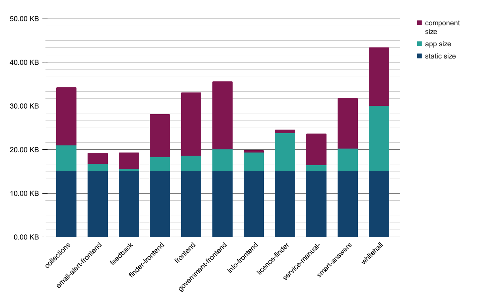
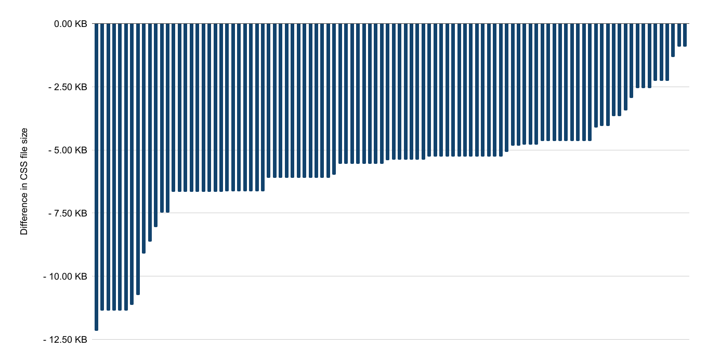

# Serve component CSS and JavaScript as individual files

## Summary

Component stylesheets and JavaScript should only be included for components present on a page on GOV.UK. This will lead to a reduction in page size, improve the ability of the browser to cache assets - which in turn improves performance for user journeys and return visits - and help reduce our reliance on manual asset auditing.

The eleven applications that render GOV.UK use the [GOV.UK Publishing Components][govuk_publishing_components] gem. This gem is the single source of truth for shared components used across GOV.UK.

Users that visit more than one page are likely to see pages rendered by different applications. Applications have unique but overlapping combinations of component use - this means that a user could download the same code in each application's concatenated stylesheets and JavaScript files when visiting pages rendered by different applications, despite the components being the same.

Because each application concatenates and appends a fingerprint string to an asset's filename, even a small change to a component will cause the filename to change - meaning that return visitors will no longer have the advantage of caching.

Currently asset auditing is a manual process that needs to be run locally. This means it's easy to miss when a component is no longer used, which leads to larger than needed stylesheets and JavaScript files being served to users.

This RFC builds upon ideas and implementations from:
* [RFC #91: Sharing assets][sharing_assets] (not implemented)
* [RFC #108: Include specific component assets in applications][specific_assets] (implemented)
* [RFC #115 : Enabling HTTP/2 on GOV.UK][http2] (implemented)

## Problems

### User journeys that visit more than one rendering app are inefficient

Four out of ten tracked visitors to GOV.UK in the past year have visited more than one page in a single session.

Each of the eleven rendering applications have different sets of CSS and JavaScript files containing both code specific to that application and code coming from shared components.

These four out of ten visitors are likely to have visited pages rendered by multiple applications - which means they have downloaded the same code more than once via different files.

For example, a three step journey can visit three different rendering applications:

1. Homepage, rendered by [frontend]
1. Search for "micro pig", rendered by [finder-frontend]
1. Micro-pig guidance page, rendered by [government-frontend]

Whilst there is shared code coming from [Static][static], CSS and JavaScript can still come from each individual application - which means there is overlap between the three applications' assets. In the previous three step journey example, there are 43 component's assets served; of which:
* 6 components are used in all 3 applications
* 16 components are used in 2 applications
* 19 components are only used in 1 application

That means that the code from 22 components is downloaded more than necessary.

The following graph shows the rendering application's CSS size and the breakdown of that CSS:



Around 15kB comes from the Static stylesheet - which is served from the same URI regardless of the rendering application, so can be cached by the browser and used again on all pages on GOV.UK.

The applications have bespoke CSS - this varies between half a kilobyte to 15kB. This CSS can't be shared, as it's for pages only rendered by that application.

The apps also have CSS that comes from the components that they use - this varies from half a kilobyte to 16kB. This is served in the rendering applications stylesheet - so a visitor who goes from app to app can't cache and then use these assets, despite the code being the same.

### A tiny change in one component can prevent the browser using the whole of a cached JavaScript and CSS file

GOV.UK doesn't take advantage of the fact that it serves CSS and JavaScript files with a long expiry header. Because the JavaScript and CSS is concatenated and fingerprinted, a change to one component will mean the filename will change.

For example, any change to the breadcrumb component would cause a change in the CSS file for six rendering apps. Any return visitors would need to download the entire stylesheet again - serving the files individually would mean that only the updated breadcrumb component stylesheet would need to be downloaded.

The component gem is released regularly - over the past year it's been released on average once every four days, but most releases were between one and seven days apart. Two thirds of repeat visitors to GOV.UK return within seven days and one quarter of repeat visitors return between 8 to 30 days. This means it is highly likely that returning visitors need to download the asset files again, regardless of how large or small any changes are.

### Auditing component use in applications is a manual process.

Each application only bundles the CSS and JavaScript for the components used - [see RFC #108 for more information][specific_assets].

Adding a component's CSS and JavaScript to an application's stylesheet and JavaScript is a manual process - which means that it's easy to forget to remove assets when a component has stopped being used in an application. We have auditing tools to help manage this - but they are not part of our deployment pipeline and rely on developers remembering to use them.

Supplying the assets that a component needs as part of the partial would mean that assets would only be included when the component is used - this would simplify the developer experience when adding or removing components from applications, and would also mean a better user experience since unused assets wouldn't be loaded.

## Proposal

Assets should be included individually on a per-component basis and included in the component partial.

This would mean that a page loads `component.css` and `component.js` only when a component is present on the page - rather than the current behaviour, which sees component assets loaded if used anywhere within an application. If multiple uses of the same component occur on the page, there should only be one instance of the assets included on the page.

### Keep the stylesheets in the head

Placing stylesheets in the `head` will ensure that all of the required CSS is downloaded and parsed before rendering begins. This is the current behaviour, so shouldn't be changed.

Whilst putting a `link rel="stylesheet"` into the body is [okay][link_stylesheet_is_body_okay], this would lead to too many changes at once, too many unknowns, and isn't considered best practice. If this proposal is implemented, further investigation could be carried to find out which is the better way of loading assets to improve painting performance.

### Keep JavaScript files just before the closing body tag

[Slimmer][slimmer] currently takes all `script` elements that don't have `defer` or `async` attributes and [moves them to the end of the markup][slimmer_moves_scripts]. This ensures that they are parsed and executed in a known order when the DOM is ready to be read. This behaviour shouldn't be changed.

### Shared assets

The assets should be placed in a folder that allows each application to reference them. The current behaviour has each application place their assets in a different folder - `/assets/collections`, `/assets/finder-frontend` etc. This prevents the browser cache from being used effectively as `/assets/collection/accordion.css` will be downloaded even if `/assets/finder-frontend/accordion.css` has already been downloaded.

A version identifier should be added to the component asset filename to help identify which version of the components gem is being used - for example `gem-v29-2-1-accordion.css`. Similarly, the bespoke app assets should be renamed to their application - so collections would have `collections.css` and `collections.js` - to make it easier to see which stylesheet comes from which application.

The assets would be placed in a shared folder so will be able to be used across GOV.UK irrespective of the rendering application. This feature is due as part of the replatforming work - but that should not block the serving of individual assets as there are performance advantages that don't rely on having a shared folder.

## Considerations

### Reduced compressibility when serving individual files

GOV.UK uses [Brotli compression][enable_brotli] when serving assets - this is a compression method that works really well on repetitive text like HTML, CSS, and JavaScript. Serving individual files will reduce the amount of compression available because the files will have less repetition in them. Since each page will only be serving the component assets required on the page - rather than the components used in the entire application - there should be a reduction in asset size.

To determine whether this is correct, I looked at the difference in CSS size for the top 100 most visited pages on GOV.UK over the past year (1 July 2021 to 31 June 2022). There was reduction in CSS size for pages[^1].

The largest change in component CSS size is -12.2kB, the smallest is -1kB, and the average decrease is 5.8kB; the graph shows the top 100 pages and the reduction in the amount of CSS for each page:




This means that all visitors will see a smaller page size, regardless of whether they visit one page or multiple pages. Six out of ten tracked visitors to GOV.UK only view a single page.

Concatenating the assets can provide a benefit for those that visit multiple pages - but this doesn't work on GOV.UK due to the number of rendering apps used and the current lack of a shared space to put assets.

### HTTP requests

The number of requests per page would go up - this shouldn't be a problem as [GOV.UK has HTTP/2 enabled][http2], and is due to have [HTTP/3][http3] enabled in the near future. During the past month 99.5% of tracked visitors used browsers that support HTTP/2, and 66.2% of visitors used browsers that supported HTTP/3.

Of the top 100 most visited pages on GOV.UK, the average number of components on a page is 19. The smallest number of components on a page is 9, and the largest number of components is 25. It's worth noting that most - but not all - components need a stylesheet (72 out of 78 components have a stylesheet) and not every component needs JavaScript (24 out of 78 components have a JavaScript file) - so adding a component to a page doesn't always mean two more requests are made.

It's worth noting that this change will lead to slower load times for browsers that only support HTTP/1.1 - even when considering the reduction in page size. ([More information on HTTP/1.1's limitations][http_limitations]). This will impact Internet Explorer 11 on Windows 8 and below; the first versions of Chrome, Firefox, and Opera that supported HTTP/2 were released in early 2015.

This balance between making the site load faster for a majority of users is not just a numbers game - the users who are most likely to be using older browsers are those that are likely to least afford the upgrade cost for a newer device, and they're likely to be the users who most need the information on GOV.UK.

Whilst this proposed change will make things slower for users whose browser doesn't support HTTP/2 or HTTP/3, it won't prevent pages from loading. This proposed change should be accepted because it will dramatically improve page performance for almost all visitors without blocking access for a small number of visitors.

### Non-rendering applications that use the components gem

There are applications that use the components gem but don't use Static and Slimmer - for example, publishing applications and the Govspeak gem.

These changes should be optional - even if this is the default behaviour, it should be able to be turned off at a component by component level and at an application level. This could be done with a helper method that checks both if the component has already been used, and if adding the component assets are allowed:

```ruby
# component_asset_helper.rb - pseudo code example:

def component_assets_allowed (component_name)
  # check:
  #  - if the component has already had the assets added to the page
  # - if the component assets loading method is allowed at an application level
  # - if the individual component has used an option to turn individual assets on or off
  @components_in_use.include?(component_name) || ENV.component_asset_loading !== "bulk" || use_individual_assets === true
end
```

## Other solutions that have been considered and rejected

* Put all components used across GOV.UK in one stylesheet and one JavaScript file - this increases page weight and doesn't solve cache invalidation
* Serve one stylesheet and one JavaScript file for all of GOV.UK - this increases page weight and doesn't solve cache invalidation
* Serve one stylesheet and one JavaScript file per template - this doesn't solve cache invalidation when one component changes
* Serve all component assets used in an application in individual files - this increases page weight for single page visitors, though often decreased it for people who visited more than one page

## Implementation process

Serving assets individually doesn't rely on the shared asset folder proposed in RFC 91 - so the lack of a shared folder is not a blocker.

* implement the individual serving of assets
   1. Stylesheets
   1. JavaScript, as this will require more investigation and relies on external factors
* once a shared folder is available, make all applications load assets from the shared folder

### Implement the individual serving of assets

Splitting this into two stages makes it more manageable and will allow improvements to be in stages.

The stages themselves can be split into app-by-app upgrades - once an app is upgraded the pages it renders will see performance improvements without relying on any other app also being upgraded. This is a similar approach to the work that was done to use the public layout component, so we know it can work - even if it takes time.

This shouldn't be done on a component by component basis - changing only one component on a page will likely cause an increase in page size as the individual component assets can't take advantage of compression.

There are more unknowns with the JavaScript implementation - and this aspect of the work may require further investigation and changes to applications.

It's worth noting that ES6 modules and import maps are the [direction of travel that Ruby on Rails is taking][rails_direction], so this could be the path of least resistance that this implementation could take. GOV.UK Frontend also offers module based imports now, and has plans to drop JavaScript support for Internet Explorer 11 in the near future. It'd be worth seeing how close to a decision these are before choosing a direction.

### Make assets load from a shared folder

A shared folder will be implemented as part of the current replatforming work - so each application will be able to [upload any assets to a shared location][shared_location_diagram].

Once the shared folder is available, each application would need to load all their assets from a shared folder to allow the browser to cache assets regardless of rendering application.

## Future plans

With more confidence in the cachability of the individual component assets, there are further improvements to the performance of GOV.UK that could be made, for example:

* preload assets based on most common next pages - similar to [guess.js][guessjs]
* lazy loading of component assets that aren't visible - for example, the footer and feedback components are always at the bottom of a page


[enable_brotli]: https://github.com/alphagov/govuk-rfcs/blob/6c16f831530be76a34954f30670035fcf7ae8ac1/rfc-138-enable-brotli-compression.md#L5-L6
[finder-frontend]: https://docs.publishing.service.gov.uk/repos/finder-frontend.html
[frontend]: https://docs.publishing.service.gov.uk/repos/frontend.html
[static]: https://docs.publishing.service.gov.uk/repos/static.html
[government-frontend]: https://docs.publishing.service.gov.uk/repos/government-frontend.html
[govuk_publishing_components]: https://docs.publishing.service.gov.uk/repos/govuk_publishing_components.html
[guessjs]: https://github.com/guess-js/guess
[http_limitations]: https://github.com/alphagov/govuk-rfcs/blob/95b4f967a43b24141c4cd0c7feb37f3c309e21c8/rfc-139-enable-http3.md#http11
[http2]: https://github.com/alphagov/govuk-rfcs/blob/95b4f967a43b24141c4cd0c7feb37f3c309e21c8/rfc-115-enabling-http2-on-govuk.md
[http3]: https://github.com/alphagov/govuk-rfcs/blob/95b4f967a43b24141c4cd0c7feb37f3c309e21c8/rfc-139-enable-http3.md
[link_stylesheet_is_body_okay]: https://html.spec.whatwg.org/multipage/links.html#link-type-stylesheet
[prerelease]: https://guides.rubygems.org/patterns/#prerelease-gems
[rails_direction]: https://world.hey.com/dhh/modern-web-apps-without-javascript-bundling-or-transpiling-a20f2755
[sharing_assets]: https://github.com/alphagov/govuk-rfcs/blob/95b4f967a43b24141c4cd0c7feb37f3c309e21c8/rfc-091-sharing-assets.md
[slimmer]: https://github.com/alphagov/slimmer/
[slimmer_moves_scripts]: https://github.com/alphagov/slimmer/blob/0968d5b715f949cc3ef5ac3fa1dcbababd7c2fd7/lib/slimmer/processors/tag_mover.rb#L8
[specific_assets]: https://github.com/alphagov/govuk-rfcs/blob/95b4f967a43b24141c4cd0c7feb37f3c309e21c8/rfc-108-including-gem-component-assets.md
[what_slimmer_does]: https://github.com/alphagov/slimmer/blob/0968d5b715f949cc3ef5ac3fa1dcbababd7c2fd7/docs/what-slimmer-does.md#tagmover

[^1]: Method - look at the markup present on the page. Search for all instances of `.gem-c-*` to get a list of all components being used and dedupe. Compile the Sass from the GOV.UK Publishing Components gem into individual CSS files for each component. Get the Brotli-compressed file size for each component, and add it to the application-specific CSS. Compare this to the current CSS file size for the application and Static.
