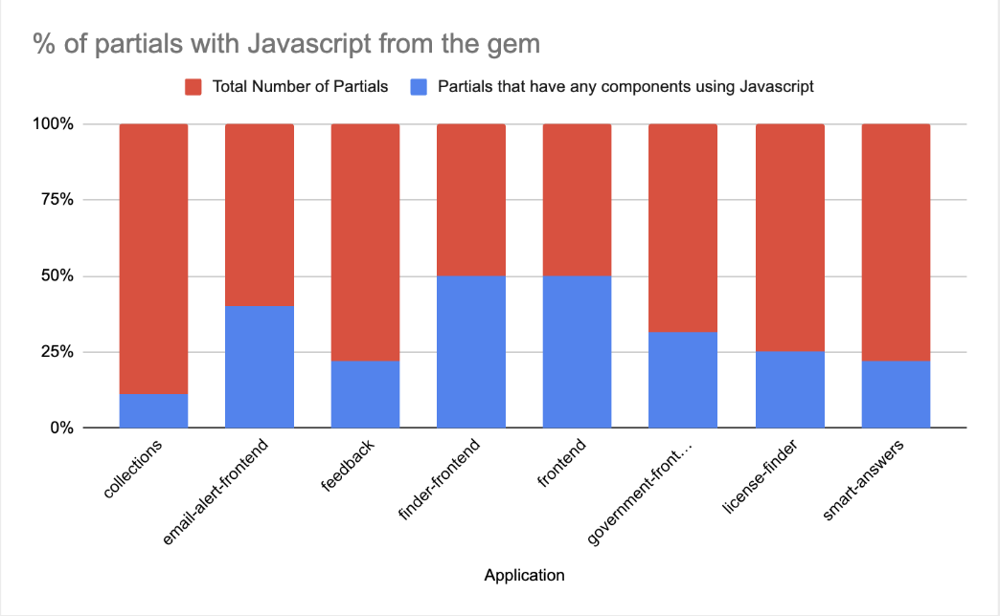
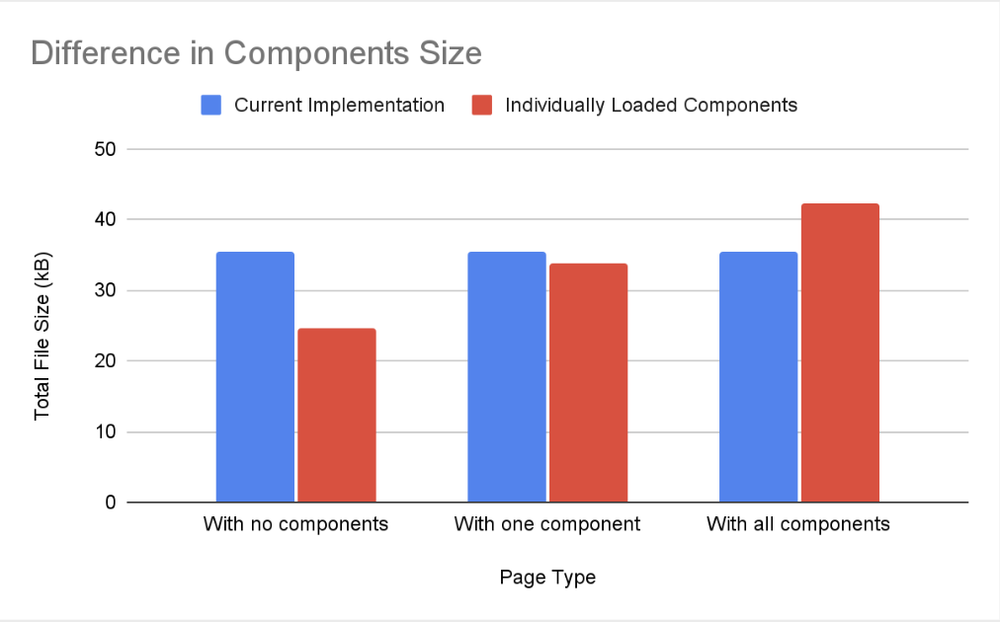
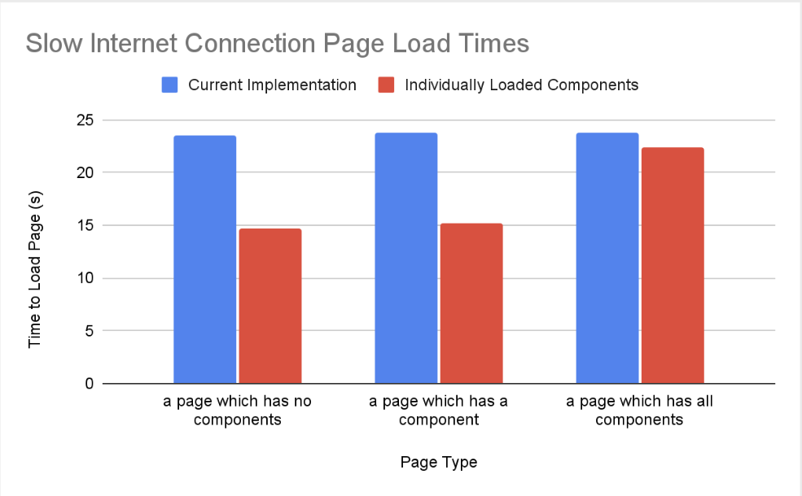

# Use ES6 Modules in govuk_publishing_components

## Summary

The approach to authoring JavaScript in [govuk_publishing_components](https://github.com/alphagov/govuk_publishing_components) should change from adopting the [ES5 standard](https://www.w3schools.com/js/js_es5.asp) to instead utilising the modular JavaScript introduced with [ES6](https://www.w3schools.com/js/js_es6.asp). This would mean govuk_publishing_components could use contemporary JavaScript, now supported for several years by the most popular browsers. Eventually, we should move the JavaScript over to a separate npm module. As intermediary step, we will integrate the bundler [Rollup](https://rollupjs.org/) using [jsbundling-rails](https://github.com/rails/jsbundling-rails). This would allow us to deliver separate Javascript files to our frontend applications, enabling [individual component javascript loading](https://github.com/alphagov/govuk-rfcs/blob/main/rfc-149-switch-to-per-page-asset-loading.md). Individual component javascript loading will allows to check browser support of different files as well as provide performance benefits to all of GOV.UK. In addition we can use Rollup to transpile ES6 Javascript to ES5 which could be used to enable analytics features to continue working with Internet Explorer, which has limited support for ES6.

This RFC builds upon ideas from:
- [RFC #149: Serve component CSS and Javascript as individual files](https://github.com/alphagov/govuk-rfcs/blob/main/rfc-149-switch-to-per-page-asset-loading.md)
- [This gem is coupled to sprockets/asset pipeline](https://github.com/alphagov/govuk_publishing_components/issues/505)

(Thanks to Kevin for providing lots of insight with Rails, govuk_publishing_components and being very helpful throughout the research process!!)

## Problem

### The future of IE11 support on GOV.UK

To support Internet Explorer 11 (IE11) all Javascript in govuk_publishing_components is written in the ES5 standard. This is because IE11 does not support ES6. However lately in the GOV.UK Frontend Community there have been calls to drop JS support for IE11. As of June 2022, [Microsoft no longer supports IE11](https://learn.microsoft.com/en-us/lifecycle/products/internet-explorer-11). From 24th of April to the 21st of May, the number of users that accessed GOV.UK using IE11 was 26,205. This is 0.067% of all users (38,821,598) who accessed GOV.UK during that time. The concensus in the community is that we should eventually drop support for IE11 but the timeline for this has yet to be established. Part of the complexity is that we would still want analytics to work for the not insigificant number of IE11 users.

### The next release of govuk-frontend

The next release of [govuk-frontend](https://github.com/alphagov/govuk-frontend) (which is used by components in govuk_publishing_components) is going to drop support for ES5. Instead it will only be available in ES6 and will target browsers that support `type="module"` script tags. This means to recieve future updates from govuk-frontend, govuk_publishing_components will need to support ES6. In addition, this change in govuk-frontend means that the components in govuk_publishing_components that depend on govuk-frontend will also now target browsers that support `type="module"`. This means that components will no longer run on older browsers (i.e. IE11) but we would like to still recieve analytics for browsers that don't support `type="module"`. This means we need to be able to provide Javascript to applications in a way that allows browser support checking for different Javascript files.

### Inability to load separate Javascript files

In each application on GOV.UK, Javascript is all imported in a single application.js file. This includes all the Javascript for every component used in an application. This application.js file is used on every page of the application, even if the page being visited uses a subset of all the components in an application. [RFC #149](https://github.com/alphagov/govuk-rfcs/blob/main/rfc-149-switch-to-per-page-asset-loading.md) proposed serving assets as individual files and while we have implemented serving CSS separately we are yet to implement serving JS separately.

### AssetPipeline is constrictive

Currently frontend rendering applications on GOV.UK install the gem as a dependency. In order to use the javascript in govuk_publishing_components, you have to use sprockets and the asset pipeline. It is not compatible with alternative methods of delivery. It means that the Javascript from govuk_publishing_components cannot be imported into other Javascript files in an application for extension.

### The future of AssetPipeline and Sprockets

The future of Javascript delivery in Rails seems to be one without AssetPipeline or Sprockets. In [this blogpost from 2021](https://world.hey.com/dhh/rails-7-will-have-three-great-answers-to-javascript-in-2021-8d68191b), the founder of Rails states that from Rails 7 there are 3 intended methods to include Javascript in your application (jsbundling-rails, import maps or moving rendering out of your Rails application entirely). None of these methods utilize AssetPipeline or Sprockets which suggests that while they are being used currently, there will come a time when they stop being maintained and we will have to move away from them. 

## Proposal

There's one significant change we should make to how we deliver Javascript in govuk_publishing_components but we can make an intermediary change which will put govuk_publishing_components in a better place for the significant change and mean that govuk_publishing_components will be able to use the ES6 modules from govuk-frontend:

- Intermediary change: use jsbundling-rails to integrate rollup in govuk_publishing_components and start delivering individual javascript files
- Significant change: move all Javascript to a separate npm module

### Intermediary change: use jsbundling-rails to integrate rollup in govuk_publishing_components and start delivering individual javascript files

Of the [methods proposed in the blogpost by the Rails founder](https://world.hey.com/dhh/rails-7-will-have-three-great-answers-to-javascript-in-2021-8d68191b), the one that makes the most sense for an intermediary change would be using the [jsbundling-rails gem](https://github.com/rails/jsbundling-rails) to integrate a bundler into govuk_publishing_components. The bundler would be able to transpile ES6 into ES5 and output individual files. This means govuk_publishing_components could use ES6, support the latest version of govuk-frontend, enable the invidual loading of Javascript in frontend applications and ensure analytics still works on older browsers.

[Rollup](https://rollupjs.org/) is a Javascript bundler that is used in govuk-frontend. It supports plugins and accepts a configuration file with handlers for specific events (such as when the transformed Javascript is being written to a file). Using js-bundling rails I was able to integrate Rollup into govuk_publishing_components.

#### Implementation (of the intermediary change)

I implemented a [prototype of govuk_publishing_components using jsbundling-rails](https://github.com/alphagov/govuk_publishing_components/compare/main...try-to-use-rollup) so I could see how it would integrate into our frontend applications. Additionally it meant that I could run performance testing to see how loading individual javascript files compared to our current delivery mechanism. What follows is my method of implementation.

##### 1. Install jsbundling-rails

The [jsbundling-rails gem](https://github.com/rails/jsbundling-rails) has to be added as dependency to govuk_publishing_components. It is a simple gem that adds rake tasks (for building and clobbering) and installs a specific bundler (esbuild, Rollup or Webpack). I determined that Rollup was best for the task at hand. This was based on my past experience with Webpack ([powerful but complex and difficult to maintain and integrate](https://blixtdev.com/you-dont-need-webpack-3-better-alternatives-for-building-your-javascript#what%E2%80%99s-wrong-with-webpack)) and trying out [esbuild](https://github.com/evanw/esbuild) (fast and lightweight but [limited options to customise ES5 output](https://github.com/evanw/esbuild/issues/297)). Rollup is still lightweight (in comparison to Webpack) but easily configurable due to its library of plugins and event handlers during build. It is also already used in govuk-frontend for building Javascript.

##### 2. Converting the Javascript to ES6

In govuk_publishing_components we use a ['module'-like implementation](https://docs.publishing.service.gov.uk/repos/govuk_publishing_components/javascript-modules.html) in which the Javascript of each component is self-contained in a function. This function is then assigned to the GOVUK window object and then the components are initialised using an "initAll" method which iterates through the components and runs each initialisation method.

As this 'module'-like pattern has already been implemented, the actual conversion to ES6 is straight forward. It would consist of wrapping the existing code in a `Class` and removing the `prototype` syntax.

```
(function (Modules) {
  function ModuleName ($module) {
    this.$module = $module;
  }

  ModuleName.prototype.utilityFunction = function () {}

  ModuleName.prototype.init = function () {}
})(window.GOVUK.Modules)
```
to 

```
Class ModuleName {
  constructor($module) {
    this.$module = $module;
  }

  utilityFunction() {}

  init() {
    this.utilityFunction();
    // rest of the init code...
  }
}

export default ModuleName;
``` 

In govuk_publishing_components, Javascript is used to add extra functionality (usually analytics) to components implemented in govuk-frontend. Currently the approach is to first initialise the govuk-frontend Javascript module of a component and then initialise the govuk_publishing_components Javascript module to add - for instance - extra analytics when a user clicks specific areas of the component. 

```
window.GOVUK.Component.init(exampleElement);
window.GOVUK.GemComponent.init(exampleElement);
```

With jsbundling we can simply this initialisation by using composition: 

```
import { Component } from 'govuk-frontend';

Class GemComponent {
  constructor($module) {
    this.govukFrontendComponent = new Component($module); // assign a variable to an instance of the component
    this.classNameOfElement = "class-name-of-element";
    // specific constructor code for the gem component
  }

  init() {
    this.govukFrontendComponent.init();  // initialise the instance of the component
    // specific init code for the gem component
  }
}

export default GemComponent;
```

```
window.GOVUK.GemComponent.init(exampleElement);
```

[I also considered using inheritance](#inheritance-vs-composition).

##### 3. Creating a Rollup configuration file

We now need to create a configuration file for Rollup:

```
const defaultConfig = input => ({
  input,
  output: {
    file: `app/assets/javascripts/govuk_publishing_components/components/${input.match(/(\w|-)+(?=\.js)/g)[0]}.js`,
    format: "umd",
    name: `GOVUK.Modules.${NameOfTheComponent}`,
    sourcemap: true,
  },
  plugins: [
    resolve(),
    buble(),
  ],
});

export default glob("app/assets/javascripts/govuk_publishing_components/components/src/*.js")
               .then(files => files.map(file => defaultConfig(file)))
```

With Rollup we can utilise a transpiler ([I used Bublé](https://buble.surge.sh/)) to convert our ES6 code into ES5. This means we can still have analytics run on IE11 and use [Uglify to minify our Javascript](https://github.com/privatenumber/minification-benchmarks#-results). Setting the output of the Javascript to [UMD](https://github.com/umdjs/umd/blob/master/templates/commonjsStrict.js) with a name of 'GOVUK.Modules.ComponentName' results in the component being [assigned to the window object that components are currently assigned to](https://docs.publishing.service.gov.uk/repos/govuk_publishing_components/javascript-modules.html#module-structure). [I also considered an alternative method in the appendix](#alternate-method-of-initialising-components).

The config uses the [glob package](https://github.com/isaacs/node-glob) to create an array of the paths of all the Javascript files we want to transpile. It then loops through the array for each Javascript file, transpiles the Javascript to ES5 using Buble and writes out the transpiled Javascript to individual files.

If we were to move the Javascript to be transpiled to `app/assets/javascripts/govuk_publishing_components/components/src/` and build the output in `app/assets/javascripts/govuk_publishing_components/components/` (as shown in the config above) it would mean we could make this change to govuk_publishing_components without having to update paths in frontend rendering applications. This is a [similar folder structure to what is used in govuk-frontend](https://github.com/alphagov/govuk-frontend/tree/main/packages/govuk-frontend/src). If analytics were also to be built by the bundler then a similar change to folder structure should be made (and those paths could be added to a [globStream](https://github.com/isaacs/node-glob#globstreampattern-string--string-options-globoptions--minipassstring--path)) although I would argue that [analytics does not necessarily need to be updated](#loading-analytics-code-individually). This script would be run on gem release so that an application could then include the generated Javascript files (similar to how node_modules are included).

##### 4. Update frontend applications to individually load Javascript

In order to load the JS for each component separately, we need to add the path of each component we are going to use to the manifest of a frontend application. Then we can add a script tag to the pages were the components are going to be used:

```
//= link govuk_publishing_components/path/to/component-name
```

then

```
  <%= javascript_include_tag "govuk_publishing_components/path/to/component-name" %>
```

If we were to follow this implementation method then we could augment AssetHelper instead of manually adding script tags to partials and paths to the manifest. AssetHelper already has this functionality for stylesheets, where the `add_component_stylesheet` function can update the manifest and add stylesheet link tags. We could add a new function for adding javascript to a partial:

`add_component_javascript("component-name")`

which would add

`<script type="module" src="path/to/component"/>`

similar to the format of `add_component_stylesheet("component-name")`. As the latest version of govuk-frontend is targeting browsers that support `type="module"` for components we use a script tag with the type module. Although analytics could also be individually loaded, [I would argue that for the intermediary change this is not required](#loading-analytics-code-individually).

[As well as the ability to test the support of a script, there are also performance benefits to individual loading of Javascript. In the performance tests in the appendix, I examine the differences in page load time and asset size if we were to switch to individually loaded Javascript](#performance-tests-of-Individual-javascript-loading).

### Significant change: Move all Javascript to a separate npm module

The intermediary change to govuk_publishing_components will solve the upcoming problem we have of needing to be able to use the ES6 modules of the latest release of govuk-frontend. However it doesn't solve the issue of the [developers of other applications being forced to use AssetPipeline and Sprockets to deliver Javascript](#assetpipeline-is-constrictive). A standard practice in other gems is to separate the Javascript into an npm package. This package then gets installed alongside the gem. If we made this separation, it would mean that the modules of the Javascript could be imported into projects and gives more flexibility to how developers can use govuk_publishing_components. It also means [applications can move away from an asset delivery mechanism that could be deprecated eventually](#the-future-of-assetpipeline-and-sprockets). If the intermediary changes are made to how Javascript is built then it would not be much more work to move it to a separate npm module as we could use the same configuration and bundler. However maintaining a separate package, rethinking how local development would work with that package and then updating the workflow of all our frontend applications would take some consideration (and is best addressed in another RFC).

Serving the Javascript as an npm module could also pave the way for other enhancements. As a separate module, the govuk_publishing_components Javascript could be delivered from the shared folder. This would mean that applications would not require their own copies of components and they could cache the shared components Javascript. It would also pave the way for import maps to be used when they are more widely supported by browsers. Other benefits to having a separate module would be allowing apps to use tree-shaking and accurate source maps. [Tree-shaking](https://web.dev/reduce-javascript-payloads-with-tree-shaking#what-is-tree-shaking) could be used to reduce total file sizes if applications import both govuk-frontend and govuk_publishing components as modules. [Source maps]() would make debugging significantly easier, currently it is difficult to determine where errors occur in Javascript code.

### Rollout of intermediary change

This change would be made to govuk_publishing_components but no immediate changes would need to be made to frontend applications. This is because:

- [the window object that components are being assigned to is not being changed](#creating-a-rollup-configuration-file)
- [the initialisation method is not being changed](#converting-the-javascript-to-es6)
- [we are still transpiling to ES5](#creating-a-rollup-configuration-file)
- [we are outputting the built Javascript to the same directory that the Javascript is being imported from](#creating-a-rollup-configuration-file)

As the [process of adding the bundler to govuk_publishing_components is straightforward](#install-jsbundling-rails) and [changes required to update the component Javascript are minimal](#converting-the-javascript-to-es6) I would propose that we make the required changes to govuk_publishing_components in a single branch. 

We would then need to make changes to AssetHelper to add extra functionality for adding Javascript script tags to partials. As the work has already been done here for stylesheets from govuk_publishing_components however this would be very straightforward. This can be done seperately from integrating the bundler as applications would still be able to deliver Javascript as they currently are until the change has been made to AssetHelper.

Although the individual loading of Javascript will require [making changes to frontend applications](#update-frontend-applications-to-individually-load-Javascript) that have govuk_publishing_components as a dependency, these changes can be staggered and do not need to be made simultaneously. A caveat here however is that if we wait until the next release of govuk-frontend then if this change is made without updating frontend applications then Javascript will crash ungracefully on browsers that don't support `type="module"` that try to run components that have govuk-frontend components as a dependency. 

### Conclusions

#### Implementation

The process outlined above to make govuk_publishing_components compatible with ES6 Javascript is not complex and will not require immediately updating the applications that depend on it*. The process to convert individual files to ES6 involves minor modifications and we already have the AssetHelper to make the process of adding individual Javascript loading straightforward. The result of this upgrade will be that govuk_publishing_components will support the latest version of govuk-frontend, allow developers to use ES6 and move govuk_publishing_components away from an asset delivery system that will - seemingly - eventually be deprecated. It also makes he transition to delivering Javascript separately from a rails application more straightforward and would make using import maps a possibility (in the future).

*: if we make the changes to govuk_publishing_components before the next version of govuk-frontend

#### Performance

Switching to individually loaded components would result in [decreased file sizes for pages that use a subset of the components](#total-file-size). It also results in [faster load times on slow connections for pages that use some or no components](#time-to-load). This would be beneficial for users who have slow connections or low data limits.  For pages that use a lot of components, the time to load a page is not significantly impacted due to GOV.UK using HTTP 3.0. This means that even though a page might request more individual files, they can be loaded simultaneously.

The worst performing test for the new delivery mechanism of Javascript was "a page that loads all the components in an application separately". It had a higher file size than the current delivery mechanism and a time to load that was similar to the current delivery mechanism (for both connection speeds). What I didn't know before running the tests was what the average number of components using Javascript per partial was on GOV.UK. After seeing the results of the tests, I thought it this would be a relevant figure to have. If I could work this out then I could better extrapolate how the changes would impact GOV.UK as a whole. A summary of the results follows, but I have included the full results as part of the RFC:



| Application | Avg. No. of Javascript Components Per Partial with Javascript Components |
| ----------- | ----------- |
| collections | 2 |
| email-alert-frontend | 1 |
| feedback | 2 |
| finder-frontend | 2 |
| frontend | 2 |
| government-frontend | 2 |
| license-finder | 1 |
| smart-answers | 1 |

[For the full results, please see the included output of the function](/rfc-160/040723-survey-of-js-using-partials.json).

To get these results, I added a [new function to the components audit in govuk_publishing_components](https://github.com/alphagov/govuk_publishing_components/compare/workout-avg-components-using-js-per-partial-on-all-apps?expand=1#diff-a89ea70a9fdb9795d633f2ae337de6aed64cfef61cdc5c5f8c91eefefea88eaaR288). A caveat with this method is that generally an entire page will be compromised of several partials. The partials that make up pages could also have the same Javascript utilising components, meaning the javascript wouldn't need to be included multiple times in the combined page. Based on the low average number of javascript components per partial and the small percentage of partials that have any javascript components at all, it is safe to say that it is likely that the majority of pages on GOV.UK have a smaller number of components than the "a page which has all components" test above. Therefore we can say that "a page which has all components" is an edge case and serves more as an example of a worst cast scenario than a real example of a page. We can also say that most pages will benefit sigificantly from a lower script size and faster load times on slower connections.

For "a page which has all components", two of the components (accordion and details) have govuk-frontend components as a dependency. Both of these components currently contain substantial polyfill for features such as classList and Element. The latest version of govuk-frontend will [target a newer browser baseline than previous versions](https://github.com/alphagov/govuk-design-system-architecture/pull/25). This baseline excludes Internet Explorer and so will result in a reduction in polyfill. The preliminary reduction in pre-compression file size between the previous components and the work-in-progress latest components can be up to 50%. This will mean that the file sizes for 'accordion' and 'details' will be smaller (if govuk_publishing_components also does not target Internet Explorer with components decide not to polyfill components for Internet Explorer 11).

## Appendix

### Inheritance vs Composition

By converting components to classes, we have two approaches to incorporating modules from govuk-frontend:

##### 1. Composition

```
import { Component } from 'govuk-frontend';

Class GemComponent {
  constructor($module) {
    this.govukFrontendComponent = new Component($module); // assign a variable to an instance of the component
    this.classNameOfElement = "class-name-of-element";
    // specific constructor code for the gem component
  }

  init() {
    this.govukFrontendComponent.init();  // initialise the instance of the component
    // specific init code for the gem component
  }
}

export default GemComponent;
```

##### 2. Inheritance

```
import { Component } from 'govuk-frontend';

Class GemComponent extends Component {
  constructor($module) {
    super($module);
    
    // if Component already has this.classNameOfElement assigned, we could inherit and remove the assignment line
    // this depends on what becomes private and what stays public in the new version of govuk-frontend

    // specific constructor code for the gem component
  }

  init() {
    super() // initialise Component first
    // specific init code for the gem component
  }
}

export default GemComponent;
```

Of these two approaches, **composition** currently makes the most sense. Inheritance would create challenges to the maintenance of the Javascript in govuk_publishing_components, as it would make it less obvious where code is coming from. In addition the components in govuk_publishing_components could be adversely affected by changes made to the Javascript in govuk-frontend, such as functions or variables being made private or the implementation of inherited functions changing. Currently there is no base class that components inherit from in govuk-frontend, meaning that including multiple components seperately in a partial will not result in duplicated code.

### Alternate method of initialising components

We can customise how we export the Javascript using a custom event handler to change how the resulting file is written. This would allow us to inject code into the resulting file. An alternative method to using the existing window object, was adding a line of code to automatically initialise all instances of the component on the page if the script was included:

```
// transpiled code of NameOfModule
document.querySelectorAll('[data-module*="${name-of-module}"]').forEach(function (el) {
  var instance = new ${NameOfModule}(el);
  instance.init();
})
```

For ease of integration I thought that using the existing initalising system and window object would be for the best.

### Alternate method of testing support for components

The target browsers for the new version of govuk-frontend will be ones that support `type="module`. An alternative to loading the scripts individually would be adding a support test in the initialisation of each component module. This would add a lot of repeated code to component javascript and individual loading of Javascript has performance benefits as well as support testing.

### Loading analytics code individually

As analytics are loaded on every page however I would argue that we (currently) don't need to update how they are built and delivered in the same way that components need to be. Analytics are already written in ES5 (and include polyfills for IE11). In addition, as they are all included together they would probably benefit being bundled together instead of being delivered seperately (as optimizations from Rollup such as tree-shaking could be used). Therefore the integration of a bundler could still benefit analytics but in a different way to components. Applications will still use AssetPipeline to deliver Javascript with the intermediary changes until we make the change to split the Javascript out of govuk_publishing_components entirely. 

### Performance Tests of Individual Javascript Loading

What follows is the results of a performance test of an application using the indvidually loaded javascript files. The application I choose to test the changes on was [collections](https://github.com/alphagov/collections). This is because it had a [good example of a page with no components](https://www.gov.uk) and [a page with one component (accordion) that requires a large javascript file](https://www.gov.uk/coronavirus). 

#### Method

I removed the [lines that import components from application.js](https://github.com/alphagov/collections/blob/main/app/assets/javascripts/application.js). Collections uses the following components from govuk_pubishing_components:

- [Accordion](https://components.publishing.service.gov.uk/component-guide/accordion)
- [Details](https://components.publishing.service.gov.uk/component-guide/details)
- [Govspeak](https://components.publishing.service.gov.uk/component-guide/govspeak)
- [Image Card](https://components.publishing.service.gov.uk/component-guide/image-card)
- [Metadata](https://components.publishing.service.gov.uk/component-guide/metadata)
- [Step by step nav](https://components.publishing.service.gov.uk/component-guide/step-by-step-nav)

Then I added to the manifest the paths of the individual javascript files. To include a component in the partial I was testing, I added the script tags of the component I wanted to add. [The changes I made to collections for testing can be seen on this branch](https://github.com/alphagov/collections/compare/main...use-rollup-mods).

I tested performance on three types of pages:

- a page which has no components (Browse, www.gov.uk/browse)
- a page which only has one component (Coronavirus (www.gov.uk/coronavirus))
- a page that has all the components (there are no examples of pages that use ALL the components in collections, so I just added them all to the Coronavirus page)

What I wanted to test was the difference in how long it takes the page to load on 'normal' and 'slow' internet connections and also the difference in total size between the separate components and all components in one application.js file. I also deliberately chose a component with one of the largest javascript file sizes in govuk_publishing_components to take into an account a 'worst case scenario'.

The time to load pages test was carried out by comparing the pages loading on a throttled "slow 3G" network in Chrome to a non throttled network, with caching disabled to simulate the first time a user visits a page (or a user visits a page of an application that has been recently redeployed).

#### Summary of Results

##### Total File Size



##### Time to Load



The differences on a fast connection between the two methods have been omitted here (as they were too similar to graph. All the results can be seen in the [Appendix](#full-results-from-tests).

##### Note about file sizes

application.js (of collections) still includes Javascript for different pages than the user is actually on. In collections there are three additional modules for specific pages (which will not be used on every page). If we included the javascript only on the specific pages that needed it, this would make application.js a smaller size. See the appendix for a breakdown of sizes per componenta and highlighting of which components would be impacted by this change.

#### Full Results from Tests

#### Total File Size

##### Before

For a page with no components/For a page with one component/For a page with all components

| File          | Size        |
| -----------   | ----------- |
| collections/application.js| 20.1kB |
| static/application.js| 15.4kB |
| **Total File Size** | **35.5kB** |

There's no difference between different pages because on all pages we include all javascript.

##### After

For a page with no components

| File          | Size        |
| ----------- | ----------- |
| collections/application.js | 9.1kB |
| static/application.js | 15.4kB |
| **Total File Size** | **24.5kB** |


For a page with one component

| File          | Size        |
| ----------- | ----------- |
| collections/application.js | 9.1kB |
| static/application.js | 15.4kB |
| gem-accordion.js| 9.3kB^ |
| **Total File Size** | **33.8kB** |


For a page with all components

| File          | Size        |
| ----------- | ----------- |
| gem-accordion.js| 9.3kB^     |
| gem-details.js| 3.9kB^     |
| govspeak.js| 326B     |
| image-card.js| 348B     |
| metadata.js| 367B |
| step-by-step-nav.js| 3.5kB |
| collections/application.js | 9.1kB | 
| static/application.js | 15.4kB |
| **Total File Size** | **42.24kB** |

^: file size that will be smaller with the upcoming changes to govuk-frontend

#### Page Load Test

##### Current Delivery Mechanism of Javascript

| Page Type | Connection Speed | Total Time to Load (s) |
| ----------- | ----------- | ----------- | 
| a page which has no components | slow | 23.53 |
| a page which has no components | fast | 5.48 |
| a page which has a component | slow | 23.80 |
| a page which has a component | fast | 5.54 |
| a page which has all components | slow | 23.80 |
| a page which has all components | fast | 5.54 |

##### New Delivery Mechanism of Javascript

| Page Type | Connection Speed | Total Time to Load (s) |
| ----------- | ----------- | ----------- | 
| a page which has no components | slow | 14.64 |
| a page which has no components | fast | 5.56 |
| a page which has a component | slow | 15.14 |
| a page which has a component | fast | 5.53 |
| a page which has all components | slow | 22.42 |
| a page which has all components | fast | 5.32 |
