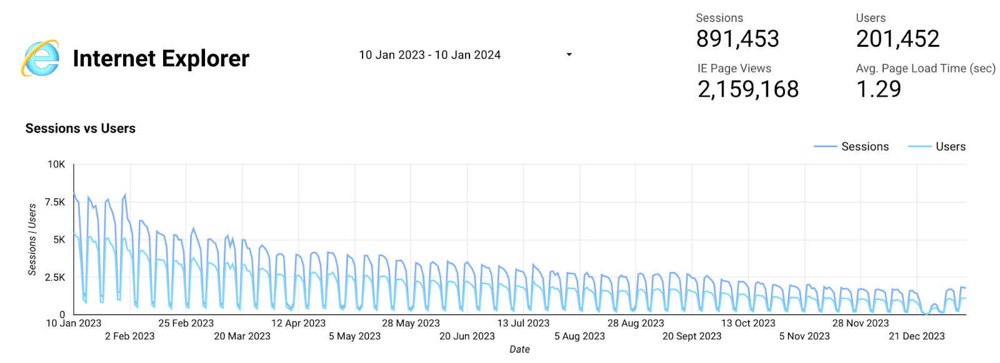
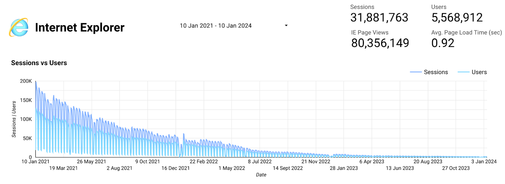

# Remove JavaScript support for legacy browsers

## Summary

This RFC proposes removing JavaScript (JS) support for old (legacy) browsers such as Internet Explorer across the GOV.UK website. This is because:

- the browsers in question are no longer supported by their vendors
- we cannot offer these browsers an entirely equal experience because `govuk-frontend` has already dropped JS support for legacy browsers
- the percentage of users likely to be affected is well below 1%, and will not increase
- we build progressively and the site will remain legible, navigable and usable for all users regardless of this change

The benefits of this are:

- reduced burden on developers to write extra code to support legacy browsers
- minor performance improvements for other users as we stop branching code and including polyfills
- we can embrace modern JS techniques, which could improve and simplify our code

The drawbacks are:

- users of legacy browsers will no longer be included in our analytics tracking

## Problem

This RFC is taking a broad approach to legacy browsers, but the main point of contention is likely to be Internet Explorer 11, the legacy browser with the most significant number of ongoing visitors.

At the time of writing the service manual (which was last updated in 2022) says "You will still need to support Internet Explorer 11 if your analytics data shows at least 2% of your users arriving at the service's start page are using it." It [recommends testing](https://www.gov.uk/service-manual/technology/designing-for-different-browsers-and-devices) only in Edge of all the Microsoft browsers.

The Design System team have updated `govuk-frontend` to use [ES modules in version 5](https://frontend.design-system.service.gov.uk/importing-css-assets-and-javascript/#javascript), released in 2023. [ES modules](https://developer.mozilla.org/en-US/docs/Web/JavaScript/Guide/Modules) are not recognised by legacy browsers, notably Internet Explorer 11 and below. These browsers are no longer supported by Microsoft. We need to keep up to date with `govuk-frontend`, which means deciding how we approach JS support for IE11. The Design System has their own definitions for [browser support](https://frontend.design-system.service.gov.uk/browser-support/).

The presence of any modern JS such as ES modules will cause errors for older browsers. This is because they will attempt to parse all JS before running it, encounter unfamiliar syntax, and error. No JS will run on older browsers once any modern JS is introduced, which means that any download of JS will be wasted.

## Proposal

The proposal is to embrace modern JS so that legacy browsers do not download any JS but see the non-JS version of GOV.UK. This should still provide a usable experience of the site as the site is built using the principle of progressive enhancement. This will also reduce page weight for those browsers and allow us to embrace modern JS techniques, leading to further code improvements in future.

We should implement ES modules initially, with further work done later to potentially use other modern JS techniques. This will be done on a problem solving basis rather than upgrading everything - we will identify issues and look at how modern JS could solve them.

Legacy browsers will not download any JS imported using the modules syntax. This would work as follows:

- the HTML includes a JS file that imports code from other JS files using module includes
- most browsers download and execute this code as normal, pulling in the code from the other JS files
- legacy browsers download this one file but don't recognise the imports and therefore don't import anything else, resulting in a minimal JS download weight and a non-JS version of GOV.UK

In practice this looks something like this.

```HTML
<script type="module" src="application.js"></script>
```

```JavaScript
// application.js
import './module1.js';
import './module2.js';
```

```JavaScript
// module1.js
// code here will only run in modern browsers
alert('hi');
```

Legacy browsers will only download `application.js` and no other JS files.

### Alternative options

For clarity here are the other options available to us, which we are not proposing.

#### Don't upgrade

This isn't a valid option. We need to keep up to date with `govuk-frontend` and all the functional and accessibility improvements this will bring.

#### Upgrade, but don't use modern JS

`govuk-frontend` includes an [option for not using ES modules](https://frontend.design-system.service.gov.uk/importing-css-assets-and-javascript/#import-javascript-using-alternative-module-formats) but this will result in larger JS files, which would reduce the performance of GOV.UK. Support for this option may not continue indefinitely.

Our initial upgrade to version 5.1 will not use ES modules, instead splitting anything that uses `govuk-frontend` into its own bundle, using the `type=module` attribute (these files will be referenced through `es6-components.js`).

#### Upgrade, but ignore the needs of legacy browsers

Although users of legacy browsers represent only a very small percentage of the overall traffic on GOV.UK we have a responsibility to ensure that all visitors to the site have access to the information they need. We follow the principle of progressive enhancement, which means that the site should be usable from only the HTML - the addition of CSS and JS should be considered enhancements to improve the site, not an essential part of the system.

If we ignore the needs of legacy browsers entirely we risk making the user experience for people with those browsers worse.

#### Upgrade and make all the things work in legacy browsers

It isn't possible to make legacy browsers understand modern JS, but it might be possible to write all of our code using modern JS and use a tool such as Babel to transpile it into older syntax.

While this might be possible, we do not currently have this as part of our build pipeline and considerable effort would be required to introduce it. This would also significantly increase the size of our JS, as it would include additional code to polyfill modern functionality - we would be making GOV.UK slower for everyone for the benefit of a very small minority. We would also lose the ability to embrace modern JS techniques.

#### Upgrade, keep some things working for legacy browsers

While many of our components would rely on ES modules JS from `govuk-frontend`, a lot of our other code does not, and could in theory still work. This would mean legacy browsers would experience some but not all of the JS enhancement of the site.

While this might be possible, the developer burden of maintaining these two parts of the JS would be unsustainable, for little reward.

### Notes on legacy browsers

#### Legacy browser usage on GOV.UK

Internet Explorer usage from 11 Dec - 10 Jan 2024.

- Sessions: 31,320 out of 82,474,794 = 0.0379%
- IE Page Views: 77,541 out of 184,555,129 = 0.0420%
- Users: 10,621 out of 30,991,823 = 0.0342%

The graphs below show Internet Explorer usage statistics for a much wider period. They are included to show the gradual decline in use of this browser.





#### Loss of analytics for legacy browsers

Moving to a model where legacy browsers don't run any of our JS means that analytics code will no longer work for these browsers. This means that we will no longer have an easy way to measure user numbers for Internet Explorer in particular.

The analytics code was written specifically for GOV.UK and does not rely on `govuk-frontend`. It depends upon the cookie banner code, which is also custom GOV.UK code independent of `govuk-frontend`. This means we could leave this code as-is and continue to have analytics on legacy browsers. The proposal is not to do this, for the following reasons.

- the effort/JS size issues already mentioned
- use of legacy browsers is already very low and will only get lower with time
- users of legacy browsers do not behave inherently differently from other users and the insight gained from tracking them is no more useful than any other browser users
- alternative methods for determining legacy browser numbers could be explored if required
- informal discussion with performance analysts suggests that losing analytics for legacy browsers does not represent a problem
