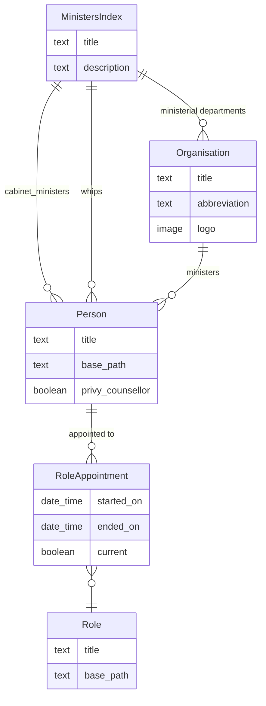
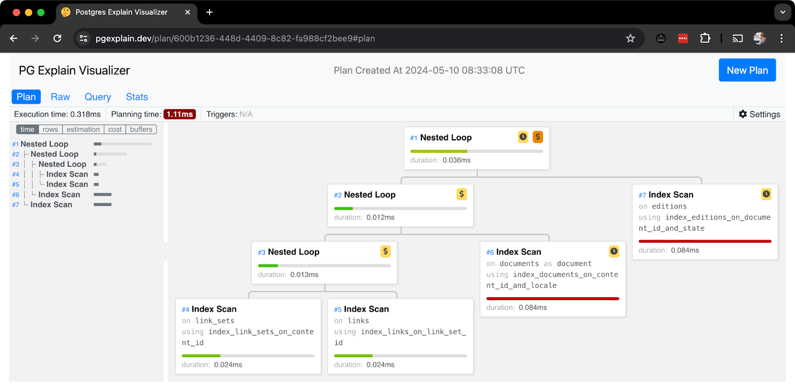

# GraphQL for GOV.UK

Summary
-------

We propose adding a new [GraphQL][graphql] content delivery API to GOV.UK. This API would provide a read-only view of GOV.UK's content, similar to the existing [content-store][content-store] API, but supporting much more flexible queries. In particular:

-   Selecting only the subset of fields relevant to the client

-   Dynamically following links between content relevant to the client, for example on /government/ministers index page [listing the ministers, and for each minister all of the roles they currently hold](#query-to-get-the-content-on-the-ministers-index-page)

-   Aggregations of content, for example [listing governments](#query-to-list-governments) or [listing documents related to a topical event](#query-to-list-documents-related-to-a-topical-event)

The implementation of this API would avoid many of the issues which make GOV.UK's current [publishing-api][publishing-api] / [content-store][content-store] / [search-api-v1][search-api-v1] architecture so complicated. In particular, it would avoid precomputing link expansion at the point when documents are published, and instead collect the links relevant to the client at query time. Similarly, with appropriate indexes in place, the API would cover many (or possibly all) of [the use cases we have for search-api-v1][search-api-v1-use-cases] and its associated Elasticsearch database.

Our hypothesis is that in the long run, this GraphQL content delivery API could fully replace both the content-store API and search-api-v1, resulting in a significantly simpler technical architecture.

This simplicity would pay dividends by making many types of development work significantly easier - for example introducing new content types, particularly for modelling complex structures, would be much easier because the developer would not need to modify things like link expansion rules in publishing-api.

A GraphQL API would also better support emerging use cases such as mobile applications, where over-fetching data is a problem because the client may be on a slow network, or be paying for their own data (compared to our current API clients, which are servers inside our AWS infrastructure).

This proposal supports GOV.UK Publishing's strategy to "model content to reduce duplication of content/effort and enable reuse across multiple channels". While it's not strictly a requirement for content modelling or content reuse, the potential benefits in terms of simplicity and flexibility make it a potentially valuable thing to investigate.

Problem
-------

There are several problems with GOV.UK's current APIs which this proposal would look (eventually) to address. Most of these are to do with technical complexity, so in some ways this proposal can be seen as a refactoring with the aim of simplifying GOV.UK's architecture.

This isn't entirely simplification for simplifications sake though, as there are some features which GOV.UK is currently missing which we expect would be significantly easier to add with the proposed architecture compared to the current architecture.

We're also considering new use cases, such as native mobile applications which may benefit from a more flexible API which doesn't overfetch data over slow mobile network connections.

### Opportunities to reduce complexity

#### Multiple views of the same data

GOV.UK's technical architecture includes a large number of databases, all storing roughly the same data in slightly different forms. A significant source of complexity in GOV.UK's microservices arises from needing to synchronise this data from one database to another (as mentioned in [a recent architectural review of publishing][architecture-review]).

For example, when a content designer writes a piece of guidance, this is stored first in Whitehall's database. It's then sent to publishing-api, where it is stored a second time as a draft. Draft content needs to be sent to the draft-content-store, so publishing-api passes the content along another step, where it is stored a third time. draft-content-store also needs to tell draft-router about the new piece of guidance, so it does that and draft-router stores (some of) the data a fourth time. When the content designer eventually publishes the guidance, publishing-api sends it to the live content-store, storing it a fifth time, and then a sixth time in the live router. We're still not done though, because we also need to index the guidance for search. As of 2024, the content is picked up by our two search engines - search-api-v1 (powered by ElasticSearch), and search-api-v2 (powered by Google Vertex) - this is the 7th and 8th time we've stored the same bit of content. There's also email-alert-api, which stores some of the content a 9th time.

We're still not done however, because once the content is live, we then scrape it and mirror the site to two cloud storage services (AWS S3 and Google Cloud Storage), to be used if there are reliability issues with our other services. These are the 10th and 11th times we've stored the same piece of guidance. Even that's not the end of the story, because we also have a few extract / transform / load pipelines, that take the content and perform various transformations before storing it again - content-data (12th time), gov-search (13th time), and the GOV.UK AI Chat vectorstore (14th time).

There are numerous places in this chain of replicated information where things can get out of sync, which often leads to bugs and incidents. Even when the system is working properly, it's hard for engineers to understand and modify.

Some of the replication of content data into multiple databases is justified (particularly for the search use case), but there are many areas where the replication of data may not be necessary - we could meet the requirements with a more powerful query interface built on top of existing databases earlier in the chain.

This RFC proposes using GraphQL as a querying interface over publishing-api's database. In the long term, this could potentially remove the need for draft-content-store, draft-router-api, content-store, router-api, and search-api-v1 - five of the fourteen places we store the content data. Reducing the possibility of content being out of sync between databases should lead to fewer bugs and better overall reliability.

#### Link expansion and dependency resolution are complicated

[RFC#12][rfc-12] sets out that:

> An ideal of the "publishing 2.0" design is that frontend apps should need to make only a single call to the "content store" to get all the information they need to render a particular page

The requirement for the frontend to make a single call to the content store means that the system must pre-compute everything the frontend will need to render a page ahead of time. In practice, this happens when content is published in a process known as link expansion.

For example, to render a speech, the frontend doesn't just need the words of the speech - it needs to know the organisations involved, the person who made the speech, which topic it covers (e.g. welfare reform). These are all separate content items, which the speech is "linked" to. Link expansion is the process of following all of these links, and combining them into a single piece of data which can be sent to the content store.

The other side of this coin is known as "dependency resolution" - if the person who made the speech changes their name (for example if they're awarded a CBE, or if they get married) then every page that links to them needs to be updated in content store, or their old name will appear on the page. The same goes for organisations, and every other kind of link on GOV.UK.

The speech case is relatively simple, but links can be deeply nested and can model quite complex relationships. For example, [the ministers index page][ministers-index-page] links to cabinet ministers, who are each "person" types, each "person" links to a number of "role appointments", each "role appointment" links to a "role". It also links to departments, which link to person, through role appointment to role. The [rules for which links should be expanded][expansion-rules] and which dependencies should be resolved are very complicated - particularly as some links should be expanded recursively, and other links act in reverse (e.g. pages which are the parents of other pages should have a "children" link populated with the pages that link to them with link type parent). The situation is further complicated by the existence of different kinds of links - some links are between a document and another document (which means they can't be drafted - as soon as the link exists on the document, it exists on all versions of the document), and some links are between an edition and a document.

The concepts of link expansion and dependency resolution are [acknowledged as complicated][link-expansion-is-complicated-comment], and the code which implements them is hard to follow, and difficult to modify to cover new requirements.

The GraphQL API proposed in this RFC doesn't depend on link expansion or dependency resolution because it computes links at request time instead of publish time. It doesn't need a central list of link expansion rules, because the frontend can specify the links it needs expanding in the GraphQL query.

Although the concepts of link expansion and dependency resolution will continue to be required until we're able to remove content-store (which is a very long term goal), the GraphQL API could allow us to do more with links because developers can add features without necessarily having to worry about link expansion rules (or link expansion / dependency resolution generally).

#### Use of search-api (v1) for non-search content aggregations

We currently have two main search engines on GOV.UK. search-api-v1 is the original, powered by an ElasticSearch database. search-api-v2 is new (c. 2024), and uses Google's [Vertex AI Search][vertex-ai-search].

Although search-api-v2 has much better performance in terms of finding results relevant to a particular query, search-api-v1 is still more useful for situations where there's no search query - for example "get all of the documents tagged to this topical event, ordered by newest first". These queries are quite common on GOV.UK - any time a frontend application needs to get a list of things, it has to use search-api, because content-store currently only allows lookups by base path or content id.

search-api-v2 is not a good fit in these cases because it is billed per request, and optimised for finding "relevant" documents rather than simply returning a list of documents matching a set of criteria.

If we had an API which could meet these requirements without needing a specialised database (like elasticsearch in the case of search-api-v1), we could retire a complicated codebase, and remove a database and the associated processing to keep the database in sync (as well as the cost of staffing teams who need to own the codebase and keep it up to date, and the modest hosting costs).

GraphQL isn't the only possible solution to this problem - it would be completely possible to serve these no-query queries by extending content-store. But in that case we'd have to choose how to structure that API. The current search API has [a complicated set of query parameters to do faceting, filtering and aggregation][search-api-faceted-search], which we could (partially) adopt, but this API is unique to us, hard to discover, hard to learn, and hard to implement. GraphQL potentially offers a more standardised way to expose the same functionality.

### Opportunities to improve functionality

#### Nested edition links aren't expanded

As mentioned above, there are two types of link.

-   "[Link set links][link-set-links]" link all versions (draft and published, in all locales) of a document to the latest version of another document.

-   "[Edition links][edition-links]" link a specific edition of a document (e.g. the latest draft, or the latest published version) to the latest version of another document.

In many cases, edition links are preferable, because they allow users to draft adding / removing / reordering links on a specific edition. With link set links, you can't change the links on a draft without immediately changing the links on the published edition.

The docs suggest that link set links "are typically used for taxonomy based links", but in practice they're used much more widely, including for link types like "documents" and "ordered_roles" which feel like they ought to be edition links. There are around 5 million link set links on GOV.UK, compared to only around 1 million edition links to published editions.

A big drawback of using edition links in the current architecture is that they're only expanded at the first level of depth - [We don't support nested edition links][nested-edition-links-not-supported]. This means that if you want a link to appear in a set of expanded links two or more levels deep, you have to use a link set link, and accept that fact that you can't draft links. There's [a ticket in the backlog to address this][nested-edition-links-trello], but because it touches link expansion, it's likely to be tricky to implement.

A graphQL API which expanded links on demand could follow both sets of links. Because it avoids the complexity of doing link expansion ahead of time, this is significantly simpler to implement. This would allow us to use edition links more widely, and resolve many situations where users can't draft links without affecting the live site.

#### It's difficult to implement features which touch content modelling

Historically GOV.UK has viewed its content primarily as a set of pages. Each page may have some peripheral links (e.g. to the organisation that published it), but the bulk of the content on the page exists within a single content item.

Content on pages can be structured according to a set of schemas. For example a publication has a body, documents, and a flag stating whether it's considered political. Speeches are similar, but they also have a delivered_on date.

In most cases though, the bulk of the content that appears on the page comes from one large block of markdown in the "body" field (or from several large blocks of markdown in the "parts" field).

There are some rare exceptions to this rule, where pages are composed primarily out of links to other content items. For example, the ministers index page has a model something like this:



Modelling content in this way generally allows more design flexibility, and makes supporting multiple channels (e.g. web, mobile apps, notifications) easier.

Because of the issues with links described above, it's hard to break down content in this way currently. You either have to deal with changes to links appearing in published editions with no draft step, or you have to flatten all the links you're interested in to one level of depth.

A GraphQL API would allow us to use the links pattern to a much greater extent, which in turn could allow us to break content down into smaller pieces, to be linked together into larger units.

#### GOV.UK's Content delivery APIs aren't well suited to other client use cases, particularly mobile apps

Closely related to the difficulty we have doing more granular content modelling, our current content delivery APIs (content store / search API) are not particularly well suited to the mobile app use case.

Mobile apps may want to fetch information which would be displayed across several pages on the web, and using content-store this would require making n API calls (where n is the number of pages the information would have appeared on). For example, to display a list of travel advice grouped by alert status, you would need to make 226 API calls to fetch alert_status for each country. In GraphQL this would be a single call, something like:

```graphql
{
  travelAdviceIndex(basePath:  "/foreign-travel-advice")  {
    children  {
      title
      alertStatus
    }
  }
}
```

While for most pages, the size of content store payloads is quite reasonable ([around 10 KiB on average][expanded-links-size-spreadsheet]), some are much larger (e.g. the [ministers index page][ministers-index-api], and [the world taxonomy][world-taxonomy-api] are several megabytes), and some mobile views may need to request content from several content items. Because mobile clients may be on slow connections, or connections where the user is paying for data, it may not be acceptable to overfetch this much data.

There's also a potential benefit in delivering personalised content - at the moment, we would have to include content for every personalised option in the content-store response (since there can be only one per page), and have the frontend application decide what to show the user. In a GraphQL world, the frontend application could request personalised content from the API, and save the user from downloading several personalised options which they won't be shown.

Proposal
--------

We propose adding a new [GraphQL][graphql] content delivery API to GOV.UK.

Initially, we will start with a minimal proof of concept, which will be deployed only to non-production environments and not queried by production code. This will allow us to experiment with the concept of GraphQL, and learn about the right shape for the API before we commit significant engineering time.

If we're happy to proceed based on what we learn from the proof of concept, we will consider various implementation details before enabling the API in production. We'll then make a gradual transition from using content-store and search-api-v1 in the website frontends to using the GraphQL API, while we continue to learn about its strengths and weaknesses.

### Initial proof of concept

As an initial proof of concept, we will develop a simple GraphQL API using [GraphQL Ruby][graphql-ruby] inside publishing-api. This API be disabled by a feature flag in production, but in other environments it will run in the same process as publishing-api, and query the primary publishing-api database.

We will only implement GraphQL queries (i.e. the API will be read-only). There's no plan to enable GraphQL mutations or subscriptions.

The API will initially support published content only - it will not show any draft information.

Authentication will use a signon bearer token, as we currently do with publishing-api itself. All users of the API will have full read access - there is no need for Authorization until we introduce draft content.

To allow efficient loading of large numbers of editions, we'll use the [Dataloader][graphql-ruby-dataloader] pattern, which batches queries together to reduce the total number of queries needed.

We'll only implement GraphQL types for Edition, and a small number of initial schemas / document types (e.g. Person, Role, Organisation, Ministers Index, Guide, Publication, Topical Event - enough to give a general feel for how the API would look, without having to implement all 80+ schemas).

We may implement some aggregations (e.g. getting lists of organisations, lists of governments, or lists of editions matching some set of criteria). Where there is a need for pagination, we'll follow the [Connections pattern][graphql-ruby-connections-pattern].

During the proof of concept phase, we'll still use content-store primarily in production, and so any work we do on content reuse or content modelling will have to work through content store.

However, we will do some limited experiments calling the proof of concept GraphQL API from frontend application in limited situations (for example for a few specific pages, or for a few specific content types). Again, we'll control this with feature flags, so we will restrict this behaviour to particular environments, and particular cookie values or query string parameters. To allow this, we'll add experimental support for the GraphQL API to gds-api-adapters.

From these experiments, we hope to learn more about the developer experience of using the GraphQL API from the frontend codebases, and to learn about the API's performance in a more realistic environment (i.e. using an RDS publishing-api database which is a network hop away from the rails app, instead of a local database). We may consider doing some light load testing at this point. It would be especially interesting to investigate API performance during a large republishing event, which can cause very large spikes in write load on publishing-api, and may motivate us to consider using a read replica of the database.

Depending on our confidence in the API, we take the proof of concept as far as production eventually, but only in situations where we can carefully control the amount of load and quickly roll back to using content-store if there are any issues. Running in production will give us more realistic information about performance in reality - in particular, how does performance of the API change with a publishing-api database under standard write load due to normal publishing activity.

### Implementation details to consider before committing to this pattern in the long term

Detailed plans for a production ready GraphQL API are out of scope for this RFC, but there are a few things we expect to consider.

1.  Whether to stick with graphql-ruby, or to consider something like [AWS AppSync][aws-app-sync] as an alternative implementation approach

2.  Whether to query the primary publishing-api database, and risk performance and locking issues since it also handles significant spikes of write load, or whether to introduce a read replica and serve GraphQL queries from that.

3.  Whether to home the GraphQL code inside publishing-api's codebase and application, or whether to create a new microservice exclusively for the GraphQL API (probably querying a replica of publishing-api's database)

4.  How to implement authentication for non-GOV.UK-microservice API clients (e.g. mobile apps), or whether to make the API fully public, as content-store is (although I think this is inadvisable)

5.  How to implement support for draft content

6.  How to authorise which clients are permitted to query draft content, and which are only permitted to query published content

7.  Whether pagination is required for nested resources, or whether we can only use pagination for top level queries

8.  Whether we need to adjust caching behaviour to lessen the impact of performance degradations (e.g. by using [stale-while-revalidate][stale-while-revalidate])

We will also need to ensure that the implementation is able to meet various non-functional requirements - that it can handle production load with sufficiently high reliability and performance, that it's sufficiently observable etc.

Consequences
------------

### Origin performance will be more complex

The content-store API effectively only makes very simple queries which can make efficient use of index scans and don't require any database joins - effectively doing this:

```sql
SELECT  "content_items".*
FROM  "content_items"
WHERE  "content_items"."base_path"  =  $1
ORDER  BY  "content_items"."id"  ASC  LIMIT  1
```

several hundred times per second.

content-store doesn't need to do any joins because all of the information needed by the frontend is precomputed at publish time.

The GraphQL approach moves the work done at publish time to render time, which means the database serving the queries will have to do significantly more read work.

The [dataloader][graphql-ruby-dataloader] approach means we'll need to do O(m) SQL queries (where m is the maximum depth of the query), rather than O(n) (where n is the total number of editions in the response). Most pages only need two or three levels of depth, so this may not be a huge issue in practice, but it's definitely an increase in the amount of work the database will need to do.

Also the queries at >1 level of depth need to go from a set of content_ids to a set of linked editions, and this means they have to join through [link_sets, links, documents, and editions][linked-editions-query]. These queries can make good use of indexes however, so in practice they are quite efficient.

<details><summary>Example query and execution plan expanding links on the fly</summary>

This query produces the following execution plan:

```sql
SELECT "editions".*, document.*, links.*, link_sets.*
FROM "editions"
INNER JOIN "documents" "document" ON "document"."id" = "editions"."document_id"
INNER JOIN "links" ON "links"."target_content_id" = "document"."content_id"
INNER JOIN "link_sets" ON "link_sets"."id" = "links"."link_set_id"
WHERE "editions"."state" = 'published' AND "document"."locale" = 'en' AND "link_sets"."content_id" IN ('9bdb6017-48c9-4590-b795-3c19d5e59320', '14aa298f-03a8-4e76-96de-483efa3d001f', '8f8d90e7-5289-4942-82f3-ed03b1a0ac10', 'cac74185-649e-4e2b-b5b8-2c5ec86c6609');
```

```
+--------------------------------------------------------------------------------------------------------------------------------------------------------------------------------------------------------------------+
|QUERY PLAN                                                                                                                                                                                                          |
+--------------------------------------------------------------------------------------------------------------------------------------------------------------------------------------------------------------------+
|Nested Loop  (cost=1.73..5525.02 rows=97 width=923) (actual time=0.048..0.277 rows=27 loops=1)                                                                                                                      |
|  ->  Nested Loop  (cost=1.29..1946.70 rows=160 width=154) (actual time=0.030..0.157 rows=28 loops=1)                                                                                                               |
|        ->  Nested Loop  (cost=0.86..917.64 rows=168 width=107) (actual time=0.022..0.061 rows=28 loops=1)                                                                                                          |
|              ->  Index Scan using index_link_sets_on_content_id on link_sets  (cost=0.42..33.77 rows=4 width=40) (actual time=0.012..0.024 rows=4 loops=1)                                                         |
|                    Index Cond: (content_id = ANY ('{9bdb6017-48c9-4590-b795-3c19d5e59320,14aa298f-03a8-4e76-96de-483efa3d001f,8f8d90e7-5289-4942-82f3-ed03b1a0ac10,cac74185-649e-4e2b-b5b8-2c5ec86c6609}'::uuid[]))|
|              ->  Index Scan using index_links_on_link_set_id on links  (cost=0.44..220.39 rows=58 width=67) (actual time=0.004..0.006 rows=7 loops=4)                                                              |
|                    Index Cond: (link_set_id = link_sets.id)                                                                                                                                                        |
|        ->  Index Scan using index_documents_on_content_id_and_locale on documents document  (cost=0.43..6.13 rows=1 width=47) (actual time=0.003..0.003 rows=1 loops=28)                                           |
|              Index Cond: ((content_id = links.target_content_id) AND ((locale)::text = 'en'::text))                                                                                                                |
|  ->  Index Scan using index_editions_on_document_id_and_state on editions  (cost=0.43..22.29 rows=7 width=769) (actual time=0.003..0.003 rows=1 loops=28)                                                          |
|        Index Cond: ((document_id = document.id) AND ((state)::text = 'published'::text))                                                                                                                           |
|Planning Time: 1.115 ms                                                                                                                                                                                             |
|Execution Time: 0.318 ms                                                                                                                                                                                            |
+--------------------------------------------------------------------------------------------------------------------------------------------------------------------------------------------------------------------+
```

Which can be [explored visually in PG Explain][pg-explain-query-plan]



</details>

Still, even with dataloader batching queries and individual queries making good use of indexes, we're asking the database to do at least around 10x more work than the current content-store database has to do, and that will have some performance or infrastructure cost implications. We will need to carefully consider how this solution performs at scale to evaluate these.

Unlike currently, more complicated pages (with lots of links) will be more expensive to render than simple pages. The most complicated page by far on GOV.UK currently is the ministers index page, and in the first prototype GraphQL API this takes between ~500ms and ~1000ms to generate an API response - real world performance may differ, but it will be important to evaluate the performance of the more complicated pages.

In terms of page load times as seen by an end user, there are additional factors that mitigate the impact of API performance. Mainly, the impact of caching - the ~90% of requests which we serve from Fastly's cache won't be affected at all by API performance, while the 10% of cache misses will. We could consider further tuning of our cache behaviour (for example using [stale-while-revalidate][stale-while-revalidate]) to further reduce performance impact.

### Frontend applications will need to make two API calls instead of one

Currently, frontend applications only need to make a single request to content store, and they can then switch on the document type in the response to determine which view to render.

The value of the GraphQL approach is that the frontend can specify the fields it needs for the document type it's rendering. For this to work, the frontend needs to know which document type a particular page has before it can make the query to get the page data.

Consequently, the frontend applications will need to make two API calls to the GraphQL API - first to get the document type, second to query the fields and links it needs to render that document type. As this is another round trip between servers, there will be a small performance cost to this (although fetching the document type should be very fast).

On the other hand, for pages which currently use search API (e.g. topical events, where they're getting lists of the most recently published documents linked to the event) the frontend applications currently make many requests, and the GraphQL approach could actually reduce this to the point where they only need to make two.

### GOV.UK's architecture will get slightly more complex in the short term

In the short term, starting to use GraphQL will add complexity to the architecture - it won't be immediately possible to retire any preexisting application code or infrastructure, and complex bits of functionality such as link expansion will need to continue to work so long as any part of the website is still using the old APIs.

The proposed initial proof of concept is a fairly small change to the overall architecture - it doesn't require any new microservices or databases - but in the medium term we may decide to introduce more complexity to improve performance, reliability, or maintainability.

### GOV.UK's architecture may get much less complex in the long term

In the long term, if the GraphQL approach meets all of its objectives, we could potentially remove some of the biggest sources of complexity in GOV.UK's architecture. Potentially including:

-   Content Store

-   Draft Content Store (instead serving draft frontend requests from the GraphQL API, with appropriate authorization in place)

-   Search API V1

-   Router / Router API

-   Link Expansion

-   Dependency Resolution

Reducing the number of times we have to replicate data and attempt to keep it synchronised should improve GOV.UK's overall reliability, and make it easier to understand, maintain and evolve.

Establishing whether it is possible to realise this promise will require further investigation, starting with the proposed proof of concept.

Appendix
--------

### Query to get the content on the ministers index page

Performance: Proof of concept takes between ~500ms and ~1000ms on a local database running on a 2019 MacBook Pro.

Real world performance may be better or worse (production database is a large instance, but it's also busy). Implementation could be further optimised by not fetching entire Editions, and instead plucking only the fields required.

```graphql
fragment  personInfo  on  Person  {
  title
  basePath
  privyCounsellor

  roles  {
    title
    basePath
  }
}

fragment  image  on  Person  {
  imageUrl
  imageAltText
}

query  ministersIndexPage  {
  ministersIndex(basePath:  "/government/ministers")  {
    contentId
    basePath
    schemaName
    contentId

    cabinetMinisters  {
      ...personInfo
      ...image
    }

    alsoAttendsCabinet  {
      ...personInfo
      ...image
    }

    ministerialDepartments  {
      title
      basePath

      ministers  {
        ...personInfo
      }
    }

    houseOfCommonsWhips  {
      ...personInfo
    }

    juniorLordsOfTheTreasuryWhips  {
      ...personInfo
    }

    assistantWhips  {
      ...personInfo
    }

    houseOfLordsWhips  {
      ...personInfo
    }

    baronessesAndLordsInWaitingWhips  {
      ...personInfo
    }
  }
}
```

### Query to list governments

```graphql
query  governments  {
  governments  {
    pageInfo  {
      hasNextPage
      endCursor
    }

    nodes  {
      title
      startedOn
      endedOn
      current
    }
  }
}
```

### Query to list documents related to a topical event

```graphql
query  topicalEvent  {
  topicalEvent(basePath:  "/government/topical-events/spring-budget-2023")  {
    title
    startDate
    endDate

    orderedFeaturedDocuments  {
      title
      href
      summary

      image  {
        url
        altText
      }
    }

    latest(first:  3)  {
      title
      basePath
      documentType
    }

    consultations(first:  3)  {
      title
      basePath
      documentType
    }

    announcements(first:  3)  {
      title
      basePath
      documentType
    }

    guidanceAndRegulation(first:  3)  {
      title
      basePath
      documentType
    }
  }
}
```

[graphql]: https://graphql.org/
[publishing-api]: https://docs.publishing.service.gov.uk/repos/publishing-api/api.html
[content-store]: https://docs.publishing.service.gov.uk/repos/content-store/content-store-api.html
[search-api-v1]: https://docs.publishing.service.gov.uk/repos/search-api/content-api.html
[search-api-v1-use-cases]: https://docs.google.com/spreadsheets/d/1mmljdq5EboLT0x6nVgf1cXz3sWRLoyrOscWqNe65gRs/edit#gid=0
[architecture-review]: https://docs.google.com/document/d/1lBcO5gUGdXIz32Z3hj9Yw1KabyGQNYNesmbbPaGumsA/edit#heading=h.5gm2diae72n7
[rfc-12]: https://github.com/alphagov/govuk-rfcs/blob/main/rfc-012-content-store-dependencies-and-frontend-publishing-split.md
[ministers-index-page]: https://www.gov.uk/government/ministers
[expansion-rules]: https://github.com/alphagov/publishing-api/blob/ca0e2ade5a873b06e7aa19f43a3d51ab6b058a6d/lib/expansion_rules.rb#L18-L71
[link-expansion-is-complicated-comment]: https://github.com/alphagov/publishing-api/blob/ca0e2ade5a873b06e7aa19f43a3d51ab6b058a6d/lib/dependency_resolution.rb#L2-L3
[vertex-ai-search]: https://cloud.google.com/enterprise-search
[search-api-faceted-search]: https://docs.publishing.service.gov.uk/repos/search-api/public-api/faceted-search
[link-set-links]: https://github.com/alphagov/publishing-api/blob/main/docs/link-expansion.md#patch-link-set---link-set-links
[edition-links]: https://github.com/alphagov/publishing-api/blob/main/docs/link-expansion.md#put-content---edition-links
[nested-edition-links-not-supported]: https://github.com/alphagov/publishing-api/blob/6143731/app/models/link_graph/node_collection_factory.rb#L18
[nested-edition-links-trello]: https://trello.com/c/qvaIIZIF
[expanded-links-size-spreadsheet]: https://docs.google.com/spreadsheets/d/1UkG9Q-oO27ClDdz6IuM18bhM76zEz-qH6EgLlVI2GFM/edit#gid=0
[ministers-index-api]: https://www.gov.uk/api/content/government/ministers
[world-taxonomy-api]: https://www.gov.uk/api/content/world/all
[graphql-ruby]: https://graphql-ruby.org/
[graphql-ruby-dataloader]: https://graphql-ruby.org/dataloader/overview
[graphql-ruby-connections-pattern]: https://graphql-ruby.org/pagination/connection_concepts
[aws-app-sync]: https://aws.amazon.com/appsync/
[stale-while-revalidate]: https://www.fastly.com/documentation/guides/concepts/edge-state/cache/stale/#stale-while-revalidate-eliminate-origin-latency
[linked-editions-query]: https://github.com/alphagov/publishing-api/blob/682eaad32ac30a508594c6a908ff5524439ee42d/app/graphql/sources/linked_editions_source.rb#L11-L18
[pg-explain-query-plan]: https://www.pgexplain.dev/plan/600b1236-448d-4409-8c82-fa988cf2bee9#plan