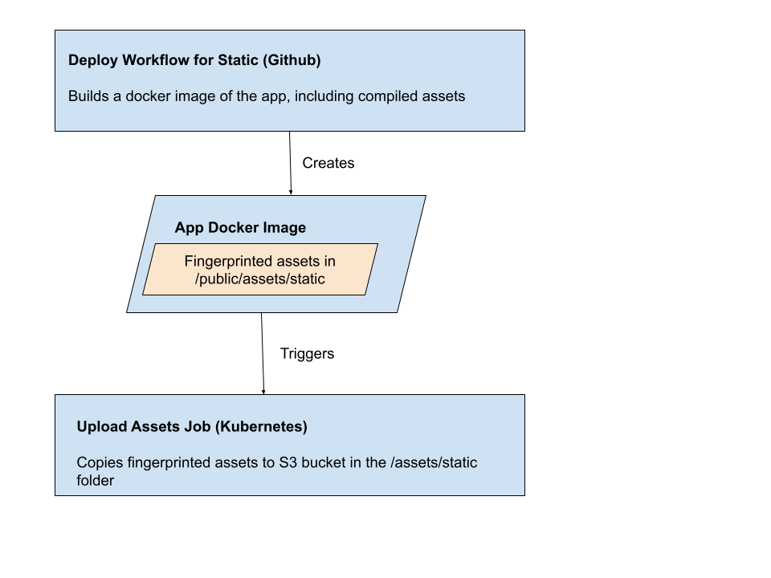
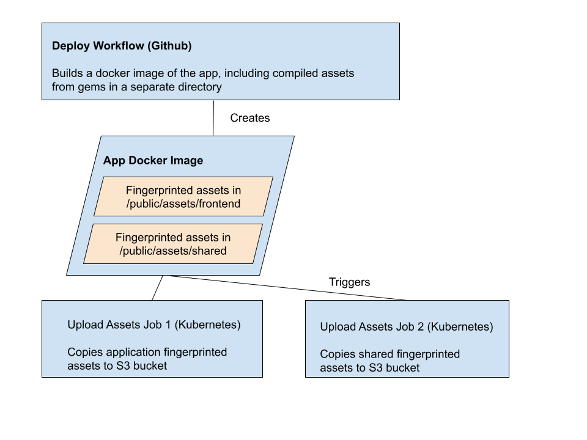

# Replacing Static

## Summary

We propose two new gems: `govuk_web_banners` and `govuk_web_layout` which will replace the [slimmer] gem, the [static] application, and will give us the option if necessary to remove parts of the [govuk_publishing_components] gem that might not belong there. Between them they will handle static’s four main responsibilities: banners, static assets, layouts, and headers/footers, but in a less astonishing way.

## Problem

The `static`/`slimmer`/`govuk_publishing components` triumviurate is a clever way of doing the jobs that it does, but it sits outside the normal idiom of how rails apps render pages, which makes it hard to understand. We have a public layout component in the `govuk_publishing_components` gem that is used to render pages in a standard way in frontend apps, but instead of accessing it directly (remember all frontend apps include the gem), they have to make a call to `slimmer` to request the variant of that layout they want, at which point `slimmer` inserts middleware that makes a network call to `static` for that layout variant. `Static` then reads that layout from its internal copy of the `govuk_publishing_components gem`, modifies it slightly to include global and emergency banners, then returns that value to the `slimmer` middleware, which slots the rendered page from the app into that returned layout.

Making a remote call through middleware to get a layout which the app already has is not an idiomatic rails way of rendering a page, and it presents a complexity barrier to changes to the frontend apps.

The reason for this complex system is that it gives `static` the ability to centralise static assets and handle adding various banners into apps. Those abilities haven't been trivial to replace. Previous RFCs have touched on: a replacing `static` with a gem ([RFC-84]), moving the header and footer into the content store([RFC-118]), adding shared asset folders ([RFC-91]) or the gordian knot solution of merging all affected apps ([RFC-174]). Although ultimately these RFCs were not implmented, the good news is that they were all pretty good solutions to part of the problem, they just needed some advancements in how our apps were built and deployed (which we now have). We’ve also established that some of the things static does can be done at a slightly slower pace and still be acceptable (for instance, that a 15 minute lag between the emergency banner being deployed and being visible site-wide is acceptable ([RFC-144])).

## Solutions

### The Emergency Banner (move to `govuk_web_banners`)

The current mechanism for deploying the emergency banner is via a shared redis instance. A UI in [whitehall] allows the banner to be set. The details of the banner are written into a redis key, and `static` reads that key every time it responds to a layout request, including the details of the banner in the response if present. There is no local caching of this request in `static`, but `slimmer`’s calls to `static` are cached for 60 seconds, so the redis cluster is being called at most 1 time per minute per application instance (not per application, unless the applications are sharing a cache). This means that there is a theoretical lag of up to a minute between the banner being published and it being displayed, but since the CDN caches all pages for 5 minutes anyway, this lag doesn’t have a big effect on deployment of the banner, and at any rate it’s been established that 15 minutes is acceptable delay between the button being pressed and the banner being available ([RFC-144])

Our proposal is that instead of `static` making this call to redis, all frontend apps be given read access to the same redis cluster (some of them may already have access to it), and they make the call directly through the new `govuk_web_banners` gem. This call can itself be cached for a minute, so in theory the number of calls to the redis cluster would remain the same, but we could then lose all the calls to `static` (which are likely to be a bit heavier-weight than the redis calls)

Longer-term, we could replace the redis call with a similarly-cached call to a [content-store] item for the various banners, which would allow us to make the various banners first-class content items with scheduling support (see also "The Global Banner"). It’s worth noting that we could also replace redis with content-store calls directly in `static`, but either way the change would be done in only one place, so that more desirable solution to handling banner content is neutral regarding whether the display is done in `static` or a gem. To implement banners in `content-store` we could either create a new schema for banners or perhaps implement them as reusable content blocks, if that project becomes realised.

### The Global Banner (move to `govuk_web_banners`)

The current mechanism for the global banner is via code directly in `static`. Adding a banner is a developer task. This allows one slight advantage over the emergency banner, which is that the code can change the banner content at a particular time (eg [removing a voter id banner] when the polls close in an election)

Our proposal is that the global banner ultimately be deployed using the same mechanism as the emergency banner, but with additional information baked into the values put into the redis store. Since redis naturally supports key expiration, the act of removing banners at a certain time would be pretty easy. Banners appearing at a certain time would be more awkward, but not insurmountable. These changes would make it deployable by content specialists as well as developers, and should be able to be implemented with minimal changes to `whitehall`.

In the short-term, just moving the existing global banner code into the gem with the recruitment banners and emergency banner would also simplify ensuring that recruitment and global banners are not shown when an emergency banner is in effect.

Longer-term, maintaining the same mechanism as emergency banners, we could look to make global banners first-class publishing items as well, which would give us standard scheduled publication options.

### Recruitment Banners (move to `govuk_web_banners`)

This isn’t a problem with `static`, but fits the banner theme and provides a neat start to the banner gem. Recruitment banners present a problem in that they often need to be inserted into the body of a page inside the area that `static` normally considers the app’s section (the wrapper). This means they need to be maintained in multiple apps.

Our proposal is that we include the current duplicated recruitment banner config, code, and partial views in the gem. Then we can include the gem in each application and put a single call to it in the relevant app layouts. This means we can keep the configuration in one place, where it’s more easily checked for problems, and a single release of the banner gem will be automatically pulled into each relevant app at the next dependabot merge.

### Static Assets (move to `govuk_web_layout`)

#### How GOV.UK handles assets

GOV.UK uses the standard rails assets pipeline for creation of assets, in which at asset compile time a fingerprint is generated for each asset based on the asset’s content, and during HTML page rendering the base names of the assets are replaced with the fingerprinted version. This allows clients to implement a pretty simple caching policy - they can always cache a given asset for as long as they like, because the asset’s name will change if the content changes - if the client doesn’t already have that fingerprinted file, they will need to download it.

Asset precompilation happens during deployment, within Github Actions. When we deploy a version of an app, during the Build and Publish Image step, a docker container is built with a snapshot of the application, including the compiled assets and the sprockets manifest. This manifest is the mechanism for Rails to map the original asset name (`crown.png`) to the fingerprinted asset name (`crown-b2ba232ade53223.png`), so the deployed app has a record of anything that was compiled as part of its assets:precompile step.

Upon deployment into the Kubernetes cluster, a job runs which copies anything from `/app/public/assets/<name of app>` into an S3 bucket `s3://govuk-app-assets-<environment>/assets/<name of app>`. [Fastly maps] any call for (e.g.) `https://www.gov.uk/assets/` to that bucket, so a request for `https://www.gov.uk/assets/frontend/crown-b2ba232ade53223.png` will be served from that s3 bucket.

#### What this means for shared assets
Because the upload-assets job in [govuk-helm-charts] includes the app name, there currently isn’t a mechanism for apps to upload assets in a shared context. If two apps both precompile a CSS file for the Table component, for instance, the fingerprint will be the same, but the path will be different, so a client that views two pages with Tables on (one in [frontend], one in [government-frontend]) will download the same file twice.

However, because all of these apps upload to different folders in the same S3 bucket, it would be relatively easy to add a second step to the upload which took assets from (say) `/app/public/assets/shared` on the deployed images and upload that to a shared folder. Because the same asset compiled in two different apps ends up with the same name, the second app’s uploaded asset would overwrite the first one with the exact same name and data. As long as mechanisms were in place to prevent confusion from two apps uploading at the same time (this may already be present in S3), we could safely write to the same shared assets directory.

#### How will we do this in practice?
Although sprockets-rails wants to put things in one directory (the assets.prefix directory configured in application.rb), it is possible to split assets by source by modifying the Sprockets::Asset class to return a digest path with different prefixes based on the asset name. Since asset engine gems tend to be namespaced (govuk_publishing_components is, for instance), we can use the gem name to determine whether a thing should go into shared or not. If the asset starts with a gem name on a list we provide, it can be prefixed with /shared, and if not it can be prefixed with the application name as usual.

Ideally we’d do this by subclassing the Sprockets environment (which is responsible for loading Assets) to provide a modified class, but at worst we could do it by monkeypatching (there’s a proof of concept of this).

### Layouts (move to `govuk_web_layout`)
All of the layouts in `static` are banner-aware configuration wrappers around a call to the public layout component included in the [govuk_publishing_components] gem. In practise this means that applications are having to make network calls to ask another application to return them a layout that they already have access to, and could easily configure themselves if necessary.

We propose that to start with we replicate this layout configuration in the gem (so that there is little additional configuration needed in the host application), and at a later stage we audit the layouts to determine if the additional configuration is something that can be provided in a default load-time step and explicitly overridden by the applications. This should give us more flexibility in terms of personalisation.

### Header and Footer Content (move to `govuk_web_layout`)
Updating header and footer content is a developer task in `static` - there are no content items that can be edited in the publishing apps. Ideally we’d prefer this not to be the case, but that’s out of the scope of this current document.

We propose for the moment moving the header and footer content into the gem, where it can be included as part of the layouts also provided by the gem. This gives us a similar developer experience to today (in that editing the content is in one place), while allowing us to remove that functionality from [static].

### Additional Considerations

Adding a couple more gems to every frontend app may mean that frontend development may become more awkward in situations where local versions of multiple gems are needed. These are likely to be few, but we should be prepared to monitor the developer experience in these situations. Hopefully, though, the clear division of purpose between these gems and the components gem should mean that most work can be done with at most one local gem.

## Proposed Roadmap

There are two initial streams, reflecting the fact that the gems could potentially be worked on independently. The work in each stream is arranged so that even if we don’t take the ultimate step, we’ll still be doing useful work. After these streams are complete, a final stream of work can retire `static`.

### Stream 1: Banner Gem
- Create prototype banner gem.
- Moving the recruitment banners into that gem, trial including them in one of the four apps which currently contain recruitment banner code.
- If trial looks promising, move the other three apps to use the gem.
- Move the emergency banner code into the gem, and including the gem in `static`
- Move current global banner code code into the gem, and use that code in `static`
- Convert the global banner code to use the same Redis system that the emergency banner uses.

### Stream 2: Layout/Shared Asset Gem
- Create prototype layout gem
- Trial moving shared assets into the gem, and allowing a host app to compile them into a shared asset bucket.
- Add a second app to the trial, to ensure that the shared components can be access by both.
- Trial adding most common layout into gem (this may require some progress on the banner gem so that we can include the banner code as part of the common layout)
- Compare application with layouts from gem with similar app with layout from static.

### Final Stream: Retire static

- Trial moving a single app away from `static` to using the banner and layout gems.
- If trial is successful, move remaining apps to the new system.
- Retire `static`/`slimmer`

[content-store]: https://github.com/alphagov/content-store
[frontend]: https://github.com/alphagov/frontend
[government-frontend]: https://github.com/alphagov/government-frontend
[govuk-helm-charts]: https://github.com/alphagov/govuk-helm-charts
[govuk_publishing_components]: https://github.com/alphagov/govuk_publishing_components
[slimmer]: https://github.com/alphagov/slimmer
[static]: https://github.com/alphagov/static
[whitehall]: https://github.com/alphagov/whitehall
[Fastly maps]: https://github.com/alphagov/govuk-fastly/issues/73
[removing a voter id banner]: https://github.com/alphagov/static/pull/3369
[RFC-84]: https://github.com/alphagov/govuk-rfcs/pull/84
[RFC-91]: https://github.com/alphagov/govuk-rfcs/pull/91
[RFC-118]: https://github.com/alphagov/govuk-rfcs/pull/118
[RFC-144]: https://github.com/alphagov/govuk-rfcs/pull/144
[RFC-174]: https://github.com/alphagov/govuk-rfcs/pull/174
