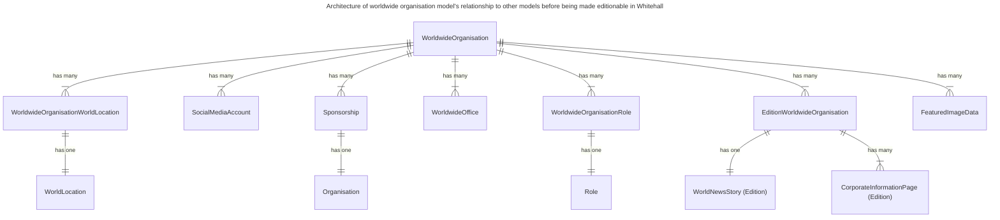
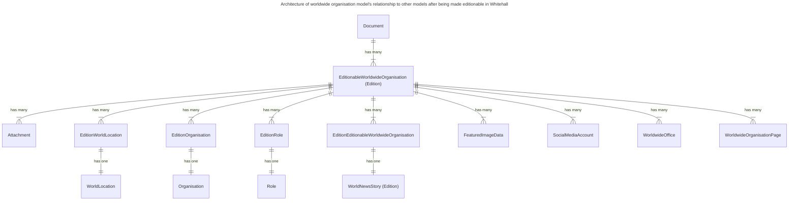

# Make all content types editionable

## Summary

GOV.UK has a number of types of content published using Whitehall Publisher. Some of these are editionable (i.e. publishers can create a draft version of the document before publishing) whereas others are not editionable (i.e. changes become live immediately).

This RFC proposes using the edition workflow for all publishable entities in Whitehall Publisher.

## Problem

Documents published outside the edition workflow suffer from the following user-facing issues:

* no draft preview (whether for the publisher themselves, or using a shareable preview link for fact checking)
* no [2i functionality](https://www.gov.uk/guidance/how-to-publish-on-gov-uk/reviewing-and-approving-content\#a-2i-checklist)
* no scheduled publishing
* high risk of content errors as changes go live immediately
* inconsistent access control
* no audit trail
* validations are not consistent with other document types, e.g. the length of a document summary

Additionally, there are a number of developer facing issues:

* a high number of callbacks are manually implemented on models to republish associated non-editionable content when changes are made in other types of non-editionable content, which has previously led to incidents where callbacks are accidentally missed or called too frequently
* two different sets of code exist for republishing the editionable and non-editionable content, with much code for the non-editionable content being specific to the content type; this affects the developer experience, making it more difficult to make changes, due to hardcoded special cases, a lack of flexibility and developers needing to understand additional code

The edition workflow offers the following features, that are not available on non-editionable models:

* 2i is mandatory; unless the user has permissions to force publish
* all documents can be scheduled to publish in advance
* all documents have a shareable preview link, which can be used for fact checking by third parties without a Signon account
* there is reduced risk of errors being published on GOV.UK by giving publishers a draft preview
* an audit trail is kept of all edits made (including the exact edit, when and by whom)
* the workflow is uniform with other document types, so publishers will already be familiar with the process without needing to learn a new user interface specifically for the content type
* documents can be searched and filtered, e.g. by world location
* all documents can be found in a central location in Whitehall, negating the need for the ‘More’ option on the heading menu

We have seen publishers work around some of these issues by using the integration environment as a draft preview. However this negates the usefulness of integration as a developer testing ground if we know publishers are using it for real publishing purposes. Data in the integration environment is overwritten each night, so drafting and previewing content over multiple days is not possible. Additionally, there is still a risk of making an error when copying the document content from integration to production.

There have been times where a topical event page has needed to be updated or published overnight, to coincide with an announcement or embargo. Without scheduled publishing functionality, a publisher needs to remain awake overnight to manually publish the document or delay publishing until the morning.

## Previous related work

In late 2023 and early 2024, the GOV.UK Publishing Platform team migrated Worldwide Organisations to use the edition workflow. This involved creating a model that inherited from the Edition class, re-associating all the related objects to this new model and then migrating the data from the non-editionable model to the new one.

As part of this work, the team ensured that the translations on sub-content were consistent with the parent page, since Worldwide Organisations had no validation on the translations that were permitted.

The diagram below shows the relationship between models in Whitehall before Worldwide Organisations were made editionable:

The diagram below shows the relationship between models in Whitehall after Worldwide Organisations were made editionable:

## Proposal

This proposal is that we shall apply the edition workflow to all the remaining non-editionable documents in Whitehall Publisher (and all their associated documents):

* Fields of Operation
* Governments
* Groups
* Organisations
* People
* Role Appointments
* Roles
* Take part pages
* Topical Events
* World Location News

This would be done in the same way as Worldwide Organisations: a new editionable model (and associated models) would be introduced alongside the existing non-editionable model, but its usage kept behind a feature flag. We would then create a migration to move the data from one model to the other, whilst also flipping the feature flag at the same time.

Furthermore we propose that new document types must be editionable. If a new document type needs to be added to any publishing application, it must always follow an edition workflow.

## Blocked

This proposal is currently partially blocked, due to technical debt in the design of Whitehall's editions.

The `Edition` model uses single table inheritance to provide models for a number of different content types. This makes the editions database table difficult to work with (at the time of writing, the table has 50 columns).

Any attempt to make the document types with more complex relationships (e.g. people, roles, role appointments and organisations) editionable would lead to more fields being added to this table and complex relationships needing to be modelled. This work could be extensive, as was seen when re-modelling Worldwide Organisations to be editionable.

Therefore it is advisable that this tech debt be resolved before this proposal is implemented in full. There are a number of approaches that could be taken to resolving this debt, which fall outside the scope of this RFC.

Having said this, some content types (whether existing or future), e.g. Take Part Pages, may suit the existing edition pattern without any complex further work being required.
