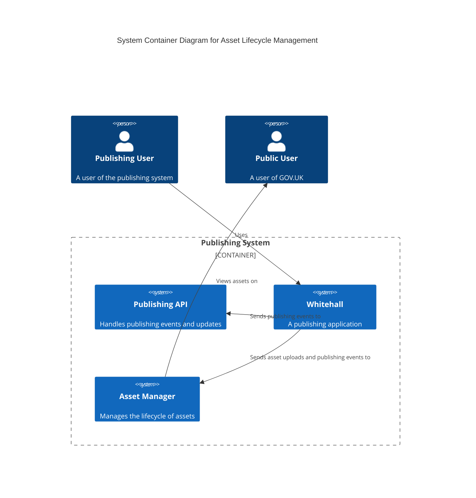
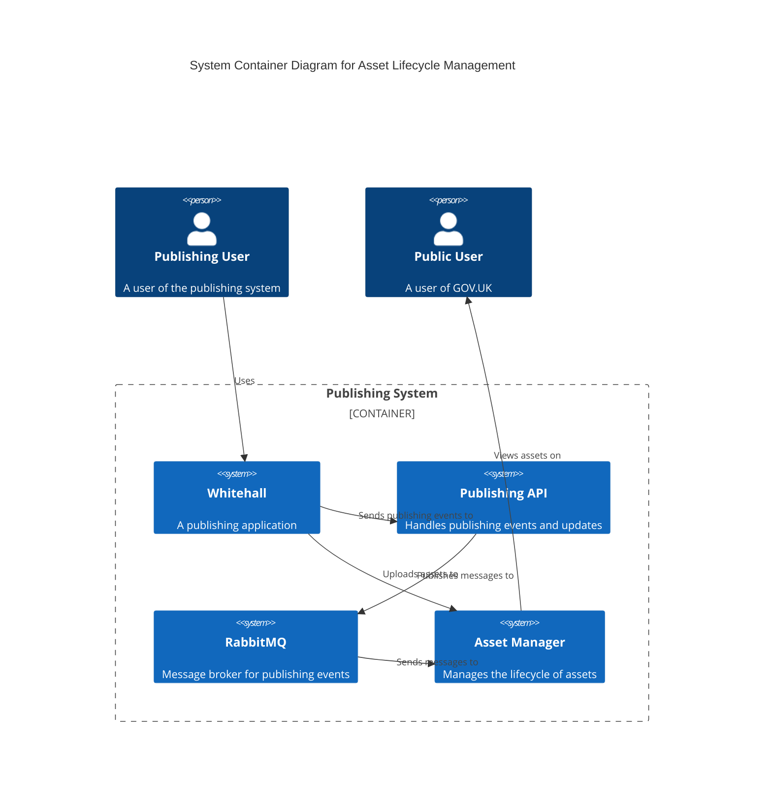

# Update Asset Lifecycle State via Publishing API Message Queue

## Summary

Currently, each publishing application updates the state of each attachment asset associated with an edition of a document when the edition's state changes. For example, when an edition is published, Whitehall updates the `draft` state of any assets associated with the edition to `false` by making an API call to Asset Manager. This will cause Asset Manager to serve the asset from the live domain. Other publishing applications which support asset uploads, such as Specialist Publisher and Manuals Publisher, make the same API call each time a document is published.

To reduce this duplication and reduce the chatty API connections between the publishing applications and Asset Manager, we could have Asset Manager consume messages placed on RabbitMQ by Publishing API whenever an edition's state is updated. The message processor could then inspect the state of the edition's attachments and images and apply the appropriate updates to the relevant asset states, for example by updating the redirect URL associated with the assets if the edition has been unpublished.

At present, image assets do not have a lifecycle. They are immediately considered "live" as soon as they are uploaded to Asset Manager, and their state is never updated by Whitehall or any other publishing application. They have a different risk profile and are therefore excluded from the scope of this RFC, but it would in theory be possible to apply a similar approach to images should it be decided in future that they require a lifecycle.

## Problem

GOV.UK publishing has found asset management a difficult challenge in recent history. It has been the source of several incidents and bugs, such as [this high profile incident](https://docs.google.com/document/d/1niSvK0w-BkzHpkqj6-yqcHrRPI4OfYhOfHn5paEQH7Q/edit?usp=sharing) from 2024, and [this extant bug in Manuals Publisher](https://trello.com/c/5LqwCypV). There are two main problems:

1. Each publishing app which supports asset uploads has duplicate code for updating the state of Asset Manager.
2. The code for synchronising the state of Asset Manager with the state of Publishing API in the publishing applications is generally very brittle and sensitive to race conditions.

## Proposal

There SHOULD be a single mechanism for updating the state of an asset based on the owning edition's state. This SHOULD be achieved via Publishing API, which will reduce the burden on the publishing applications to maintain consistency between Publishing API and Asset Manager. This will make the data flow consistent with how Search API and Email Alert API are updated, and decouple the publishing applications from Asset Manager.

In this scenario, publishing applications MUST upload binary assets directly to Asset Manager (as per the current process). Asset Manager can set the default lifecycle state for new assets as follows:

```ruby
{
  draft: true,
  deleted_at: nil,
  parent_document_url: nil,
  replacement_id: nil,
  redirect_url: nil,
}
```

For new assets, we COULD provide the necessary auth bypass ID and access limiting organisation IDs with the original asset, but it would be preferable not to do that if we can avoid it because it would reduce coupling between the publishing application and Asset Manager. Ideally the only interaction between the publishing application and Asset Manager would be the initial file upload, and the only path to setting the asset state would be via Publishing API. To enable this, we SHOULD create a new piece of state in Asset Manager which prevents serving the asset until a first update to the edition is processed.

After this, publishing applications must continue to include sufficient information about attachments and images in Publishing API payloads to allow Asset Manager to make appropriate state updates. Attachments sent to Publishing API by Whitehall look like this:

```json
{
    "accessible": false,
    "alternative_format_contact_email": "different.format@hmrc.gov.uk",
    "attachment_type": "file",
    "command_paper_number": "",
    "content_type": "application/vnd.oasis.opendocument.text",
    "file_size": 11349,
    "filename": "Amendments_5_to_8_to_Clause_37-Claim_for_relief_on_foreign_income.odt",
    "hoc_paper_number": "",
    "id": "8485786",
    "isbn": "",
    "title": "Amendments 5 to 8 to Clause 37: Claim for relief on foreign income",
    "unique_reference": "",
    "unnumbered_command_paper": false,
    "unnumbered_hoc_paper": false,
    "url": "https://assets.publishing.service.gov.uk/media/67bf19a4750837d7604dbb96/Amendments_5_to_8_to_Clause_37-Claim_for_relief_on_foreign_income.odt"
}
```

Asset Manager's ID for the asset is part of the attachment URL (except for in some legacy Whitehall assets), but we SHOULD provide it as a separate field so that Asset Manager can easily perform a lookup for the correct asset. [Work has already started to do that in Whitehall](https://github.com/alphagov/whitehall/pull/9641). We MUST add a deletion marker and the replacement ID (if replaced) to the attachment data to allow Asset Manager to make the correct state adjustments for attachment assets. Deleted and replaced attachments MUST be filtered out of the data sent to content store by Publishing API.

Following the changes proposed, the JSON for the attachment above would look something like:

```json
{
    "accessible": false,
    "alternative_format_contact_email": "different.format@hmrc.gov.uk",
    "asset_manager_id": "67bf19a4750837d7604dbb96",
    "attachment_type": "file",
    "command_paper_number": "",
    "content_type": "application/vnd.oasis.opendocument.text",
    "deleted": false,
    "file_size": 11349,
    "filename": "Amendments_5_to_8_to_Clause_37-Claim_for_relief_on_foreign_income.odt",
    "hoc_paper_number": "",
    "id": "8485786",
    "isbn": "",
    "replaced_by_asset_manager_id": null,
    "title": "Amendments 5 to 8 to Clause 37: Claim for relief on foreign income",
    "unique_reference": "",
    "unnumbered_command_paper": false,
    "unnumbered_hoc_paper": false,
    "url": "https://assets.publishing.service.gov.uk/media/67bf19a4750837d7604dbb96/Amendments_5_to_8_to_Clause_37-Claim_for_relief_on_foreign_income.odt"
}
```

Publishing API already places a message on an ActiveMQ exchange each time an edition is published. We MUST add another topic to the exchange for updates to draft editions so that Asset Manager can make additional updates to access limiting and auth bypass states for draft documents. This may also be useful in the future to provide draft stack capability for Search API (see [related tech debt card](https://trello.com/c/5nN8vKG7/600-create-draft-search-index-to-enable-draft-search-preview)).

Unpublishings look like this:

```json
{
  "analytics_identifier": null,
  "base_path": "/guidance/brexit-guidance-for-individuals-and-families",
  "content_id": null,
  "description": null,
  "details": {

  },
  "document_type": "redirect",
  "first_published_at": "2021-07-01T11:33:00+01:00",
  "links": {

  },
  "locale": "en",
  "phase": "live",
  "public_updated_at": "2022-05-09T12:37:43+01:00",
  "publishing_app": "whitehall",
  "publishing_request_id": null,
  "publishing_scheduled_at": null,
  "redirects": [
    {
      "destination": "/government/collections/brexit-guidance",
      "path": "/guidance/brexit-guidance-for-individuals-and-families",
      "type": "exact"
    }
  ],
  "rendering_app": null,
  "scheduled_publishing_delay_seconds": null,
  "schema_name": "redirect",
  "title": null,
  "updated_at": "2025-01-21T14:44:13+00:00",
  "withdrawn_notice": {

  }
}
```

We MUST add a way to look up assets belonging to unpublished editions so that they can be redirected. It is likely that the simplest way to achieve this would be to include the attachment data in the unpublishing details. Alternatively, we could create an "unpublished document" topic on the ActiveMQ exchange, but that would be a change from the current model of how Publishing API and downstream services interact, and probably doesn't make sense in a world where a redirect is a valid content item.

Adding the attachment data in the unpublishing details would look as follows:

```json
{
  "details": {
    "attachments": [
      {
        "asset_manager_id": "67bf19a4750837d7604dbb96",
        "redirect_url": "/government/collections/brexit-guidance"
      }
    ]
  }
}
```

Generally it is expected that publishing apps will simply redirect unpublished attachments to the parent redirect URL, but explicitly including a redirect URL for each attachment does give us options in the future if publishers would like to redirect some attachment URLs elsewhere.

## Implementation

Asset Manager can use the `GovukMessageQueueConsumer` to consume ActiveMQ messages from the `published_documents` topic. Here is how Search API consumes the queue: https://github.com/alphagov/search-api/blob/main/lib/tasks/message_queue.rake.

As mentioned above, we MUST add a new topic for draft documents.

The message processing code MUST be retryable, and COULD use an exponential backoff strategy. ActiveMQ does not enable such behaviour out of the box, so we SHOULD adopt the strategy used by GOV.UK Chat (and now also Search API v1), which uses a [separate delay retry queue](https://github.com/alphagov/govuk-chat/blob/main/lib/tasks/message_queue.rake) with a constant backoff. Exponential backoff would be preferable to avoid potential "thundering herd" issues, but we have an established pattern in place from other GOV.UK apps, so we should adopt that for now.

We MUST ensure that data consistency is maintained even if messages arrive at Asset Manager from the Publishing API out-of-order. To achieve this, we SHOULD apply the same strategy as Content Store and Search API by checking the payload version of each message. If the asset has been updated by a more recent message than the version included in the current message, then the message should be dropped.

We SHOULD initially restrict the message processor to only process messages where the document has a publishing app of Whitehall. Once we have proven that we can manage asset lifecycle state via Publishing API for Whitehall assets, we can migrate other publishing applications to use the same system.

## Diagrams

Currently, the asset and document lifecycle looks like this:


```mermaid
%%{init: {'theme': 'base', 'themeVariables': { 'background': '#ffffff' }}}%%
C4Container
    title System Container Diagram for Asset Lifecycle Management

    Person(user, "Publishing User", "A user of the publishing system")
    Person(public, "Public User", "A user of GOV.UK")

    Container_Boundary(c1, "Publishing System") {
        System(publishing_api, "Publishing API", "Handles publishing events and updates")
        System(whitehall, "Whitehall", "A publishing application")
        System(asset_manager, "Asset Manager", "Manages the lifecycle of assets")
    }

    Rel(user, whitehall, "Uses")
    Rel(whitehall, publishing_api, "Sends publishing events to")
    Rel(whitehall, asset_manager, "Sends asset uploads and publishing events to")
    Rel(asset_manager, public, "Views assets on")
```

You can see in the diagram above that for each change to an attachment or image Whitehall has to send requests to both Asset Manager and Publishing API. There is a chance that one of the requests may fail, or may succeed but only after a delay, leaving the system in an inconsistent state. It isn't unusual for example, for Publishing API to reject an unpublishing because of an invalid redirect URL. However, in this situation Asset Manager would still unpublish the assets.

If this proposal is enacted, it would look like the below C4 container diagram.


```mermaid
%%{init: {'theme': 'base', 'themeVariables': { 'background': '#ffffff' }}}%%
C4Container
    title System Container Diagram for Asset Lifecycle Management

    Person(user, "Publishing User", "A user of the publishing system")
    Person(public, "Public User", "A user of GOV.UK")

    Container_Boundary(c1, "Publishing System") {
        System(whitehall, "Whitehall", "A publishing application")
        System(publishing_api, "Publishing API", "Handles publishing events and updates")
        System(rabbitmq, "RabbitMQ", "Message broker for publishing events")
        System(asset_manager, "Asset Manager", "Manages the lifecycle of assets")
    }

    Rel(user, whitehall, "Uses")
    Rel(whitehall, asset_manager, "Uploads assets to")
    Rel(whitehall, publishing_api, "Sends publishing events to")
    Rel(publishing_api, rabbitmq, "Publishes messages to")
    Rel(rabbitmq, asset_manager, "Sends messages to")
    Rel(asset_manager, public, "Views assets on")
```

In the diagram above, you can see that the flow of data is now unidirectional after the initial asset upload. There are no conditions under which Asset Manager might accept an update to a document, but Publishing API might not. This should increase the robustness of the publishing system.