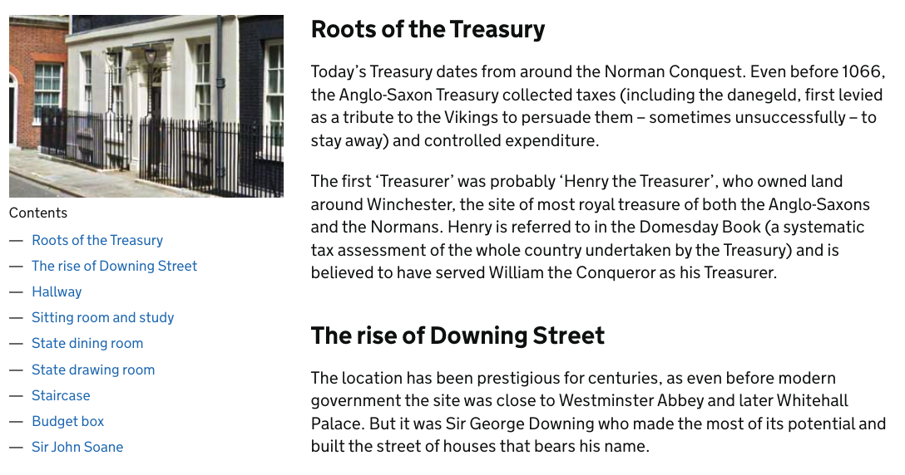

# Technical approach for Flexible pages

## Summary

Flexible pages is the name for a new kind of page on GOV.UK that will provide more options for customisation than existing page types. This will allow new pages to be created with minimal developer involvement, particularly where GOV.UK must respond quickly to urgent page requirements.

This document details the proposed initial technical approach for flexible pages, specifically their structure and associated governing rules.

The plan is to create a minimal viable product (MVP) of flexible pages that will allow us to use them to recreate an existing page type. Further work will then be done to expand and improve flexible pages beyond MVP.

## Proposal

One of the key considerations when deciding upon an approach for flexible pages is the amount of flexibility that is given to the user (content designers working in GDS and government departments). This can be thought of as a scale of flexibility, with two extreme ends:

- Full control: the user has tools available to them that will allow full customisation of layout and page content with almost no restrictions.
- Limited control: the user would choose from different preset page layouts, but only enter content in very restricted ways.

Neither option is desirable. Limited control would defeat the point of a ‘flexible page’. Full control could lead to a loss of consistency across GOV.UK content, potentially create accessibility issues, and create a system that would be extremely difficult to edit and manage.

Instead, we propose a middle ground, where users cannot control page layout but can construct pages from a series of pre-built flexible sections, into which specific content can be added. This will help to preserve and protect the GOV.UK brand, the consistency of GOV.UK pages and their accessibility.

### Flexible sections

Flexible sections occupy the full width of the page and would never occur visibly side by side. They contain a layout based on existing GOV.UK layouts (for example a two thirds/one third layout) but allow no control over that layout.

A flexible section should be designed for a particular use and only allow content within its layout based on that use. Users should be able to choose a flexible section and add content into it, but have little to no control over how that content is positioned. Users should be able to change the order of flexible sections within a page.

Flexible sections should be specific enough to provide an understandable ‘building block’ for making a page, without being generic enough to allow users free reign - they should have a specific purpose. For example, a flexible section that only defines layout would allow too much freedom to put content anywhere within it.

Examples of flexible sections could be:

- a page title flexible section, limited to a two thirds column, that contains the page H1 and a lead paragraph
- a govspeak flexible section, with a one third column containing a contents list and a two thirds column containing govspeak and images

Initially we propose only building the flexible sections needed for MVP. Further flexible sections or variations of flexible sections would be constructed as the work on flexible pages continues. For example, an additional page title flexible section could be built to provide the page title but in a GOV.UK blue box, or this could be provided as an option on the existing page title flexible section.

### Content within flexible sections

Content would likely be based around existing GOV.UK Publishing frontend components. Examples could include:

- rich text, allowing paragraphs, headings and lists to be displayed (based on govspeak)
- images, including alt text and an optional caption
- document lists

### Flexible pages preset layouts

A further improvement to creating flexible pages would be to provide preset options for creating particular page types. Users would be able to choose from two options in the publishing interface when creating a new flexible page:

Option 1: start from a blank page

- users would be able to add flexible sections from an existing list, add content to them and reorder them if required (within defined constraints)

Option 2: select a preset page type

- users would select a preset type from a list e.g. history page, help page
- the flexible sections required for that page would be automatically added into the editing window, allowing users to then add content within those flexible sections but not allowing them to reorder them

### Next steps

We will build a minimum viable product (MVP). This will involve:

- choosing an existing page type to convert to a flexible page (probably a static page)
- determining the flexible sections needed to construct the page and creating them
- deciding on a content schema for the page
- creating the minimum system necessary to make the page editable

#### Candidate for MVP

The page type chosen as the basis for this work is the history of a building page e.g.

- [10 Downing Street](https://www.gov.uk/government/history/10-downing-street)
- [11 Downing Street](https://www.gov.uk/government/history/11-downing-street)
- [King Charles Street](https://www.gov.uk/government/history/king-charles-street)
- [Lancaster House](https://www.gov.uk/government/history/lancaster-house)
- [1 Horse Guards Road](https://www.gov.uk/government/history/1-horse-guards-road)

There are other pages within the [History of the UK government](https://www.gov.uk/government/history) section, but they have different layouts or are of different page types. They may be considered for work post-MVP.

The chosen pages are relatively simple and their content is currently hard coded in applications, meaning that developers are required to make changes. This MVP will allow us to start with a relatively small number of flexible sections, test many aspects of this work and gain user feedback.

For reference, these are the other candidates that were considered. Some of them may be included in future.

- custom pages for urgent situations (e.g. coronavirus, brexit, cost of living)
- the GOV.UK roadmap
- help pages, such as the cookie information page
- topical events

#### Required flexible sections

To allow the flexible page MVP to recreate history pages, the following will be needed.

Screenshot | Flexible section
---------- | ----------------
 | Standard GOV.UK header, not a flexible section
 | Page title
 | Rich text with contents list

**Page title**: content wrapped in a two thirds width column. Content authors would be able to add:

- heading level 1 (required)
- heading context (optional)
- lead paragraph (optional)

Constraints:

- only one **Page title** per flexible page
- pages must have a **Page title** (or equivalent flexible section, in future there would likely be others that provide a heading level 1)
- **Page title** must be the first flexible section (i.e. at the top of the page)

**Rich text with contents list**: content wrapped in a one third/two thirds column layout. Content authors would be able to add:

- image src (optional)
- image alt text (optional)
- image caption (optional)
- contents list (ideally automatically generated from content but may not be included for MVP)
- rich text

Image and contents list would appear in the left column. Rich text content will appear in the right.

Constraints:

- only one **Rich text with contents list** per flexible page (for MVP, at least)

Future work may be required if more than one **Rich text with contents list** is required per page (for example to make the contents list only appear in the first one).

#### Content schemas

For an application to render a flexible page it will need a content item to be passed from a publishing interface, which will need an agreed schema. Below is a proposal for the flexible pages portion of the content item in a simplified form for readability, for the history page above.

```
document_type: history_page
schema_name: flexible_page
details:
  flexible_sections:
  - type: page_title
    heading_text: "11 Downing Street"
    context: "History"
    lead_paragraph: "This is the history of 11 Downing Street."
  - type: rich_text_with_contents_list
      contents_list:
        image:
          source: (image path)
          alt: ""
          caption: ""
        items:
        - href: “#roots”
          text: “Roots of the Treasury”
        - href: “#rise”
          text: “The rise of Downing street”
      content: (govspeak content)
```

#### Making the MVP editable

The minimum system required to make the MVP editable would be a hard coded content item stored as a YAML file within the `frontend` application. This system will be implemented first to allow spike frontend work to be carried out without the dependency of a publishing interface.

For MVP the aim will be to have a publishing interface to replace the YAML file. This interface will be the minimum required to create only a history page, based on the idea for a preset page type (proposed earlier), but with the potential for more flexibility in the underlying data structures, to build on for future work.

### Future considerations

#### Choice of URLs

Flexible pages will need options for setting their URLs. For the MVP this will be limited to `/government/history/<slug>`.

Future work will allow for further URL options, but this will be balanced with permission levels for content authors. For example it may be that only those with higher permission would be able to create a top level URL e.g. `/coronavirus`.

#### Breadcrumbs

The MVP for history pages will have a simple breadcrumb containing `Home -> History of the UK Government`. This will need to be extended for other breadcrumbs in future.

#### Tagging content to a page

Flexible pages will need a mechanism to allow content to appear on them, for example a list of related documents or news articles. Whitehall already has options for tagging pages to organisations, topical events, ministers and other items, so hopefully we can reuse that as much as possible.

#### Publishing and managing flexible pages

Like other GOV.UK content, flexible pages will need to be drafted, reviewed, previewed and published. These mechanisms will need to be included as part of the publishing interface.

If flexible pages are successful there may eventually be a lot of them on GOV.UK. This could lead to difficulties with managing and navigating them in publishing interfaces, as they would all be of the same type. For example, if flexible pages were used to create world location pages, there would be nothing to differentiate them from other flexible pages.

There should be a way of tagging flexible pages in the publishing interface to provide a way to navigate and filter them. Tags will be added as the work progresses, but initial tags should be created for:

- the page type we choose for MVP e.g. “name of page type”
- unique or custom pages created to respond to world events (such as coronavirus) e.g. “custom page”

Initially the creation of new tags will be handled by developers but eventually this should be handled by those with a specific publishing permission level such as content leads. Schema name and document type are two separate fields in content items, so a tag could be used in place of one of these fields.

#### Reusable content

It might be that flexible pages are used to create a group of pages, with a requirement that they link to each other with a common navigation menu or share other elements. In this situation it would be helpful if there was a mechanism for managing this, other than having to manually update every page in the group when a new page is added. It is possible that the Content Block Manager may be of use here.

#### Tracking

For MVP no options for adding GA4 tracking will be included. This means that tracking will be limited to standard page views, plus any default tracking included with frontend components (for example specific tracking on the contents list component).

Future work will include consideration for more tracking options.
